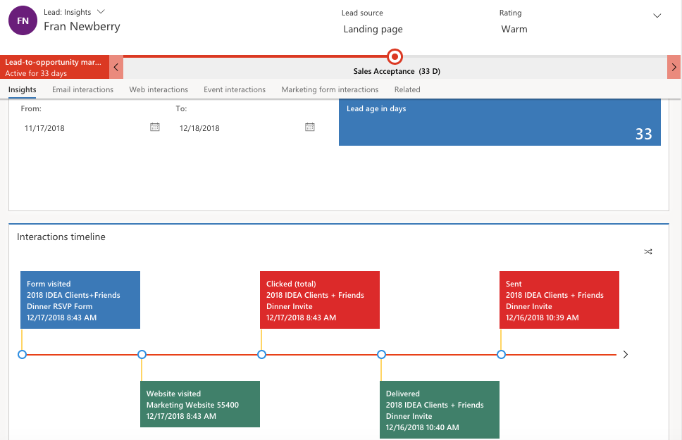
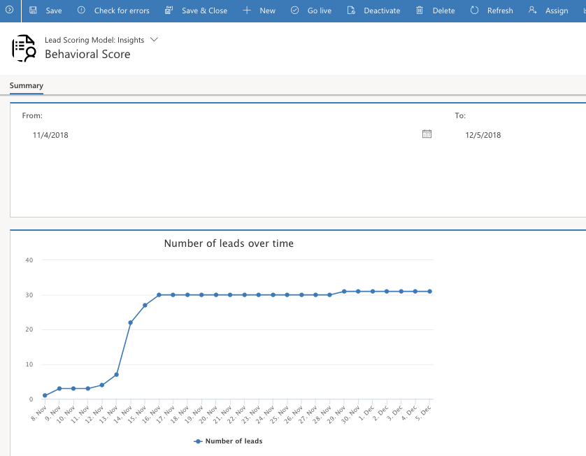

The lead insights show a complete history of how your selected lead has interacted with your marketing initiatives. Marketers will use this information to understand what their leads are interested in and the messages that they responded to.

To view lead insights, go to **Marketing** > **Lead Management** > **Leads**. Select a lead record, and then open its **Lead:** **Insights**  view.

Most of the insights displayed for a lead are the same as those shown for contacts and are taken from the contact record associated with the current lead (for more details, refer to the Contacts insights description above). One exception is that the Insights tab tracks lead-specific information such as the lead\'s age (how long the record has been active) and its progress over time.

### Lead scoring model insights

To view lead scoring model insights, go to **Marketing** > **Lead management** > **Lead scoring models**, select a model, and then open its **Lead scoring model: Insights** form view. Insights are only available for models that are (or have been) live.

In the Summary view, you can find a timeline showing the number of leads processed by the model and you can filter by date.