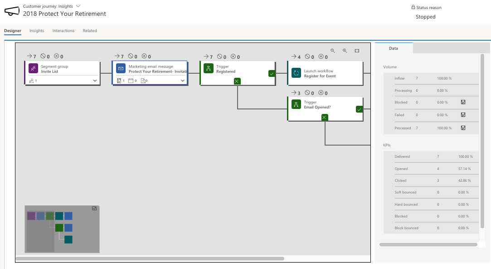
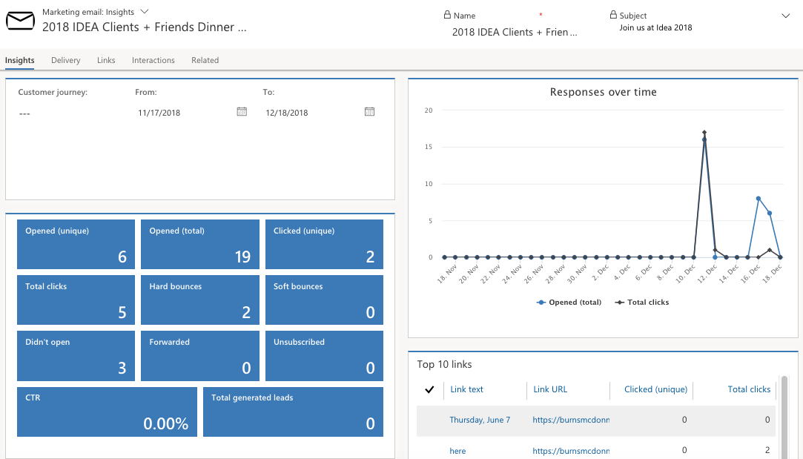
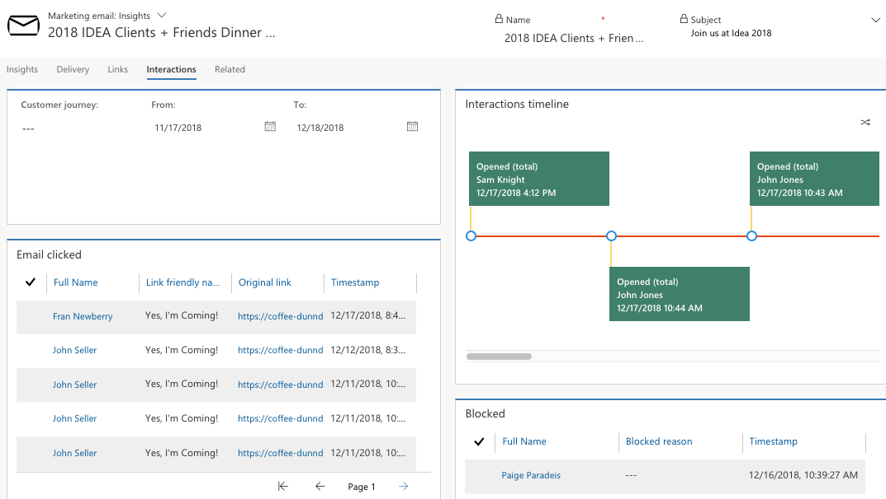

Customer journey insights allows marketers to monitor the performance of their campaigns by analyzing each activity and their respective Key Performance Indicators (KPIs). Insights are not generated until a customer journey is live and may take some time to generate insights once the journey is running.

To see your customer journey insights, go to **Marketing** > **Marketing Execution** > **Customer Journeys**. Open a live customer journey that you want to learn about and switch to the **Customer Journey:** **Insights** view.

From here, use the Designer tab to see information and results for each tile from your pipeline. Click several of the tiles, such as marketing emails, pages, and forms, in your customer journey to see the detailed data, such as Volume and KPIs, on the right pane.  The data on the right varies based on what type of tile you select. For example, if you select a marketing email message tile you will see the Volume data, such as Inflow, Processing, Blocked, Failed, and Processed, and the KPIs of the record, such as Delivered, Opened, Clicked, Soft Bounced, Hard bounced, Block Bounced, and Blocked.

Go to the Insights tab to view the timeline of responses by pages and emails. You can also see a pie chart representing the total marketing emails sent associated with the journey. Set the From and To timeline to filter the insights by date. 

On the Interactions tab, you can view the blocked contact activity with an option to filter by date.

### Review marketing email insights

To see your marketing email message page insights, go to **Marketing** > **Marketing Execution** > **Marketing Emails**. Open a live marketing email message you want to learn about and switch to the **Marketing email:** **Insights** view.

Because you can reuse an email message in several different journeys, the filter settings for email insights include a field for specifying which journey you would like to analyze. If you don't select a journey,
then the information you see applies to all journeys where the message was used. As with most other entities, you can filter email insights using a date range.

There are four tabs in the marketing email insights, including Insights, Delivery, Links, and Interactions.

On the Insights tab, you can see the overview of the marketing email metric counts, such as opened (total and unique), clicked (total and unique), hard bounces, soft bounces, didn't open, forwarded, unsubscribed, click-through rate (CTR), and total generated leads. You can also view responses over time, top 10 links, send results per type (blocked, bounced, and delivered), and geographical data of the email clicked count.

On the Delivery tab, you can view delivery progress (processed, delivered, and blocked), as well as delivery details and results by domain.

The Links tab provides a full analysis of each link included in the marketing email, including a graphical reproduction of the message showing a heat map highlighting your links. You can hover the mouse pointer to view details for each highlighted link. For each link you can see the number of total clicks, unique clicks, and the click-through rate (total number of unique clicks for a given link divided by the
total number of unique clicks overall).

Lastly, the Interactions tab provides full lists of recipients counted for each of the several KPIs (such as opens, clicks, and forwards), plus a timeline of interactions.

The following list contains a description of each KPIs:

-  **Blocked**- Messages that were blocked (not sent) due to a contact's preferences or a problem with their email address. This can happen if the segment included contacts that were marked as **Do not bulk email**, or because the contact\'s email address was missing, invalid, or blacklisted. Examples of blacklisted address include known anonymous email servers and generic addresses such as do-not-repy\@contoso.com or office\@contoso.com.

-  **Bounced (hard**) - Messages that resulted in a hard bounce, which indicates that the address is invalid. A hard bounce might occur because the domain name doesn't exist or because the recipient is unknown. Multiple hard bounces can lower your server's send reputation, which will reduce your delivery rate, so you should remove hard-bouncing addresses from your contact records. When an address returns a hard bounce, Dynamics 365 will automatically stop sending new messages to that address for six months, but your email results will still show each attempt as a hard bounce.

-  **Bounced (other)** - Messages that bounced for some reason other than a hard or soft bounce. This result is rare, and might indicate a remote bounce, which occurs when a server initially accepting a message returns a bounce message sometime later. These are treated as soft bounces.

-  **Bounced (soft)** - Messages that resulted in a soft bounce. A soft bounce occurs when an email is sent to a valid server, which recognizes the user, but still rejects the message for some reason, such as because the recipient\'s mailbox is full, the mail server is temporarily unavailable, or the recipient no longer has an email account at that address. If five successive messages sent to a given address result in a soft bounce, then that address is treated as a hard-bounce address.

-  **Clicked (total)** - The total count of all the links clicked in all sent messages. Multiple clicks of the same link in a single message are counted multiple times, so the proportion of total clicks per total sent can sometimes be more than 100 percent.

-  **Clicked (unique)** - The number of sent messages where the recipient clicked at least one link at least one time. Clicks on multiple links and multiple clicks on a single link are not counted after the first click, so the maximum unique clicks per message is one.

-  **Click-through rate** - This value is shown for each link included in a message. They are listed on the **Marketing email: Insights > Links** tab and can also be viewed on the heat map there. This is a ratio that shows the number of unique clicks on a given link divided by the number of unique clicks overall for the message.

-  **Delivered** - Messages that were sent, not including hard or soft-bounced messages (Delivered = Sent - TotalBounced)

-  **Did not open** - Messages for which no open email was recorded. (Note that Marketing can only count opens when the email recipient allows images to load for the message, so some messages could be read and even clicked without an open being registered for them.)

-  **Feedback loops** - Messages for which Dynamics 365 received a feedback message. When a recipient uses their email client to mark a message as spam, the client typically sets up a filtering rule and then returns feedback to the sender that the message has been marked as spam. If you continue to send messages to an address that has returned this feedback, you risk lowering your server's send reputation, which will reduce your delivery rate. When feedback is received, Dynamics 365 will automatically stop sending new messages to that address, but your email results will still show each attempt as a feedback loop.

-  **Forwarded** - Forwards made by recipients using the forward-to-a-friend link included in the message. The submitted forwarding addresses were not necessarily unique. (This value does not record forwards made using the mail-client forward feature.)

-  **Opened (total)** - The total number of times a message was opened, including multiple opens of a single message by a single recipient. (Note that Marketing can only count opens when the email recipient allows images to load for the message, so some messages could be read and even clicked without an open being registered for them.)

-   **Opened (unique)** - The total number of messages that were opened by a contact at least once. This value does not count multiple opens of the same message by the same contact. (Note that Marketing can only cont opens when the email recipient allows images to load for the message, so some messages could be read and even clicked without an open being registered for them.)

-  **Sending failed** - Messages that were blocked due to a system failure or other unexpected error that occurred during sending.

-  **Sent** - Sent messages, including bounced messages, but not including blocked messages (Sent = TotalTargetedContacts - TotalBlockedQuantity)

-  **Subscription submitted** - These are messages where a contact clicked on the subscription center link and then submitted the subscription center at least once, regardless of whether the contact changed their subscriptions or contact details.

-  **Total generated leads**  -The number of leads generated as a result of an email message. A new lead is counted when a recipient clicks a landing-page link in the message and then submits the landing page, which generates a new lead for that contact as a result. Landing page submissions that don't generate a new lead aren't counted (for example, because a matching lead already exists or because the landing page isn't set up to generate leads).
-  **Unsubscribed** - Messages where a recipient clicked the subscription center link and then unsubscribed from one or more mailing lists. This value counts, at most, as one unsubscribe per message per recipient.