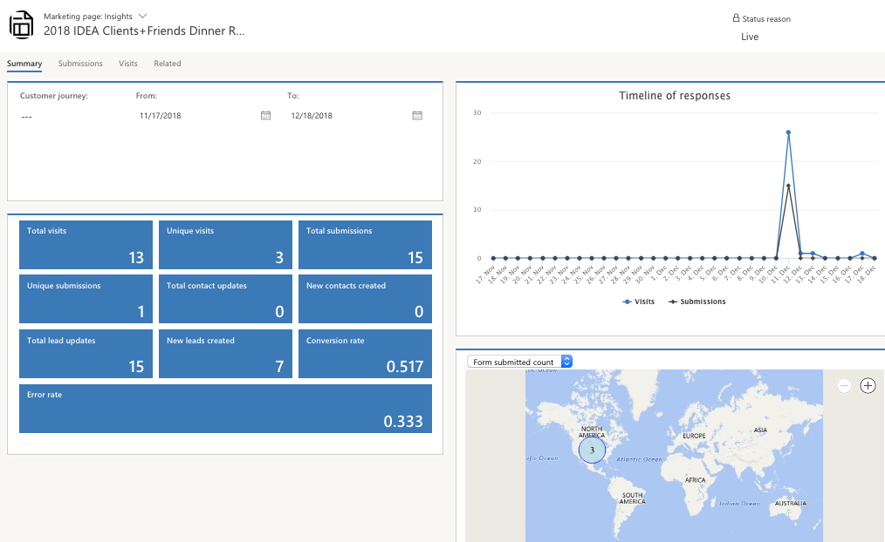
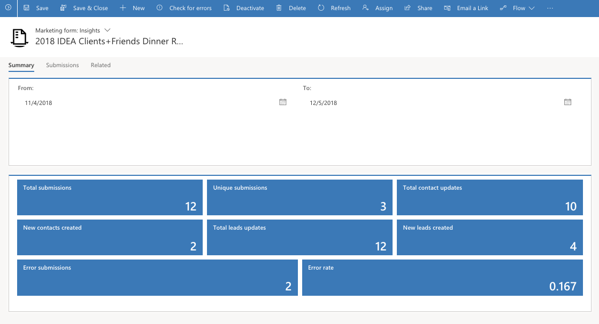

To view marketing page insights, go to **Marketing** > **Internet marketing** > **Marketing pages**. Select a marketing page, and then open its **Marketing page: Insights** view. Insights are only available for pages that are (or have been) live.

You can view a complete history of how various contacts have interacted with the page and the submissions made using it.

Because you can reuse each marketing page in several different journeys,the filter controls for page insights include a field for specifying which journey you would like to analyze. If you don\'t select a journey,then the information you see applies to all journeys where the page was used. As with most entities, you can filter marketing page insights by using date range.

Marketing pages provide the following insight tabs:

- **Summary** - Provides an overview that includes KPIs, responses over time, and geographical data.
- **Submissions**-  Provides a table that lists the full content of each submission made through the page. Metadata and several important field values are shown in the table columns for each submission. Hover your mouse pointer over a value in the Form submissions column to open a tooltip showing all values included in a given submission.
- **Visits** - Provides a table that lists information about each time the page was opened.

### Marketing form insights

To view marketing form insights, go to **Marketing** > **Internet marketing** > **Marketing forms**. Select a form, and then open its **Marketing form: Insights* view. You can review a complete history of how various contacts have interacted with the form and the submissions made using this view.

Although you can use each form on multiple pages and in multiple journeys, all form insights combine data from all usages, you can still filter results by using a date range.

Marketing forms provide the following insight tabs:

- **General info**-  Provides basic information about the form (but no results).

- **Setup** - Provides KPIs such as the total number of form submissions, contacts created or updated, and leads created or updated by the form.

- **Submissions**- Provides a table that lists the full content of each submission made through the form. Metadata and several important field values are shown in the table columns for each submission. Hover your mouse pointer over a value in the Form submissions column to open a tooltip that shows all values included in a given submission.
