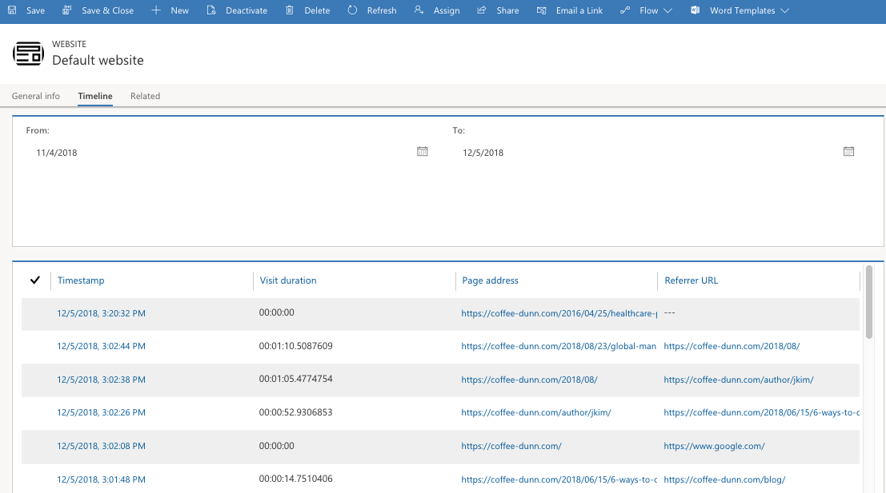

On the website insights, you can see general information such as a list of the most popular website pages and timeline information tracked website pages that tracked loading the script.

To view website insights, go to **Marketing** > **Internet marketing** > **Websites** Select a website record.

Website insights is available on the main form view:

- **General info** Shows the settings that you made when creating the website and the JavaScript code that you must include this information on each web page that you want to track with this website setup.

- **Timeline** Shows a table that provides details about each time a page tracked as part of this website, was loaded.

### Redirect URL insights

To view redirect URL insights, go to **Marketing** > **Internet marketing** > **Redirect URLs**. Select a redirect URL record.

Redirect URL insights is available on the main form view:
- **General info** Shows the settings you made when creating the redirect URL and a map that shows where people were when they selected the redirected link.
- **Timeline** Shows a table that provides details about each time the  redirect URL was selected.
