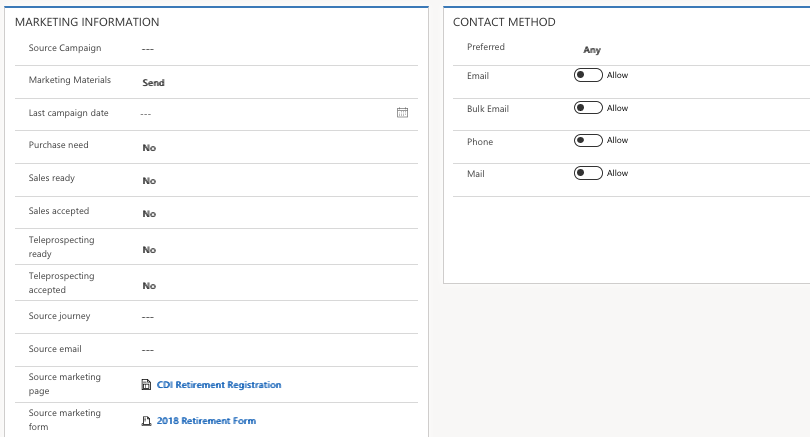
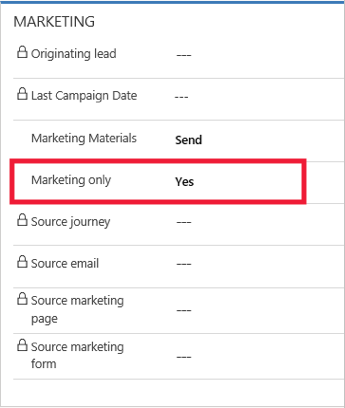

Most of your contacts will represent customers or potential customers,
but you might also include partners or suppliers among your contacts,
especially for events where you\'ll typically include speakers, vendors,
and sponsors in your contacts database.

### Define and manage sales-ready versus non-sales ready leads

On the lead entity summary form under Lead Management, you should see a
listing of lead scores based on the scoring model and the corresponding grade value. As you navigate to the LinkedIn Lead Info tab, you can drill into the specific details of which activities and/or attribute data was
the reason for the score. Lastly, on the Details tab, you can see a host
of marketing information related to source campaign and journey, sales
readiness, marketing page, and form.

You can manually move leads to opportunities or contacts by going through
the steps of the business process tool or simply by clicking Qualify and
entering required information on the lead entity.

### Lead scoring model insights

To view lead scoring model insights, go to **Marketing** > **Lead
management** \> **Lead scoring models**. Select a model, and then open
its **Lead scoring model: Insights** view. Insights are only
available for live (or have been live) models. Here you can find a
timeline showing the number of leads processed by the model. 

Another option for reporting is that you can customize the lead views and
dashboards to sales, which ensures that only sales-ready leads are
displayed. Select the following links for instructions about how to set up new [views](https://docs.microsoft.com/dynamics365/customer-engagement/customize/create-edit-views)
and
[dashboards](https://docs.microsoft.com/dynamics365/customer-engagement/customize/create-edit-dashboards).

### Differentiate the automatically generated contacts from others 

Use the Marketing only flag on the contact entity to differentiate the automatically generated (marketing only) contacts from other types of
contacts. This makes it easy to see a distinction between the two types of contacts. Additionally, you can set up list views for sales only displaying
sales-qualified contacts excluding the marketing-only contacts.

If you are using a workflow to automatically generate marketing-only contacts, then your workflow should set the marketing only flag for
the contacts it creates. Once the lead is qualified as an opportunity, another workflow could clear this flag from the related contact entity,
whereby marking it as a sales-qualified contact.

Marketing pages can create new leads when a known contact submits a marketing page and no matching lead is found. To keep from generating
duplicate leads, set the lead-matching strategy used by your landing pages ensure existing leads will be found and scored, instead of creating new ones.