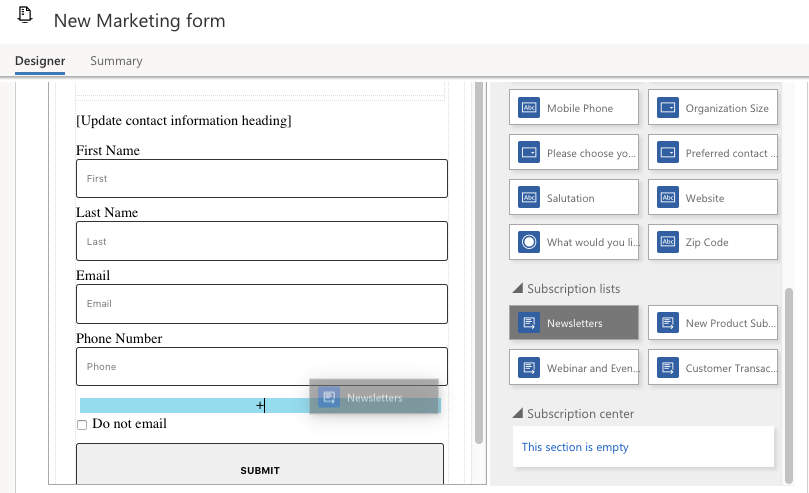
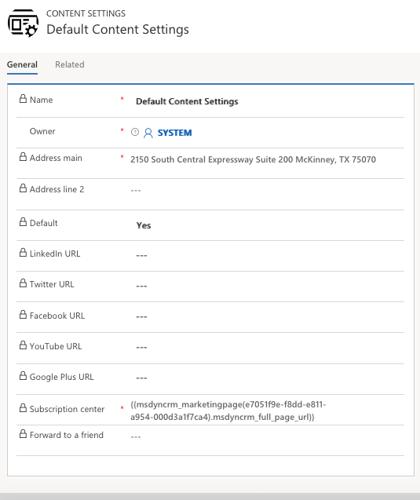
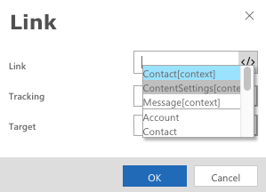
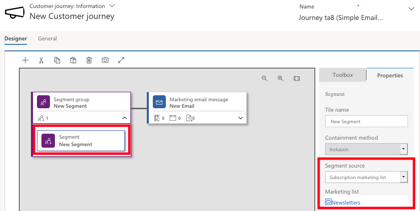

There is a relationship between subscription lists, subscription center, forms and marketing pages. A subscription center is a marketing page that contacts can use to manage their communication preferences and contact details with your organization.

Your subscription center can present several subscription options, by providing access to a list of available newsletters, promotions or events. Marketing email messages created by Dynamics 365 for Marketing include a personalized link to a subscription center. By presenting several different subscription marketing lists, you gain an opportunity to learn more about your contacts\' specific interests and provide more options beyond the legally required \"do not bulk email."

One of the main uses of a subscription-center link is to embed the link into a marketing email. Specifically, commercial messages require a subscription-center link while transactional messages do not. Marketing manages consent independently for each of these two types of messages.

> [!Note] 
> A plain-text version of the email message must exist and must also include a subscription center link and the sender\'s physical address. Although this is typically automatically generated, you should review it.

A subscription center link is required content and Dynamics 365 has an automated error-check to help ensure compliance, before any message can go live. Dynamics 365 includes a standard subscription center, which you can edit to contain your subscription lists and to reflect your subscription options, languages, or brands. You\'ll add a subscription center link to your page by highlighting the link text and selecting **Link** on the text toolbar, and then using the assist-edit feature to select the subscription center URL from the content settings.

After a contact clicks the subscription center link, they can sign up for specific marketing lists. However, contacts who do not want to receive marketing emails, can globally unsubscribe by marking them as do not bulk email, override any subscription list memberships. List memberships can be reactivated if a contact later clears the do not bulk email field.

### Create a subscription list

1.  Go to the **Survey app** > **Marketing** > **Marketing lists**
2.  Click **+ New** to create a new marketing list (subscription lists are based on the standard (static) marketing lists feature of Dynamics 365)

> [!Note]
> Marketing lists aren\'t included in the current version of the Marketing work area, so one place you can find them is in the Surveys app, which is included with Dynamics 365 for Marketing. You could also use the Dynamics 365 - custom app.

3.  Enter the following details
    - **Name**: Enter a descriptive name
    - **Subscription**: Set to True
    - **Locked**: Set to No

> [!Note]
> When you set **Subscription** to **True**, the **List Type** is automatically set to **Static** and **Targeted At** is automatically set to **Contact**. Both settings are consistent with the requirements of a subscription list, and they remain locked unless you change the **Subscription** setting.

4. Select **Save** to save your new subscription list.

### Add a subscription list to a subscription form

When a subscription list is available, you can add it to a subscription form. When creating your subscription form, it\'s important to select a subscription center template. You can filter template list by type, and then choose Subscription center from the drop-down list. 

To add a subscription list to a form,

1. Go to **Marketing** > **Internet Marketing** > **Marketing forms**
2. Open the marketing form that you want to add the subscription list to

>[!Important]
>If you edit an existing form, your edits will affect all marketing pages using that form. Marketing forms are referenced to the form, not copied like other templates.

3. On the **Toolbox** tab, scroll down until you find the **Subscription Lists** heading. You should see the subscription list that you listed, plus any others lists already in your system. Drag a list from the **Toolbox** to place on your designer.

You can also add subscription lists to standard marketing pages, which enables inbound (previously unknown) contacts to sign up for one or more subscription lists at the same time that they register with your site.

### Identify a subscription center in content settings

The content settings include dynamic content about your organization such as subscription-center URL or the sender postal address.

Go to **Marketing > Templates > Content Settings** to view a list of all current content settings. To create a new subscription center, select New, provide a name and address, then specify the subscription center using the **assist-edit button </\>** , select **Content settings [context]** select your **marketing page** (GUID) and then select the marketing page **FullPageUrl**.

You can create as many content settings records as you want, however you must assign one to each customer journey. Based on this architecture, you can use the same email message in several customer journeys, but the
subscription center link (and other content settings) included in the email message can be different for each customer journey.

Through marketing execution, you select your journey, navigate to the general tab and locate the Content Settings. Once there, you can search for the Content setting record applied to your customer journey. Because the content-settings record is specified by the customer journey sending the message, you can test your content settings on a live message.

To learn more about, see [Use content settings to set up repositories of standard and required values for email messages](https://docs.microsoft.com/dynamics365/customer-engagement/marketing/dynamic-email-content#content-settings).
and  [Include a subscription center link in a marketing email](https://docs.microsoft.com/dynamics365/customer-engagement/marketing/set-up-subscription-center#include-a-subscription-center-link-in-a-marketing-email).

You can use a single marketing email message in several marketing contexts. Examples of marketing contexts include supporting page links such as a subscription center, your postal address, and social-media links. With this feature, you can use a single live email message in several different customer journeys or campaigns.

### Set up a customer journey that targets a subscription list

When setting up a customer journey, commercial email messages types need to contain a subscription center for legal requirements and deliver-ability. Regardless of the target audience or email message type, it's a better practice to include an unsubscribe link giving recipients authority to control the content they received. Additionally, internet reputation monitors can identify marketing email messages and might remove those that don't include an unsubscribe link. 

To create a customer journey targeting a subscription list,

1. Go to Marketing > marketing Execution > Customer Journey.
	- See the unit on Create and Manage Customer Journeys in the Market to Leads and Contracts in Dynamics Marketing for instructions on creating a new Journey.
2. Add a segment to your canvas you use a template, the segment group may already appear on the canvas)
3. Expand the segment group menu. Select the segment tile under the segment group. 
1. Go to the **Properties** tab. In the **Segment Source** field, select Subscription Marketing List
1. In the **Marketing List** field, select the appropriate marketing list
2. Save.

When a customer journey targets a subscription list, any contact that unsubscribes from the list using a subscription center will automatically be removed from the journey within 24 hours, even if they are already partially through it.  However, if a Dynamics 365 user removes a contact from the list manually, the contact will continue to be processed by any journeys they are on and may continue to receive messages until all active journeys are complete. For this reason, it is usually best to request all contacts to manage their own subscriptions using the subscription center.