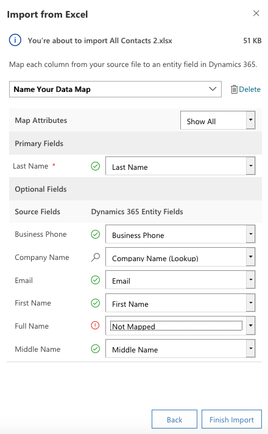

Import your customer and sales data into your marketing app. You will need to follow specific steps to prepare your file for the import. You will also want to validate your results by viewing the data within your application.

### Import leads from a marketing list

Dynamics 365 processes imports in the background through data management. Before import, you must separate contacts and leads into their respective .csv or Excel file format for importation. Navigate to [Importing data](https://docs.microsoft.com/dynamics365/customer-engagement/marketing/import-data).

After an import is completed, you can review which records were successfully imported, failed to be imported, or partially imported. To fix the records that failed to be imported, export them into a separate file, fix them, and then try to import them again (if necessary, you can start over by
deleting all records associated with the previous import).

### Prepare your file for import

Here are some guidelines to help ensure that your file will be imported successfully to Dynamics 365:

1.  Put records for each record type in a separate file such as leads versus contacts.
2.  Make sure that the file is in one of the following formats:
    -   Comma-separated value (.csv) file.
    -   Excel templates provided by Dynamics 365.

>[!Note]
>If your import file is a .csv file, make sure that it is correctly delimited. You can use double quotation marks (") or single quotation marks (') as data delimiters. For more information about how to import contacts in Dynamics 365 Customer Engagement, go to the Basics Guide for [Import Contacts](https://docs.microsoft.com/dynamics365/customer-engagement/basics/import-contacts).  If you import file is in Excel, Dynamics 365 provides Excel templates to streamline import process.

3.  Make sure the first line of the file is a row of column headings. Add column headings (which is text used in the first row of a workbook or file that labels the data in each column) if they are not already present.
    -   Note: Data can be imported more quickly if it can be automatically mapped during the import process. It helps to have your column headings match the display name of fields in Dynamics 365.
4.  Make sure data exists for all required fields.

>[!Note]
>The default required fields for lead imported records are **Topic, Last Name, and Company Name**.

To learn more, see [import accounts, leads, or other data](https://docs.microsoft.com/dynamics365/customer-engagement/basics/import-accounts-leads-other-data)

### View results of an import and correct errors

You must wait for an import job to be completed before you can correct any errors.

1.  Go to **Settings** > **Advanced Settings** > **Business Management** > **Import Data**
	- Import jobs for all recent imports are listed here.

2.  Find your job in the list and check its progress. The **Status** column shows the status of the import by using the following values:
	- Submitted
	- Parsing
	- Transforming
	- Importing
	- Completed

3.  After the import is complete, the **Success**, **Failure**, and **Partial Import** columns will show the number of records that were successfully imported, failed to be imported, or were partially imported.
	- Use the tabs to see information about failures, success, or partial failure of records during import.
4.  Open the import file to view the records that were not imported or were partially imported. Double-click the import file record.
5.  On the **Failures** tab, select **Export Error Rows** to export rows to a new .csv file. These are rows that failed to be imported. You can correct the errors in this file, and then import it.

### Create leads manually from lead entity

Adding leads is a key part of lead generation which require multiple options
to capture leads, such as manually creating a lead.

1.  Select **New** from the command bar.
2.  Provide some general information about this new lead.
	- Required: **Topic** and **Last Name**
	- Recommended: **First Name** and **Company Name**
	- Business Optional: **Lead Source, Rating** and **Email Address**
3.  Click **Save**.

>[!Note]
>The Topic field provides information regarding how the lead was generated or what they may be interested in (such as a marketing event or, social media campaign). Use a business process flow (Inquiry) to associate a lead to an existing contact.