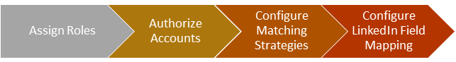
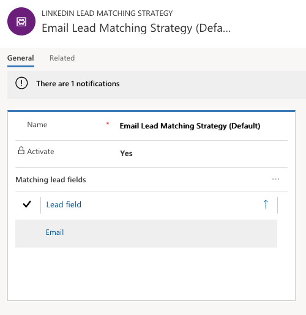

Dynamics 365 for Marketing includes a connector for LinkedIn Lead Gen. This allows you to automatically sync leads captured on LinkedIn with your Dynamics 365 online organization so your sales and marketing teams can identify and develop them.

Using the app, your marketing team will generate high-quality leads at scale, prove the return on investment (ROI) of your lead gen campaigns, and access and manage your leads with ease.

Lead Gen Forms remove the main barrier to online conversion: forms filled out manually by prospects. When LinkedIn members click your ad, their profile data automatically populates a form that they can submit with one click. They'll save time and effort and you will get more accurate and complete information about your leads.

### LinkedIn Lead Gen integration methodology

### Assign roles

Dedicated security roles must be assigned for synchronization to take
place. There are 3 primary security roles that need to be assigned:

- LinkedIn Lead Gen Forms Administrator
	- Configure lead mapping strategies, LinkedIn field mappings, and manage solution settings for Dynamics 365 Connector for LinkedIn Lead Gen Forms
- LinkedIn Lead Gen Forms Salesperson
    - Authorizer of user profiles to sync data and view synced submissions
- LinkedIn Lead Gen S2S Inbound
    - Internal security role solely used to be the connector and sync data

### Authorize accounts

A LinkedIn member with access to LinkedIn Campaign Manager is required to authorize their LinkedIn accounts in Dynamics 365. The following steps are required for authorization.

1.  Go to **Marketing** > **LinkedIn Lead Gen** > **User Profiles**
2.  Add a new LinkedIn user profile record
3.  Add LinkedIn accounts to the user profile record
4.  Enter credentials
5.  Allow in permissions
6.  Validate the Dynamics 365 organization

After successful authorization, the associated LinkedIn accounts are listed in the Associated LinkedIn Accounts section and form submissions are now automatically synced to Dynamics 365 for Marketing.

### Configure matching strategies

A matching strategy maps the fields of a LinkedIn form submission to the record fields of a lead in Dynamics 365. By default, a matching strategy based on a lead\'s email address is activated. At least one active matching strategy must be in place at a single time. If a matching strategy contains more than one field mapping, all mappings must match before an existing lead record is updated.

### Configure LinkedIn field mapping

The LinkedIn Lead Gen integration provides a set of field mappings out of the box. Field mappings define the name and the related field on the lead entity it maps to. As a system administrator or customizer, you can change the field mapping or create new mappings to support fields from custom questions on LinkedIn Lead Gen forms.

LinkedIn form submissions are automatically synced to Dynamics 365 for Marketing. You\'ll be able to see the data as soon as the sync is complete, such as on dashboards, lead records, and form submissions. Additionally, the integration provides a lead source along with any data residing in LinkedIn regarding the lead.