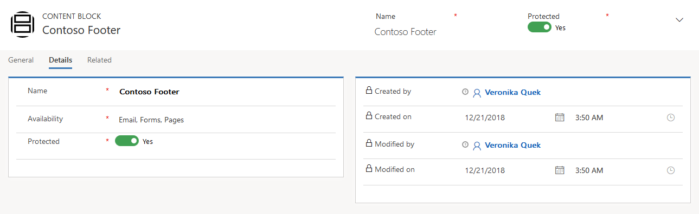

Forms are nearly always intended to create or update one or more database records---especially contact or lead records. However, record creation will fail if any fields required by the database are missing when the form is submitted. When you\'re designing a form, always be sure to identify all  fields that are required by your database and add any form element with their **required** checkbox as needed. 

As with marketing pages, each marketing form has a type, mapping directly to the page type where you can use the form. Although you can include more than one form on a marketing page, all forms on the page
must be of the same type, and that type must match the type of the page itself.

When the form is submitted, Dynamics 365 tries to match the incoming data to an existing contact; if a match is found, the matching record is updated, otherwise a new record is created. 

### Utilize content-block elements

Content blocks are available for use internally with other entities such
as emails, forms and pages, but are not published externally. Content
blocks can only include a single design element which can be either text or
image.

To create and manage content blocks, go to ***Marketing** > **Marketing
Content \> Content Blocks.***

Use the content-block element to add a content block to your design. When you first add the element, a placeholder icon appears at the location where you dropped the element. Select the new content-block element, open the properties panel, and use the content block lookup field to find and select the block containing the content that you want to include.

Content blocks work like templates, as they include a fixed collection of content that you add all at once to a design. Once added, the content is copied into your design and doesn\'t maintain any connection to the original block content, which means, if you edit a content block itself, or its content in a particular design, other designs using that block won\'t be affected.

### Form summary and configuration

The **Summary** tab provides a few options and configuration settings:

-  **General Information**- Provides naming, ownership, created on and modified by information

-  **Timeline**- Details the history and any related notes

-  **Related marketing page**- Provides a list of related marketing pages to use with this form.

-  **Related marketing page fields**- Provides a list of related marketing page fields used on the form.

-  **Content and lead matching strategies**- Control if matching strategies are based on form field mapping.

-  **Generate leads without matching**- Controls if matching updates an existing lead or creates a new lead for each submission.

-  **Purpose and Visual style**- Provides insight to how the form can be found in the template gallery.

-  **Prefill fields**- Set to Yes, to prefill forms and modify landing pages only.

You can share the information collected securely across your business and understand how every interaction impacts results. Additionally, connecting sales and marketing processes enables you to automate follow-ups and track the progress of your leads, giving your organization a 360-degree view of every lead and contact.

### Create a marketing forms

>[!VIDEO https://www.microsoft.com/en-us/videoplayer/embed/RE2NNot]

### Enable prefilling of forms

Whether you are trying to engage with customers early on, updating client contact information or simply sending a survey, the prefill option for forms makes it easier for known contacts and/or leads to submit their information.

However, you must be mindful of how the contact and/or leads data is being used based on on the European Union's General Data Protection Regulations (GDPR). Only fields explicitly configured to allow prefilling can provide prefilled values. This also valid only on forms where prefilling is enabled, and only for contacts who enabled the \"remember me\" feature the last time that submitted a form on your site.

Three managed landing-page form prefilling options are at the field, form and contact levels.

### Embed a form on an external website

Typically marketing forms provide a complete solution for your marketing initiatives; however, there are options for publishing through standard web-publishing tools on your website. You can only embed landing pages externally; all other forms will require marketing pages that are native to Dynamics 365 for Marketing. Lead and/or contact generation will function the same regardless where the form is hosted.

The following steps embed a landing page form externally:

1. Go to **Marketing** > **Internet Marketing** > **Marketing Forms**
2. Open an existing form
3. Select the **Form hosting** tab
4. Add new form safe list rule
    - Your form will only work on the domains that you denote on the safe list.
    - In the Name field, enter the domain name of the website where you will host the form.
5. Select form page name to open its settings and view the embedded code
6. **Copy and paste** the code onto the page of your website.
