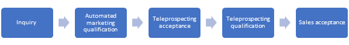
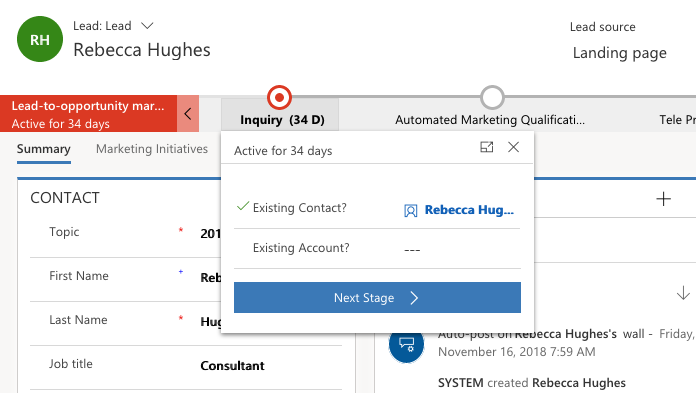

### Establish your marketing contacts

In Dynamics 365 for Marketing, a lead is an expressed interest in a specific campaign or initiative and linked to a contact record. Marketing activities, in Dynamics 365 for Marketing, focus primarily on contact records. Leads must be related to a contact,  otherwise the lead cannot be created as a member of a segment. A lead cannot be targeted by a customer journey scored by Marketing. If you aren't sure, you can still create a segment by finding lead records based on their local values and then find the contacts linked to those records.

### Generate leads

As defined above, a lead is an expressed interest and linked to a
specific contact record. For example, you engage with your contacts
through marketing initiatives and your contacts will express their
interests, such as through, an event registration form. Leads can be
generated by syncing from LinkedIn Lead Gen Forms, adding a create-lead
tile in a customer journey, or through landing page or event
registration submissions. You can also add leads manually or import a
list.

### Define lead and contact matching strategies

Matching strategy helps to avoid duplicate contacts or leads in your
database. When contacts and leads are generated through, for example,
page submission or event registration, matching strategies (for each
lead and contact) will be applied to determine whether a marketing lead
or contact record(s) already exists in the system. If a record exists, the
system will only update those records. Matching strategies allow the use
of landing page submissions to update existing contacts or leads, and
associate new leads with existing contacts. You will have a default set
of contact and lead matching strategies automatically applied to all
marketing forms, but you can also create and apply different strategies,
as needed.

### Lead nurturing and scoring

A contact may hold multiple lead records activated at the same time,
tracking different levels of interest in a different campaign, product
or service. After the initial interaction, leads are typically taken
into a nurturing campaign, where they can be cultivated to continue
building interest with information and offers about the campaign,
product or service. This is where the lead scoring comes in. The lead
scoring enables marketing to calculate scores and prioritize each lead
based on demographic, firmographic, and interaction details, such as
email opens, landing page submissions, or event attendance. You can
establish many scoring models and apply them to different customer
journeys where appropriate. Each scoring model includes a sales-ready
threshold; when a lead passes the threshold, it will be marked as sales
ready, which means the lead is sales-qualified and the salesperson may
pick up the leads going forward.

### Lead business process

Leads are an important entity supporting business processes. Marketing
can customize the sample lead process that is provided out of the box or
create a custom internal process.

The standard process guides users through the following stages.

Similar to other business processes, each stage timeline provides a
drop-down menu of fields supporting the stage along with a button for
marking the stage complete and activating the next stage of the process.

If not already displayed, you can display the marketing business process
on your lead record by selecting **Process** > **Switch process** on
the command bar and selecting business process.

You can customize your system to support other aspects of this process,
such as setting up dashboards and custom views to display newly
qualified leads, or by setting up workflows automating other aspects of
your internal sales processes. If you are integrating Dynamics 365 for
Marketing with Dynamics 365 Customer Engagement, then you should
probably customize the lead views and dashboards ensuring that only
sales-ready leads are shown.
