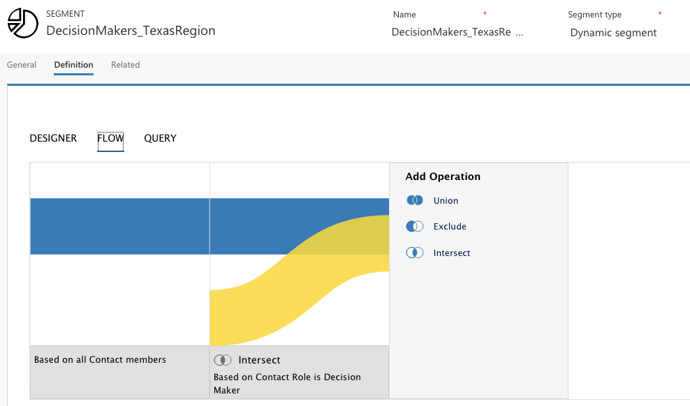
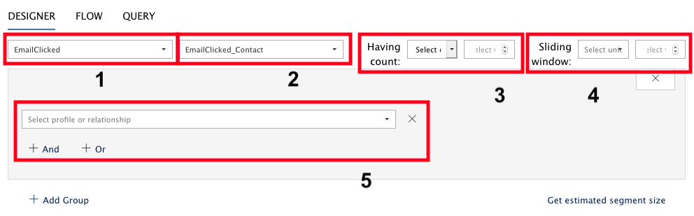
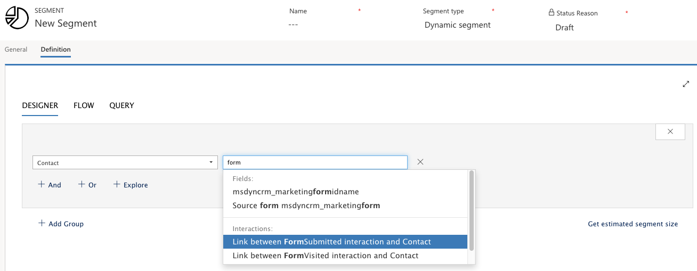
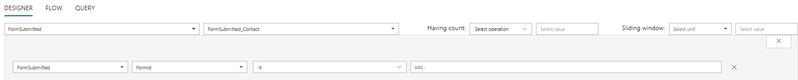

To create, view, or manage your segment, you must go to **Marketing** \> **Customers** \> **Segments**. You can search, sort, filter, create, and delete your segment in the standard view. Segment records consist of several tabs, including the **General** and **Definition** tabs discussed below.

The **General** tab provides general information about the segment, including:
-   **Name** - Enter a name that will make the segment easy for you and others to identify.
-   **Segment Type** - Set the segment to dynamic, static, or compound. This setting controls which types of settings you\'ll see when populating the list on the **Definition** tab.
-   **Status reason** - Shows whether the segment is draft or live. Only live segments are available for use in customer journeys and compound segments.

On the **Definition** tab, you can define the type of segment that you want to pull. The **Definition** tab will differ based on segment type. For static segments, you can select specific contacts, one at a time. For dynamic segments, you can select contacts based on the query builder. For compound segments, you can create logic for combining existing segments.

### Static segment

On the **General** tab, when selecting the segment type as Static, the **Definition** tab can populate a list of contacts from your database with a check box for each contact. You can add each contact into the segment simply by clicking in the checkbox. You can also use the search filter at the top to quickly find the contacts that you want to add.

### Dynamic (profile-based) segment

On the **General** tab, if you choose Dynamic as your segment type, you can use the **Definition** tab to build a dynamic segment by combining groups of logical expressions, each of which results in a set of contacts. There are two ways to build a dynamic segment: profile-based and interaction-based.

Profile segments query the profile records stored in the customer-interaction database. Profile records are synced between your Dynamics 365 database and the customer-interaction database include entities you typically  work with in the Dynamics 365 user interface, such as contacts, accounts and leads.

Each group in your segment must result in a list of contacts, which are selected by the logic defined in that group. Each group must therefore establish a path through various entities, each linked through relations, and which ends with the contact entity. A simple query group might query the contact entity alone, but a more complex one could pass through several entities. You can create as many groups as possible by clicking the + Add Group button.

Groups can be combined using the Union, Exclude, and/or Intersect operators. Use Union when you combine all members of a group with the results of the previous group. Use Exclude to remove members of a group from the results of the previous group. Lastly, use Intersect to remove all members from the previous groups that are not also members of the current group.

The **Flow** tab provides a Sankey diagram of how your groups are combined, and how contacts flow into and out of the segment as a result of the operation from each group.

In the **Flow** tab, if you select any operation, the **Explore** view appears. This provides a graphical map of the path that you're creating when you are adding a query clause for a dynamic profile segment. However, the graphical map is not available when you are working with an interaction segment.

For example, you might build a path as follows:

1.  Start with the **Marketing List** entity to find a marketing list named subscribers
2.  Continue to the **Accounts** entity to find the accounts from the list, and find only companies working in the entertainment industry
3.  End at the **Contacts** entity to find the contacts from those accounts, and find only contacts living in **New York**

Because the path ends with contacts, the result is a list of contacts who live in New York and work for entertainment companies that are on the subscribers list. (Many segment groups you create will query the **Contacts** entity only, but even groups such as these might employ complex logic combining multiple AND and OR clauses.)

##### Dynamic (interaction-based) segment

Another way of creating a dynamic segment is to use interaction-based query. **Interaction segments** query the interaction records stored in the customer-interaction database and displayed through the Dynamics 365 user interface. They are generated in response to contact interactions, such as opening an email, clicking an email link, submitting a form, or registering for an event.

1.  **Interaction name** - This is the type of interaction that the segment will search for.

2.  **Relation to contacts** - This is how your selected interaction relates to the contact entity. All segments must resolve to a collection of contact entities, and this value shows how the two entities are connected. For the most common interactions, there is only one choice here, so you don't need to worry about it, but some types of interactions have multiple connections to the contact entity through different field values on either the interaction record or the contact record.

3.  **Having count** - Enter any count to limit results to include  contacts that have some minimum or exact value of interactions, such as at least 3 email opens or "exactly 1 event registration. If you leave these blank, then your segment will find contacts with at least one of the selected interaction type.

4.  **Sliding window** - Use these settings to consider interactions that occurred only recently, such as in the last two weeks, last three months, or last year. The date is always calculated based on the current date, so if you apply a limit here, then some contacts may slip out of the segment with each passing day.

5.  **Additional restrictions**- These settings work just like they do for profile segments, but here you can filter results based on values for the selected type of interaction records. For example, you might want to find clicks on a specific email message, or registrations for a specific event. You can add as many additional clauses as you want using the And and Or buttons.

### Create an interaction segment

One of the examples of an interaction segment is a segment based on form submission. The following steps show how you can create a segment to find contacts who submitted a specific form.

1.  Go to **Marketing** > **Customers** > **Segments**
2.  Select **New** on the command bar to create a new segment
3.  Give the new segment a name on the **General** tab, set its segment type to **Dynamic**, and open its **Definition** tab.
4.  Your new segment already has a query group set to  the **Contact** entity. Select the field box (currently showing a value of **All**) and start to type the name of the interaction that you want to look for. In this case, start typing 'form'. A drop-down list will open to show contact fields and interaction types with names matching your text. For this scenario,click **Link between FormSubmitted interaction and Contact**

5.  When you select an interaction (not a specific field), the layout of the Designer forms changes to interaction mode, which provides the features. You are able to provide additional criteria to segment based upon such as quantity (having count) and time frame (sliding window) 

6.  You will locate the field ID of the form submission you are attemp to segment based uplon. To learn more about finding record ID's refer to the next section below. 
7.  When you\'re done designing your segment, select **Save** and **Go live**

#### Find record IDs

If you want to find interactions associated with a specific form, customer journey, message, event, or other specific record, you need to find the **ID** of the record that you're looking for.

1.  Open the record that you want to reference, such as event or email.
2.  Check the address bar in your browser, which should show a URL such as: https://\<MyOrg\>.crm.dynamics.com/main.aspx?appid=c8cba597-4754-e811-a859-000d3a1be1a3&pagetype=entityrecord&etn=msevtmgt\_event&id=**5acc43d5-356e-e811-a960-000d3a1cae35**

3.  At the end of the URL, find the part that starts with &id=, which is followed by the ID number of your current record. Copy the number (in this case, **5acc43d5-356e-e811-a960-000d3a1cae35**) to use it in your expression.

### Compound segment

#### A compound segment is used to combine one or more existing segments into a single new segment. 

1.  Create or edit a segment and, on the **General** tab, set its Segment type to **Compound** segment.
2.  Go to the **Definition** tab, which shows a drop-down list for selecting your first member segment. Choose an existing segment and then select the **Submit** button next to the list.

>[!Note]
>A Segment must be live to be used when building a compound segment

3.  Your chosen segment is added, and a new **Add Operation** block is shown. If you want to combine another segment with the current result, then choose an operation, such as **Union**, **Exclude**, or **Intersect**
4.  A new block is added, which once again asks you to choose a segment. As before, choose a segment and then select the submit button to apply it.
5.  Continue to compose your new segment by adding more segments as needed and choosing an operation for each. As with the flow view for dynamic segments, you will build a Sankey diagram of how your segments are combined, and how contacts flow into and out of the segment as a result of each operation.