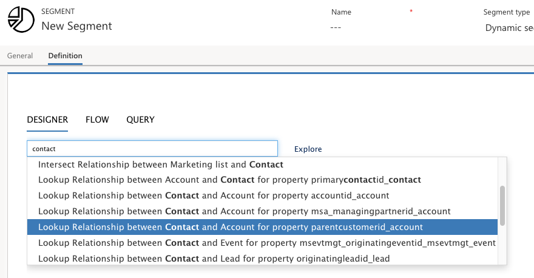
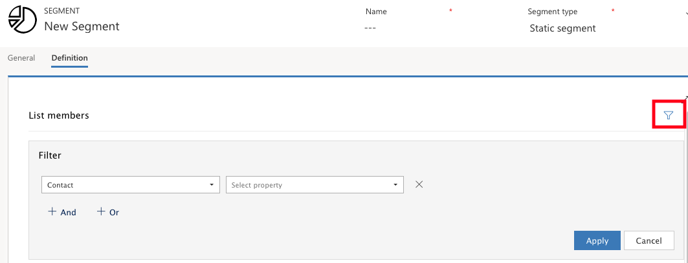

Account-based marketing is an approach where you organize your marketing initiatives around account records instead of, or in addition to, contacts. This means, that your leads may reference accounts and are scored based on interactions made by any or all the contacts belonging to those accounts. In Dynamics 365 for Marketing, you can build an account-based journey, personalize email content, review insights, and leverage leads
and lead scoring.

### Create segments for account-based journeys

As with all types of segments, the segments that you create for account-based customer journeys must resolve to a collection of contacts. However, when an account-based journey processes the segment,
it will look up the account each contact belongs to and group contacts by their account.

### Create a dynamic segment starting with accounts

1. Go to **Marketing** > **Customers** > **Segments** and select **+ New** from the command bar
2. Fill out the **General** tab with a name and description for your new segment
3. Set Segment type as **Dynamic**
4. Open the **Definition** tab, where you will find the segment **Designer**. A default contact group is provided. Select the **Close** button to remove this default group
5. Select **Account** from the **Select a profile or relationship** drop-down list
6. Finish setting up the selection criteria
7. Select the **+ And** button to add a new **Select a profile or relationship** drop-down list and choose **Lookup Relationship between Contact and Account for property parentcustomeridaccount** from that list.

>[!Note]
>This value describes a relationship between the contact and account entity, where the parentcustomerid field of the contact entity contains the ID of the account record the contact belongs to (in other words, it finds the contacts belonging to accounts that have been found so far).

8. Set the last drop-down list to **All** to find all matching contacts
9. If needed, you can add more contact-based criteria to further limit the set of contacts found for the segment
10. Select **Save** and **Go live**
11. After a few minutes, you'll be able to open the **Members** tab to see which contacts are included in your new segment. The list includes a column showing which account each contact belongs to

### Create a static segment using an account filter

1. Go to **Marketing** > **Customers** > **Segments** and select **+ New** from the command bar
2. Fill out the **General** tab with a name and description for your new segment
3. Set **Segment type** to **Static**
4. Open the **Definition** tab
5. Select the **filter** button to expose the filter controls

6. Use the filter to find the contacts you want to include in the segment. Account ID might be useful when setting up account-based segments. To do that, use the various drop-down lists in the **Filter** area to set up a query clause of the following form:
    - Contact Company Name account is <account-ID>

>[!Note]
>Account ID <account-ID> is the unique ID for the account you want to look for

7. Continue to add clauses to your query as needed
8. Select the check box for each contact you want to include in your static segment and select **Save**
9. Check for errors and and **Go live**