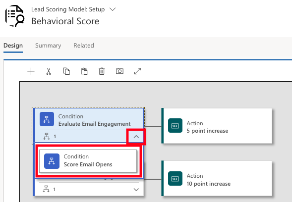
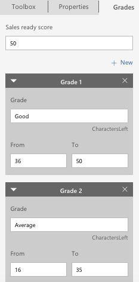

In Dynamics 365 for Marketing, you can score each lead based on criteria that includes demographic details and interaction records. A lead who meets your target demographic profile and has interacted with your marketing materials, such as opening emails, registering for downloads, browsing your website, or attending an event, will receive  a high score, using a business appropriate lead scoring model.  You can create any number of lead-scoring models, with each lead being scored according to each model. If you have several models, each lead will also have several scores. A lead becomes sales-ready as soon as at least one model produces a sales-ready score for the lead.

### Create a lead scoring model

1.  Go to **Marketing** > **Lead Management** > **Lead Scoring Model**. On the command bar, select **New**
2.  The new lead scoring model page opens, with the **Design** tab shown.  Here you can build scoring models by creating a collection of condition/action tile pairs:

	- **Condition** - tile Establishes a condition, such as email opened
	- **Action** - tile Establishes how the score should change when the condition is met

3.  Drag a **Condition** tile to the first position on the canvas
4.  When you drop the tile, it stays selected and the **Properties** tab opens. Enter the **Display name**
5.  Expand the new **Condition** tile by choosing the expansion button in the lower-right corner. Here you can see a
    **child Condition** tile under your new **Condition**

6.  Select the **child Condition** tile, open the **Properties** tab, and then enter a **Display name** for the tile
7.  Select in the **Entity** field to place the insertion point. The list includes all relevant entities that can be related to a lead record, plus the lead entity itself
8.  After you\'ve chosen an entity, an **Expression** box is added providing choices appropriate for the entity. Use the **Field**, **Operator**, and **Value** fields to establish an expression
9.  Drag an **Action** tile from the **Toolbox** tab, to the space on the right of the **Condition** tile that you set up
10. When you drop the tile, it stays selected and the **Properties** tab opens. This is where you set how a lead\'s score is changed when the **Condition** resolves to **true**
11. Add more child conditions by dragging more **Condition** tiles onto the same parent. If you do this, all child conditions are combined with an **AND** operator, which means all conditions must evaluate to true for the following **Action** to be applied. Otherwise, add additional child conditions below the existing parent condition, as needed
12. Open the **Grades** tab in the rightmost column. Set **Sales ready score**
13. If needed, you can add additional grades to help classify a lead according to its score (such as 0-25=Cold, 26-60=Warm, 61-100=Hot). Choose **+ New** on the **Grades** tab to add and define each required grade

14. Go to the **Summary** tab
	- Give your rule a **Name**
	- Set the **Entity Target** as either **Contact** or **Account**
15. On the command bar, do the following:
	- Select **Save** and **Check for Errors**
	- Select **Go Live** to activate the model

### Account-based leads and lead scoring

Each customer journey must be either contact-based or account-based. This option modifies how the journey\'s tiles will work. Use the target setting on the **General** tab to configure this option
for each journey.

Leads can be associated with accounts or contacts. If a lead is associated with both an account and a contact, then the lead is treated as a contact lead when it comes to lead scoring, for example the account is ignored. Leads associated with neither a contact nor an account cannot be scored by a lead-scoring model. The following rules apply for lead-scoring models:

-   You can set each lead-scoring model to apply to either contact-based or account-based leads

-   Interactions made by all contacts related to an account contribute to the score of an account-based lead. For example, each contact from an account that opens an email message could increase the score of the lead associated with that account

-   You can set demographic or firmographic scoring conditions that score on the lead record itself by setting Entity = Lead, on the related account (Entity = Lead.Parent account), or on the related contact (Entity = Lead.Parent contact)

One way to score an account associated lead is to set up a condition tile with the following properties:

1.  Set **Entity** = **Lead**
2.  Add an **Expression** where parent account for lead account = <account-ID>. You can find the account ID by opening the account record and checking for the value of the id parameter at the end of the page URL