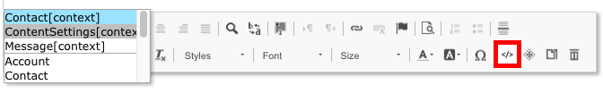
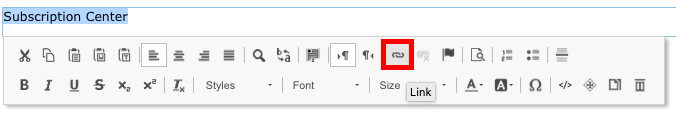

Email is a vital marketing channel for most modern organizations. It\'s also a core feature of Dynamics 365 for Marketing, which provides tools for creating graphically rich marketing emails with dynamic, personalized content. Dynamics 365 for Marketing can send large volumes of personalized marketing emails, monitor how each recipient interacts with them, drive customer-journey automation based on these interactions, and present results for individual contacts with aggregate statistical analytics. Emails in Dynamics 365 for Marketing are executed through simple or complex customer journeys.

> [!Important]
> One of the most important performance metrics for email marketing is deliverability, which measures the ability of your messages to arrive in recipients\' inboxes rather than getting flagged as spam and filtered away, out of sight. Microsoft is dedicated to helping our Dynamics 365 for Marketing customers maximize deliverability. To learn more, see [Dynamics 365 for Marketing: Set up DKIM for your sending domain to keep up with recent Office 365 changes](https://blogs.msdn.microsoft.com/crm/2018/11/05/dynamics-365-for-marketing-set-up-dkim-for-your-sending-domain-to-keep-up-with-recent-office-365-changes).

### Create a marketing email

>[!VIDEO https://www.microsoft.com/en-us/videoplayer/embed/RE2NNos]

### Add required fields to marketing emails

Physical mailing address and subscription center are two fields required to create a marketing email. To add these fields, you need to use the Assist Edit feature to bring in stored information from content settings.

To add content settings, do the following:

1.  Go to the marketing email designer
2.  Add a **Text** element from the **Toolbox** onto the designer where appropriate
3.  On the text editor, click on the **Assist Edit** icon

4.  Select **ContentSettings** [context]
	- To add physical mailing address, select **AddressMain**
	- To add subscription center, select **Susbcription Center**
5.  Click **Save**

To add a subscription center as a hyperlink, do the following:

1.  Navigate to the marketing email designer
2.  Add a **Text** element in the **Toolbox** onto the designer where appropriate
3.  In the text editor, type in the name of the subscription center. Highlight it and click the **Link** icon

4.  In the **Link** popup menu, click the **Assist Edit** icon and select **ContentSettings**  [context]
5.  Select **SubscriptionCenter**
6.  Click **Save**
