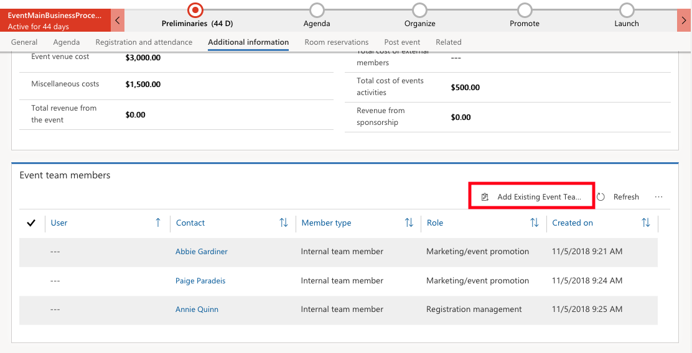
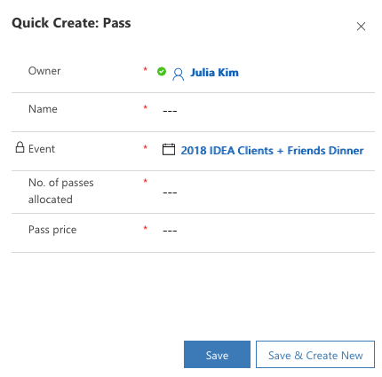
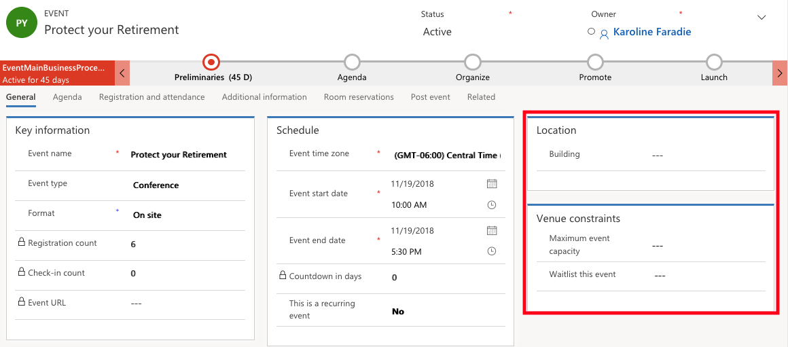

Many organizations participate and organize live events and webinars as
part of their sales and marketing efforts. The logistics of these events
can often be difficult to plan, execute, and follow up on. The event
features within Dynamics 365 for Marketing help you from planning and
budgeting through promotion and publication, attendee registration,
webinar broadcasting, lead generation, analytics and return on investment.  Dynamics 365
for Marketing helps you with everything from track all your planning details, link to related
records (like leads and surveys) and develop a business-process timeline
to guide you through each step of the event planning process.

### Set up an event 

To access events, expand the side navigator bar and select the ellipsis
(...) to open the work area menu. Select **Events** from the work area
menu. The side navigator is updated to show pages available in the
Events work area. Select **Events**

Choose an existing event to edit or delete or choose **+ New** from the
command bar to create a new one.

The **General** tab allows you to view and edit basic event details
including key information, schedule, additional information, timeline,
and event team members. The following sections are available:

-  **Key Information**- Includes the name of your event and other basic details

   -  The **Format** setting is where you can set up your event to include one or more webinars or webinar simulcasts

-  **Additional information**- Provides a basic description and outlines your goals

-  **Timeline** - Here you can build a record of the activities (such as calls, emails, and appointments) you and others do in relation to the event. You can also share notes. Use the links, buttons, and menus at the top of this area to create new items and to search and sort the list

-  **Event team members** - Add links to coworkers and external contacts who are helping you organize the event

The **Agenda** tab includes details about the schedule of sessions
happening during your event. You can find tables for each session, each
external track is a collection of related, non-conflicting sessions
likely would be of interest to the same audience, speaker engagements
and a list of people who will be speaking at the event, as well as
sponsors who are sponsoring the event

The **Registration and attendance** tab allows you to view and create
each type of pass you will provide for the event and view some analytics
about them.

The **Additional Information** tab shows the expected outcome and the
primary goal of the event. You can view and record budget details for
your event, and see any internal or external team members assigned to
the specified event.

The **Post-event** tab allows you to view and create surveys related to
your event. Users typically use this to collect opinions from attendees
about how the event went. A second table provides links to individual
survey responses.

The **Related** tab includes additional information related to the
event.

After you set up an event record, then set up your event team, venues,
event passes and manage speakers and sessions, which we will cover later
in this unit.

### Create an event team

You can set up a database of people who are available to help with your
events. This allows you to add your coworkers and external contacts who
will be helping organize the event as team members. By doing this, you
can easily see who to call and find their contact information as needed.

To add team members to an event, the user/contact must first be added to
the Event Team Members section

1. Go to **Events** > **Event** > **Event Team Members**
2. Click **+ New** to add a new user/contact

When you create a new team member record, you'll be able to choose whether to associate it either with a user or a contact. Users are people who work for your organization and have a Dynamics 365 license. Contacts come from your contact database, which will include customers, potential customers, suppliers, partners.

3. After you add a user/contact to the **Event team Members** section, you will then be able to select them on a specific event. Go to **Events** > **Event** > **Events** and open the appropriate event.
4. On the Additional information tab of the event, there is an **Event** **team members** section. Select the ellipsis then select **Add Existing Event Team Member**. Search for the specific person, select their name, and then click **Add**.

### Set up sessions, including internal and external tracks

An event session represents a subdivision of things happening at your event. Each session can be a seminar or keynote, or anything that you would
like to represent as a session.

There are two track types -- internal and external.

- **Internal tracks** can be used during the planning phase to group sessions along organization lines, such as team resources or required equipment.
- **External tracks** are used to group sessions by content or audience and to enable ticketing and registration. They are published on customer-facing platforms, such as event portals and mobile apps. You can set up a pass type for each relevant external track, as needed. In most cases you would not set up passes for internal tracks.

To add sessions to an event:

1. Go to **Events > Event > Events** and open the appropriate event
2. On the **Agenda tab**, you will find the Sessions and Session Tracks sections
3. Each session is associated with a specific event and speaker and includes scheduling details
4. For each session you can set it up to be either an **internal** or **external track**

### Set up speakers

Events allow users to track information related to the speakers of your events including contact details and biographical details, published to the event portal for attendees to review. You can also view the history of the speakers' engagement, if any records are associated.

Speakers can be set up in advance of an event being created. Go to **Events > Participants > Speakers**. This shows a list all speakers who are available for previous, current, or future events. Click **+ New** to add a new speaker and fill in the required details.

To add speakers to an event:

1. Go to **Events > Event > Events** and open the appropriate event. On the Agenda tab, you will find the Speaker Engagements section. Click **+ Add New Speaker Engagement**.
1. In the **Speaker field,** you will be able to select a speaker previously created or you can click **+ New** to create a new speaker from the Agenda tab of the event record.
1. Each speaker record can include a photo, contact details, and biographical details you can publish to the event portal for attendees to review. It also includes a record of all speaking engagements and sessions where the speaker has presented or will present.

### Create event passes

Event passes are tickets you can sell or give away to grant access to your event or various sessions and session tracks. Setting up passes is optional and not required.

To add an event pass:

1. Go to **Events > Event > Events** and open the appropriate event.
2. If the **Registration & Attendance** tab, you will find the passes section where you can add a new pass. You can assign a category, price, number of tickets, and other details. You can also assign a session track for the pass to grant access to all the sessions in that track.

- For a simple event, usually can set up one pass type to grant access to all sessions for all types of attendees.
- For a complex event, you can set up passes for each of several session tracks and require specific pass types for accessing certain areas of the venue.

3. When setting up a pass, pay attention to the Passes Allocated field, where you set the number of passes available, and its related fields: Passes Sold and Passes Remaining. Each time a pass is granted to an attendee, the passes sold number automatically increases and the passes remaining number decreases. When passes remaining reaches zero, the pass will be shown on the portal as \"sold out\" and will no longer be available for purchase by further attendees.

4. You can either manually map each event registration to one or more pass types or attendees can register for the passes they want while registering on the event portal. For each assigned pass, Dynamics 365 generates a unique QR code you can print onto a physical badge allowing event personnel to quickly scan on entrance and confirm eligibility and record attendance.

5. On a specific event, under Registration & Attendance, you can also see the overview of the pass allocation, such as pass price, number of passes allocated, number of passes sold, and number of passes left to sell.

### Set up venues and manage sponsors

In **Venues**, you can set up a physical or virtual location where you hold an event or session. You can enter important details of the venue including name, location, facilities, capacity, sub-venues. You can also assign events and sessions as needed. Then, set up buildings, rooms, and/or layouts and associate them with a venue, if required.

To add venues, go to **Events > Venue Management**, from there you will notice Venues, Buildings, Rooms, and Layouts sub-menus. In this area, you can set up various types of venue entities to construct a hierarchical model of your event location.

Use the following entities to model your venues:

- **Events > Venue Management > Venues:** Here you can see all types of venues available to be assigned to sessions. This list includes standalone venues (which are only listed here), but also buildings and rooms which also exist as independent entities. Typically, users would set up a venue record to represent a simple venue with no sub-venues but set up a building record with associated room records for events having concurrent sessions.
-**Events > Venue Management > Buildings:** Buildings represent free-standing structures that might or might not be divided into rooms. Each building you see or create here is considered a type of venue, and is therefore also listed on the Venues page.
**Events > Venue Management > Rooms:** Rooms represent subdivisions of buildings, and each must be assigned to a building record stored in the system. 
**Events > Venue Management > Layouts:** During an event, you might use a single room to host several types of sessions, each of which might require a different arrangement of chairs and other facilities. Each layout must be associated with a room, but you can set up any number of layouts for each room.

To add a **Venue** to an event, go to **Events > Event > Events** and select the appropriate event. On the **General tab**, locate the **Location** section and select the **Building** associated with your
venue.

### Manage vendors, logistics, and accommodations

In Dynamics 365 for Marketing, you can also set up and manage event vendors, event logistics, and even set up hotel room accommodations and room reservations. You can enter information that can help attendees from farther away plan accommodations for their trip. You can register local hotels, record their contact information, allocate sets of rooms made available to attendees, and take reservations for the allocated
rooms. You can also register airlines, car rentals, food caterers, and more in this area.

Use the following entities to record and provide logistics services for attendees:

1. **Events > Logistics > Event Vendors:** Enter and view event-vendor details here. Each event vendor must be associated with an account (external company) already recorded in your system. You can assign each vendor a type, such as hotel group, airline, or car rental.

2. **Events > Logistics > Hotels:** Enter and view details about specific hotel properties here. You can associate each hotel record with a contact from your database, so you\'ll know who to call if you have any questions for the hotel. You can associate the hotel record with a hotel group (event vendor) if the property is part of a group.

3. **Events > Logistics > Hotel Room Allocations**: Room allocations represent a block of rooms the hotel has agreed to make available during your event. Each room allocation record specifies the number of rooms allocated and the type of rooms they are (single, double, or suite). Each hotel room allocation must be associated with a hotel registered in your database.

4. **Events > Logistics > Hotel Room Reservations:** Here you can reserve rooms for attendees from among the rooms you have allocated. For more information, see [Book hotel rooms for staff, speakers, and guest](https://docs.microsoft.com/dynamics365/customer-engagement/marketing/invite-register-house-event-attendees#book-hotel-rooms-for-staff-speakers-and-guests).

### Create event invitations, banners, and social media posts

After your event is planned and set up, users can start promoting the event using tools available in Dynamics 365 for Marketing. You can create a marketing email message that includes an event call-to-action button taking recipients directly to your event portal as well as create banners and social media posts.

1. Create a marketing email message that includes an event element in its design. The event element creates a call-to-action button in your message taking message recipients directly to your event portal. For more information, see [Prepare marketing email messages](https://docs.microsoft.com/dynamics365/customer-engagement/marketing/prepare-marketing-emails) and [Event elements](https://docs.microsoft.com/dynamics365/customer-engagement/marketing/content-blocks-reference#marketing-page-event-and-survey-elements).

2. Set up a customer journey that sends your marketing email message to all the relevant contacts, registers message interactions, and reacts to event registrations.

3. After you successfully execute your customer journey, you can create corresponding banners and social media posts to promote your event. Users should include a link to your event portal in each post and use the Dynamics 365 for Marketing redirect-URL feature to create short URLs registering clicks and instantly forwarding contacts to your event portal. Creating different redirect URL for each social-media site, banner, or message enables you to collect   separate click results for each URL, so you can evaluate the success of each channel or initiative.
