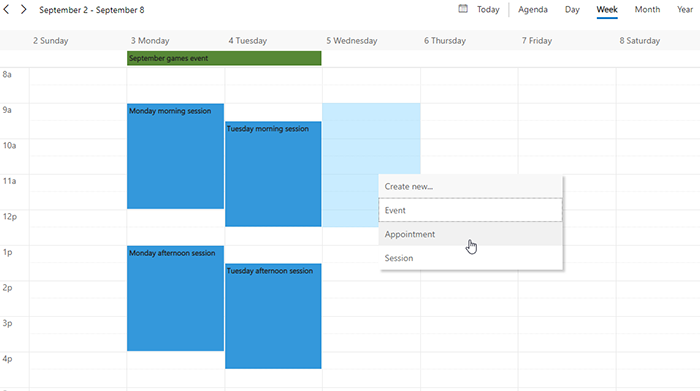

The marketing calendar lets marketers visualize a variety of marketing activities that have a start and end date. It also provides a quick
overview of all scheduled activities and events so everyone on your team has the same information and can plan effective, timely campaigns
through various channels.

The Marketing Calendar in Microsoft Dynamics 365 for Marketing provides an intuitive interface by showing campaign activities in a timeline
view. It helps marketing managers get an overview of all present, past, and future campaign activities and provides a visual comparison to
similar campaigns.

The marketing calendar control lets marketers visualize a variety of marketing activities that have a start and end date. Effectively,
marketers can view many elements of a campaign (such as events) on the same calendar, providing an easy overview.

There are two basic types of marketing calendars:

-  **Entity-level calendars** - Entity-level calendars appear when you first open an entity from the main navigator, such as events, customer journeys, or the main marketing calendar. Here you to can switch between the calendar view and list view. You'll see relevant records plotted on the calendar according to their scheduled dates, and you can open any listed record. This type of calendar can show several types of entities and provides a  system view selector for filtering the records shown.

-  **Form-level calendars** - Form-level calendars appear while you are viewing a specific record, such as a specific event. They are integrated into the form view. These might appear in their own tab on the form, or as a section on a tab with other sections of settings also available. This type of calendar can only show and create records of one type of entity, which does not provide a system-view selector. These calendars are often configured to show information that is related to the specific record where they appear.

To access the marketing calendar, go to the entities that you want to see in the **Marketing Calendar** view such as **Customer Journeys** and **Events**. On the command bar at the top, select the ellipsis **(...)** , click **Show As** and select your **CalendarControlName**.

