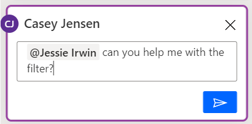
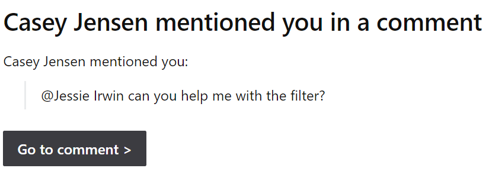
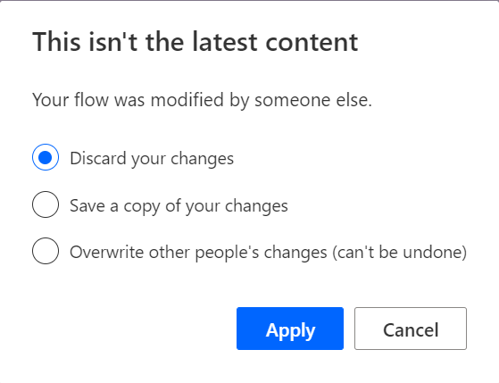

By using an @mention, you can tag other co-owners of the flow. This feature can be a great way to ask for help or to request feedback.

> [!div class="mx-imgBorder"]
> 

Additionally, you can tag multiple users in a single comment or reply. They'll be notified of each mention by a separate email. Keep that in mind if you plan to mention them in multiple comments.

> [!div class="mx-imgBorder"]
> 

When the receiving user selects the **Go to comment** button, the cloud flow designer will load, and the comment will be highlighted. If the user receives multiple mentions, each **Go to comment** that they select will open the flow in a new browser tab.

## Refresh comments

Comments are loaded in the flow designer when the edit session starts for a flow. Any new comments that you add will be visible immediately. Comments that are added by other users while your session is in progress won't be visible immediately. You should close and reopen the edit session to refresh the **Comments** pane.

## Copresence

As you start collaborating with other flow owners by using comments, multiple users can edit the same flow simultaneously. As a result, you'll know in near real-time other users who are currently editing the flow. You can access the list of users who are editing the flow in the upper-right corner of the screen next to the **Comments** button.

> [!div class="mx-imgBorder"]
> 

The list is updated periodically as users open and close their edit sessions.

The flow designer allows one primary editor and multiple users to view and comment on a flow. It's up to the users to self-select who is the primary editor, which is determined by who saves the flow first. After a user has saved the flow, subsequent attempts to save by another user will result in the options to save a copy, discard changes, or overwrite, as shown in the following image.

> [!div class="mx-imgBorder"]
> 

Discarding your changes is the safest option, but it will result in the loss of your changes. Selecting **Save a copy** can be helpful if you've made numerous changes and you don't want to lose them. After saving a copy, you can integrate your changes into the original flow later. In some cases, you can copy and paste your changes from the saved copy into the original flow. The main negative of saving a copy is if it's done frequently and isn't cleaned up. As a result, you could have many extra copies cluttering your environment. Use the **Overwrite** button with caution because all other users' changes will be lost. Ideally, you should use the list of users who are currently editing the flow to contact them and coordinate a resolution.

The best option is to coordinate ahead of time and avoid conflicting saves. Often, teams will use work item assignments to designate an owner of a change and then assign all work items for the same flow to the same user. Commenting on a flow isn't considered a conflicting save. That is, one can work while others can comment (though the comments won't be immediately visible to others).

Co-owners of flows can also agree if they're responding to a mention in a comment from another user in a flow. They're only viewing and not editing.

Using comments and copresence can help you build flows as a team and solve more complex automation challenges by using team members' strengths.
