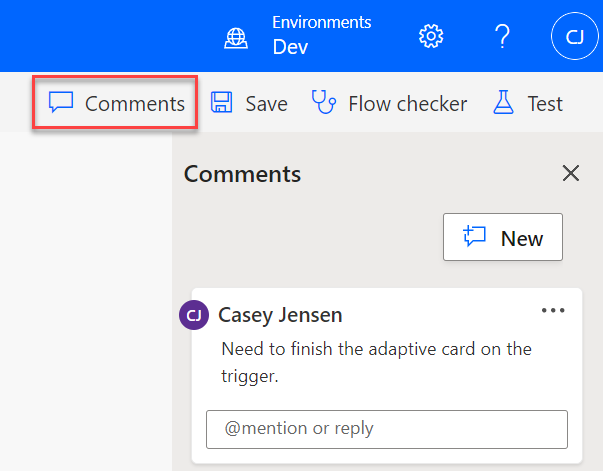
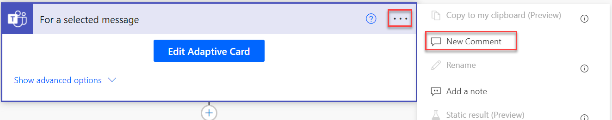
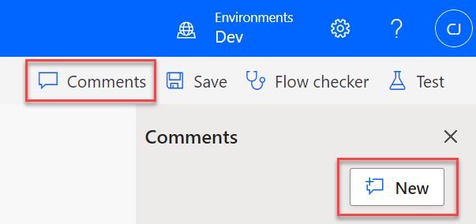
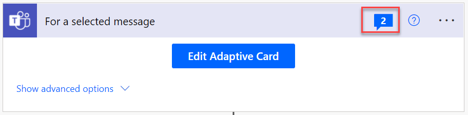
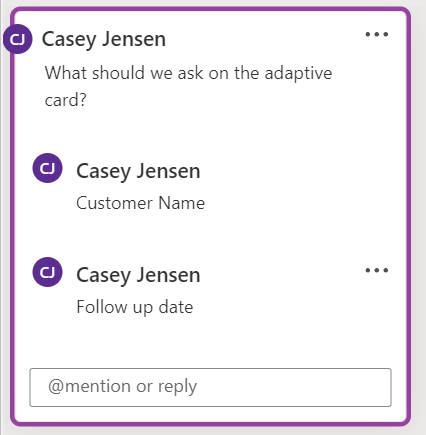
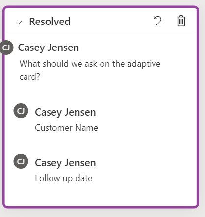
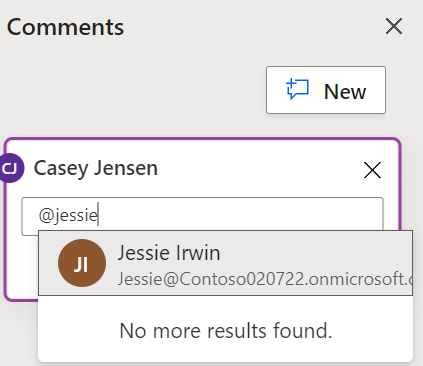
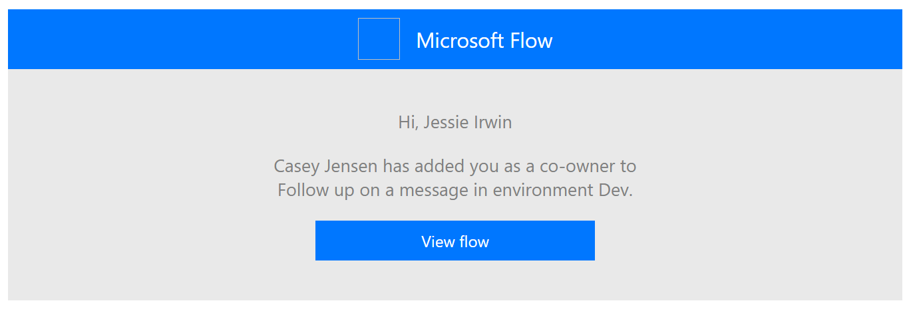
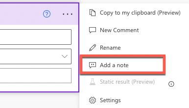
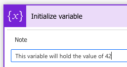

You can use comments when creating and maintaining cloud flows to improve documentation and collaboration.

> [!div class="mx-imgBorder"]
> 

Key uses of comments include:

- Document your flow.

- Use comments as to-do items to track remaining work.

- Collaborate with other users.

- Use threads to keep related comments together.

- Resolve comments and save them for future reference.

The following video demonstrates the basics of how comments work in cloud flows.

> [!VIDEO https://www.microsoft.com/videoplayer/embed/RE4QTFv]

## Get started with comments

The comment feature is enabled for cloud flows that are edited in Microsoft Power Platform environments that have Microsoft Dataverse set up. Your cloud flow doesn't need to be in a Dataverse solution or use Dataverse connector actions. You can use Dataverse to store the comments. If you're using Dataverse solutions, you can only add comments to cloud flows in unmanaged solutions, which typically happen in the development environments.

After you've saved your flow the first time, you can start adding comments from the trigger or any action step in the cloud flow.

> [!div class="mx-imgBorder"]
> 

Additionally, you can open the **Comments** pane to add a comment. The comment will be associated with the currently selected trigger or action when it's added from the **Comments** pane.

> [!div class="mx-imgBorder"]
> 

In the upper-right corner of the step header, a comment icon will show which steps in the flow have comments and the number of comments on that step.

> [!div class="mx-imgBorder"]
> 

The comment icon doesn't show for control actions such as condition, switch, and scope. However, if you select a comment in the **Comments** pane, the associated step in the flow will be expanded and selected. This feature allows you to review the context of the comment.

As comments are added, they're displayed in the **Comments** pane in the order that they were added, oldest to newest. You can add multiple comments on each step, or you can reply to an existing comment to start a thread of related comments.

> [!div class="mx-imgBorder"]
> 

You can edit, resolve, or delete comments, but you can only edit or delete replies to comments. Resolving a comment will mark it as resolved, and then no one will be able to make further edits or replies. Resolving is a good way to retain some history on the cloud flow while tracking what remains outstanding. The following screenshot shows a resolved comment.

> [!div class="mx-imgBorder"]
> 

## Collaborate with others

You can use comments to collaborate with other users, which will allow you to get help or seek input on the flow. Any user who is a co-owner of a cloud flow can view and add comments. You can @mention a user in a comment or reply to notify them of your comment.

> [!div class="mx-imgBorder"]
> 

You can @mention any existing co-owner. If the cloud flow is in a Dataverse solution, you need to add users manually as co-owners before you can @mention them. For non-solution cloud flows, it will prompt you to **Share and notify**.

> [!div class="mx-imgBorder"]
> 

> [!Important]
> You should only add trusted users who you want to have full access to your cloud flow as a co-owner.

The user whom you mentioned will receive an email inviting them to view the flow.

> [!div class="mx-imgBorder"]
> 

## Notes and comments

You might already be familiar with the concept of notes that you can add to any step in a flow, as shown in the following image.

> [!div class="mx-imgBorder"]
> 

> [!div class="mx-imgBorder"]
> 

The primary objective of the notes is to add a description to the step, which helps clarify the step's purpose and document complex expressions.

Comments extend this concept to enable multiple comments and collaboration. You can also list all comments together in the **Comments** pane without having to open each step in the flow.

In the rest of this module, you'll explore more details on how to use comments in your cloud flow to enhance your productivity.
