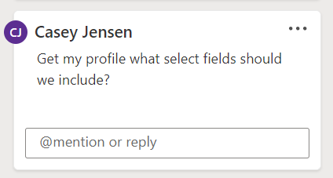
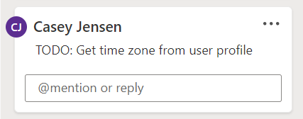
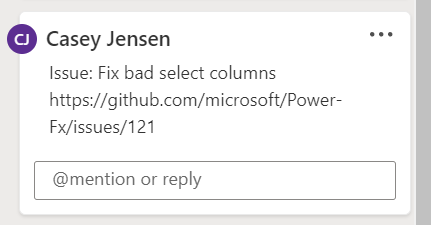
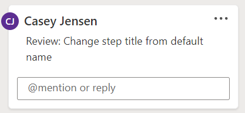

Cloud flow comments are designed to help you be more productive when building flows. You’re not limited to a right or wrong way for using them. Give comments a try to discover what works best for you. In this article, you'll explore different methods for using comments with your cloud flows.

## Include the step title

You can select a comment in the **Comments** pane, and it will highlight the step. However, if you have numerous comments and are looking at the **Comments** pane list, if the comment has the step title, it can simplify your task of corelating with the step that it belongs to. In the following example, **Get my profile** (the title of the step that's being commented on) was included at the beginning to give context.

> [!div class="mx-imgBorder"]
> 

## Informal to-do tracking

As you start building your flow, you might not necessarily include all steps at the beginning; instead, you might choose to build your flow incrementally. You can also add steps without filling in all options to set up the step. Use comments to track what needs to be done. You can prefix the comment with something like **TODO:** to make it stand out from other comments.

> [!div class="mx-imgBorder"]
> 

Then, you can use these prefixes to manage your work. As you complete the tasks, you can resolve or delete the related comment.

## Tie comments to your work item tracking

If you're using GitHub issues or Microsoft Azure DevOps work items to track your work, you can include the work item link in the comments. That way, someone can look up the details.

> [!div class="mx-imgBorder"]
> 

## Conduct flow reviews

A great way to improve the quality of the flows that you and your team build is to conduct flow reviews. Flow reviews are done by having others look at your flow and provide feedback. You can use comments to record feedback during the review process. You could prefix comments with **Review:** to make them stand out.

> [!div class="mx-imgBorder"]
> 

## Recognize when not to use comments

While comments are flexible, you'll occasionally need to recognize when you should switch from comments to an email, a meeting, a link to a wiki page, or some other medium to be more productive. For example, you can create a long comment that's difficult to read in the **Comments** pane, and you could do the same for a comment that generates numerous replies. An email or a quick chat might be more productive. Often, pictures or screenshots can explain a comment, but flow comments don't allow you to include pictures. However, you can put your picture in a site, such as SharePoint, and then include a link in the comment.

Notes are more appropriate if you want to document a specific technique that's used in the step. For example, writing the formula that's used in the step as a note could be helpful, especially when someone wants to understand the flow process, because they don't have to drill into the step for details. Doing the same in the **Comments** pane can be distracting.

These ideas are only a few to help get you started. Discuss these ideas with your team and consider what might work best with how you build your flows.
