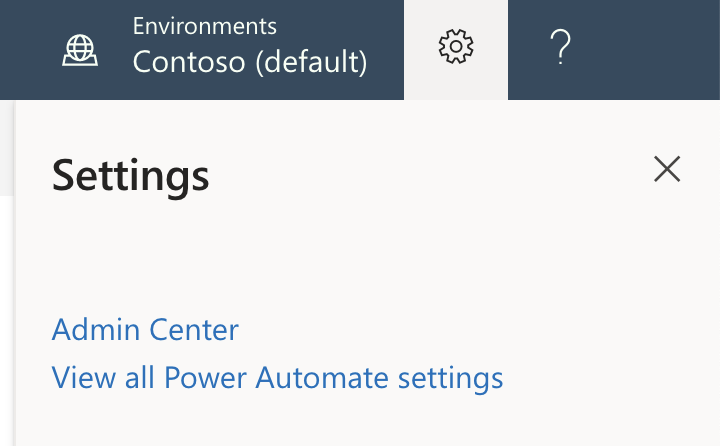

Welcome to the Admin center! The Admin center is the central location where 
tenant admins and environment admins manage an organization's data policies 
and environments. Any changes that you make in the Admin center are immediately 
available to users in the organization.

In this module, you'll learn how to:

- Import and export flows.
- Share flows.
- Monitor flows.

## Open the Admin center
There are two ways to open the Admin center.

### Option 1: Power Automate settings

1. Go to [Power Automate](https://flow.microsoft.com), and sign in by using your organizational account.
1. Select the **Settings** button (the gear symbol), and then select **Admin Center** on the menu.

    

    The Admin center is opened.

### Option 2: Open the admin center directly

- Go directly to the [Admin center](https://admin.flow.microsoft.com), and sign in by using your work account.

## Environments

An *environment* is a space where you can store, manage, and share your organization's 
business data, apps, and flows. It also serves as a container to separate apps that might 
have different roles, security requirements, or target audiences.

The way that you use environments depends on your organization and the apps that you're 
trying to build. Here are some examples:

- You can create separate environments to group the test and production versions of your apps.
- You can create separate environments that correspond to specific teams or departments in your company. Each environment holds the relevant data and apps for each team/department.
- You can create separate environments for different global branches of your company.
- You can build all your apps in a single environment.

## Data policies

When you use Power Automate, the data is automatically protected with whatever security 
roles your organization already has in place. It isn't possible to use Power Automate to 
get access to information that the user doesn't already have access to in the organization. 
Some organizations may want to add an additional, optional layer of security that can 
proactively block flows that violate certain policies.
