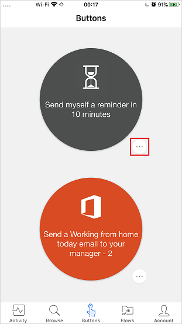
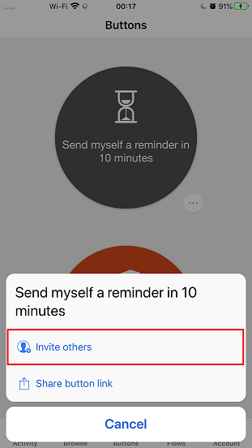
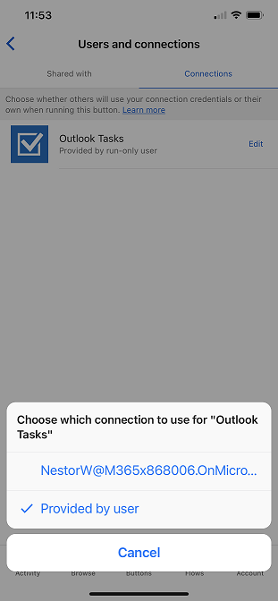
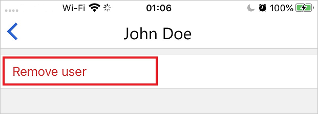

In the Microsoft Flow mobile app, you can share button flows with other users or groups in your organization. The users or groups that you share a button with can then run it the same way they run their own buttons.

You can also share a link to buttons that another person shared with you.

You can stop sharing your buttons at any time.

The screenshots in this unit were taken on a Google Android device. If you're using an Apple iPhone, what you see might differ, but the functionality is the same.

## Prerequisites

To share buttons, you need:

* An account that has access to [Microsoft Flow](https://flow.microsoft.com).
* A flow to share.
* A mobile device that has the Microsoft Flow mobile app for [Android](https://aka.ms/flowmobiledocsandroid), [Apple iOS](https://aka.ms/flowmobiledocsios), or [Windows Phone](https://aka.ms/flowmobilewindows).
* A person or group in your organization to share your button with.

## Share a button

You share a button by using the **Buttons** tab of the Microsoft Flow mobile app.

1. Start the Microsoft Flow mobile app.
1. On the **Buttons** tab, select the person symbol next to the button that you want to share.

    

1. On the **Button users** page, select **Invite others**.

    

1. Search for and select the person or group that you want to share the button with.

    

1. On the **Invite others** page, select **Send**.

    

1. On the page that states that the button sharing action was successful, select **Done**.

    

## Require users to use their own connections

When you share a button with other people, you can either let them use all the connections that the button uses or require that they use their own connections. Follow these steps to require the people that you share your button with to use their own connections.

> [!NOTE]
> If you let other people use your connections, they can't access the credentials in your connection. They also can't reuse those connections in any other flow.

1. On the page that appears immediately after you share a button, select **Manage connections**.
1. Select **Edit** for the button that you want to manage.
1. Select **Provided by user** or your email address to specify whose connections must be used in the shared button.

    

    You can view or change your selection at any time.

    1. On the **Flows** tab, select the flow that you shared.
    1. On the **Users and connections** page, on the **Connections** tab, select **Edit** for the button that you want to manage.

    

## View the list of button users

You can view all users or groups that a button is shared with by following these steps.

1. On the **Buttons** tab, select the person symbol next to the button for the flow that you want to view.

    

1. On the **Button users** page, view all groups or users that the button is shared with.

    

## Stop sharing a button

You can stop sharing a button by following these steps.

1. On the **Buttons** tab, select the person symbol next to the button that you no longer want to share.

    

1. On the **Button users** page, select the user or group that you want to stop sharing the button with.

    

1. On the user's page, select **Remove user**.

    

1. Wait for the removal action to be finished. The list on the **Button users** page is refreshed, and the user or group that you removed is no longer listed.

    

## Monitor the run history

You can view the whole run history, even for runs started by a person that a button is shared with.

1. Start the Microsoft Flow mobile app.
1. Select the **Activity** tab to view the run history.

## Use shared buttons

Before you can run a button that someone has shared with you, you must add it to your **Buttons** tab from the **Add buttons** page.

1. On the **Buttons** tab, select **Get more** (or the **New buttons are available** banner if it appears).

    

1. Select the button to use.

    The button is immediately added to the **Buttons** tab. You can then run the button from the **Buttons** tab, just like any other button that's listed there.

    

## Re-share a button

You can share a link to a button that has been shared with you.

1. On the **Buttons** tab, select the **More commands** button (**...**) next to the button that you want to share.

    

1. Select **Share button link**.

    

1. Select the app that you want to use to share the button.
1. Follow the steps for sending a button to a person that you want to share it with.

## Stop using a shared button

If you no longer want to use a button that was shared with you, you can remove it.

1. On the **Buttons** tab, select the **More commands** button (**...**) next to the button that you no longer want to use.

    

1. Select **Remove**.

> [!NOTE]
> After you remove a shared button, you can add it back by selecting **Get more** on the **Buttons** tab.
