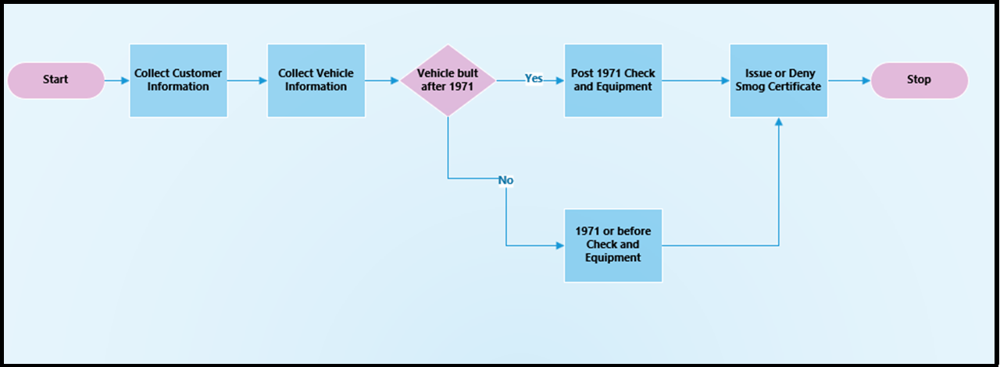

In module two, we created a simple, two-step linear Business Process
Flow. Some business processes are simple step-by-step sequential
workflows, but many require branching logic requiring one set of stages
for one condition and another set of stages for an alternative
condition. Think of this as a simple "if then else" statement.

Confused? Here's an easy way to conceptualize how logical branching can
be used within a Business Process Flow. Logical branching requires a
decision point and a test of a value or condition. If a condition
matches a certain value, then the Business Process Flows goes through
one branch with one or many stages, if not, then the Business Process
Flow goes through another set of one or many stages. Sometimes the two
logical paths will meet at a rendezvous point and sometimes they will
not. Let's spend some time exploring how you use logical branching in
Business Process Flows.

Branching Logic is useful when you are trying to
model a business process to standardize data collection and improve
process outcomes. Logical branching enables creation of Business Process
Flows that can adapt to different conditions within the same
Business Process Flow instead of having to create and launch many
different Business Process Flows to handle one condition or another.
Let's look at an example.

In the scenario we used in module two, customers come to our fictitious
company, SmogCheckRUS for bi-annual smog checks on their vehicles. In
many jurisdictions, there are different requirements for emission
controls standards and equipment based upon the year of the vehicle
manufacture. It would be useful to be able to model all required
tests within a single Business Process Flow. Let's take a look at how we
can accomplish this using logical branching within a Business Process
Flow.

The diagram below models the branching business logic that we need to
build into our Business Process Flow. Take a look at the diagram and
then we will discuss below.

In the Business Process Flow logical diagram, we see that the smog
equipment and the checks needed are different for vehicles built before
or during 1971 and after 1971. That means we need to add a logical
branch to check the year of the vehicle manufacture and collect
different information and perform different checks on vehicles built
after 1971. We will show you how to build a Business Process Flow to
manage this scenario in the exercise at the end of this module.

Unfortunately, Business Process flows have some limitations on what can
be modeled using logical branching, so let's examine what types of
logical branching cannot be modeled and built in Business Process flows
today.

### Unsupported logical branching and a work-around

Sometimes you will want to model a business process that has multiple
branches and not all branches end up at the same rendezvous stage. This
is not currently allowed in a Business Process Flow. An example of an
unsupported Business Process Flow is shown below.

Notice the decision point around the "Vehicle Service" decision point.
You can see that two of the branches end up at the "Issue or Deny Smog
Certificate" stage [and then the]{.underline} "Collect Payment" while
the top branch skips the "Issue or Deny Smog Certificate Stage" and ends
at the" Collect Payment" stage. This logical model is NOT supported. All
the stages at a decision point must resolve to the same stage without
intermediate stages for some but not other branches.

The root of the problem above is the logic is not modeled properly. The
decision stage is really modeling two If Then Else conditions and not
one. A better way to model this is to add a second decision point as
shown below. The approach shown below [IS]{.underline} supported because
the decision stages are each testing one condition and all resolve to a
single stage.

Study this example so you understand how you can add an additional
logical branch and model Business Process Flows correctly.
