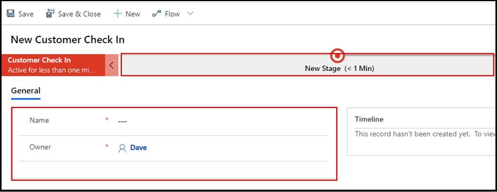

Let's look at the business process flow we created in the exercise for
the previous module, Create an immersive business process flow in Power 
Automate. Review the screenshot below, and you'll notice there is a visual
representation of the process flow and a form under the business process
flow called General with only two fields, Name and Owner.

Wouldn't it be great if you could add additional fields to this form called? 
For example, let's say you want to record the amount of the invoice, record an 
autogenerated invoice number, and add general notes about the service you 
completed for a customer.

It is easy to add additional fields and display them on a form associated 
with an immersive business process flow and we'll show you how in the 
following exercise. As you'll soon learn, these flows are powerful 
and you are only limited by your imagination and skill. Let's get started.

