We assume that you have completed the exercise to create an immersive 
business process flow in the previous module of this learning path. If
you have not, return to the previous module and complete the exercises within
it prior to attempting the exercises in this module.

In this exercise, we'll enhance the business process flow by adding 
a logical branch to determine what test needs to be performed and
what information is required to collect to complete a smog check on a
vehicle based upon the year of the vehicle manufacture. We will add
logic that will provide a different set to of instructions for vehicles
manufactured prior to, or during 1971, versus vehicles manufactured after 1971. 

1. Log into [Power Automate](https://preview.flow.microsoft.com/?azure-portal=true) 
and make sure you are in the same environment you used to create the process flow in 
the previous module.

1. Select **My flows** and then select **Business process flows**.

1. Select the **Edit** button (pencil icon) and open the Customer Check
In business process flow in the business process flow editor.

	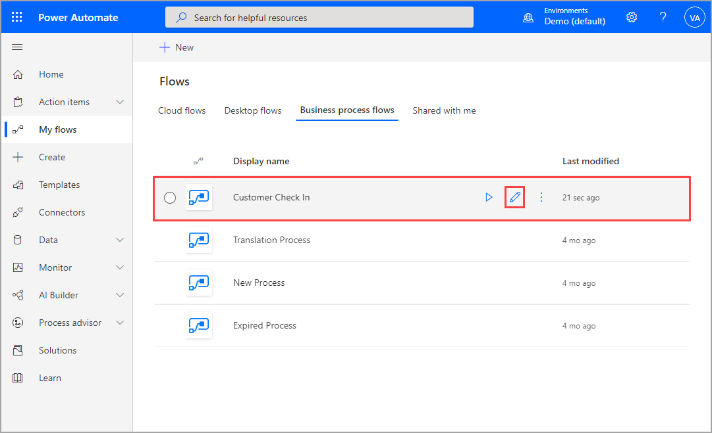

1. Select the Condition Flow control under the components tab and drag
it to the right of the Customer Check in Stage as shown below.

	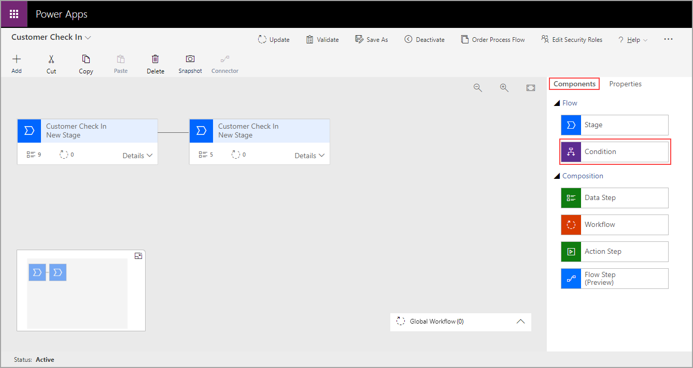

	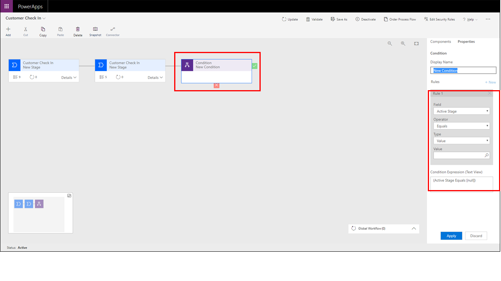

1. Select the Condition component within the editor and enter the following:

	-   Display Name - Manufacture Year Pre or Post 1971
	
	-   Field - Automobile Year
	
	-   Operator - Is greater than
	
	-   Type - Value
	
	-   Value - 1971

	The entries should look like the screenshot below. When complete select
	the **Apply** button.
	
	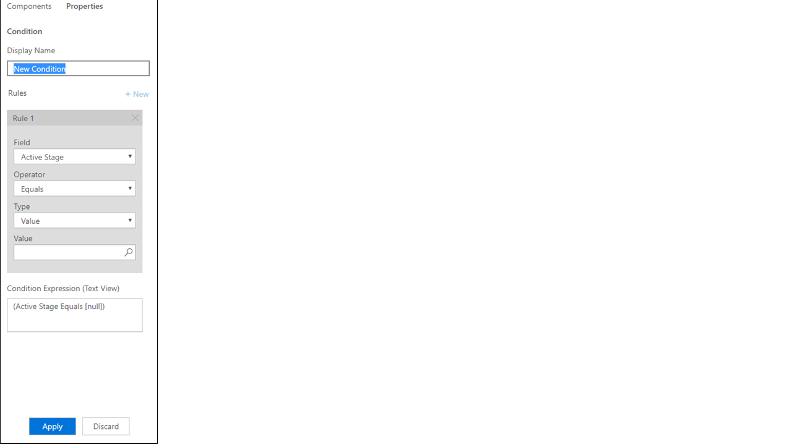

1. Select the **Components** tab and drag a new Stage to the right side
**+** and another to the **+** under the Condition stage as shown below.
Name each of the new stages as shown by selecting each new stage and
typing in the new name.

	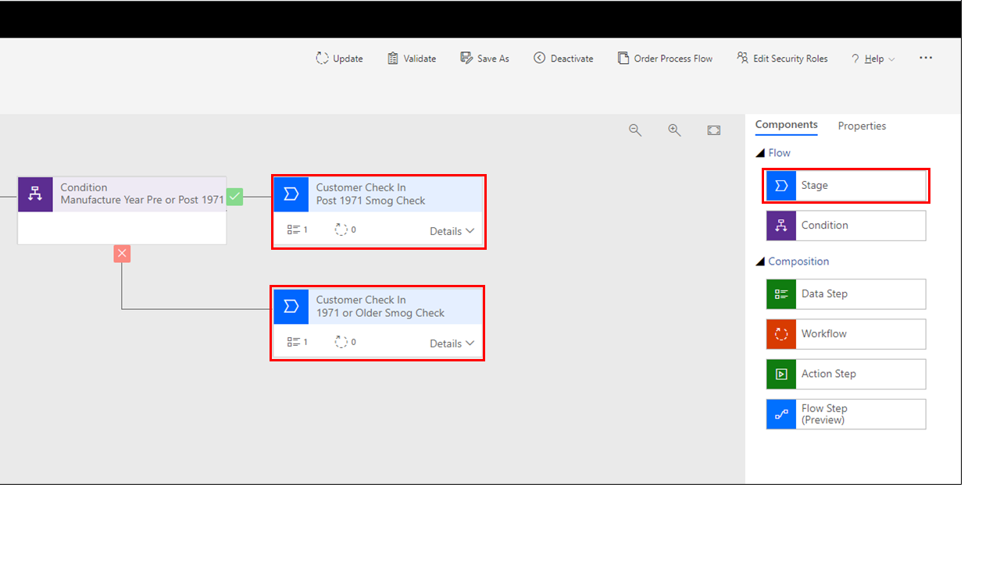

1. Drag another stage to the right of the Customer Check in Post 1971
Smog Check stage as shown below. Rename this last stage as Collect
Payment.

	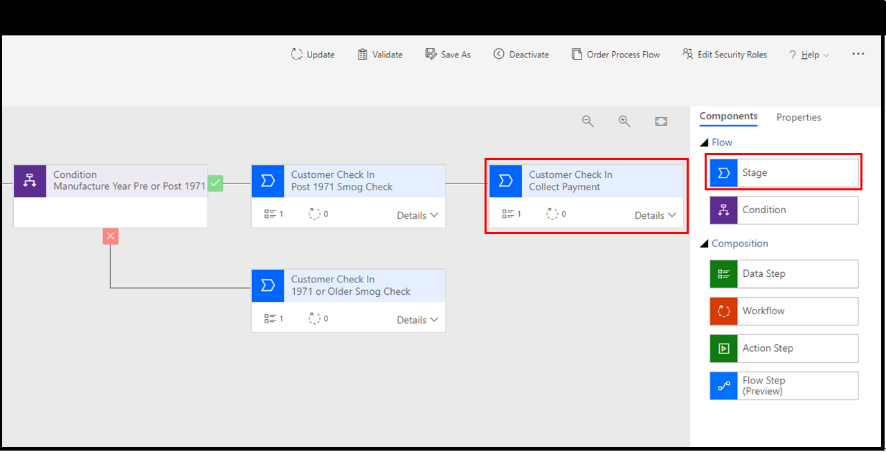

1. Connect the Customer Check In 1971 or Older Smog Check Stage to
the Collect Payment Stage by following the steps below:

	1. Select the Customer Check In 1971 or Older Smog Check Stage.
	
	1. Select **Connector** in the Ribbon and select the **Connect** option.
	
	1. Select the Customer Check In Collect Payment Stage to connect the two stages as shown below.

	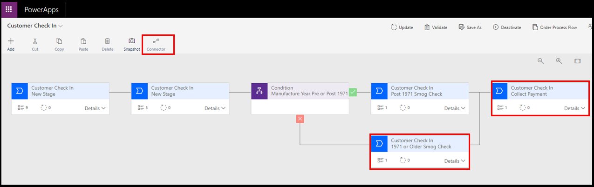

1.  Now let's set up the data we want to collect in each stage that we
	just added. Select the Customer Check In Post 1971 stage and add all of the
	following fields using the **add field and forms** hyperlink on the
	right-hand side of the page.
	
	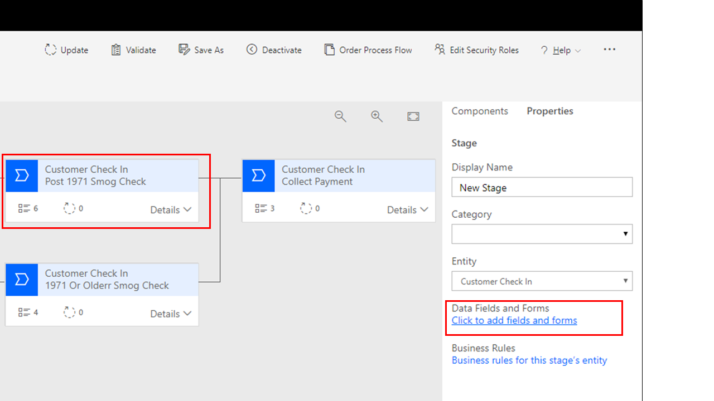
	
1.	Select the **Add Field** button in the ribbon above the fields shown for
	the Customer Check In Entity as shown below and add the following
	fields:
	
	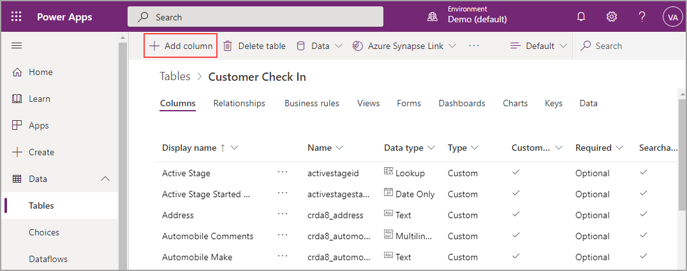
	
	- Smog Pump Intact - Two Option - Set Yes as default
		
	- PVC Valve Intact - Two Option - Set Yes as default
		
	- Aftermarket Exhaust Headers - Two Option - Set No as default
		
	- Comments Pre 1972 - Text Area
		
	- Exhaust Test Performed with Passing Score - Two Option - Set Yes as	default
		
	- HC Reading at 2000 RPM - Floating Number
		
	- O2 Reading 2000 RPM - Floating Number
		
	- CO Reading 2000 RPM - Floating Number
		
	- Original Equipment - Two Option - Set Yes as default
		
	- Comments Post 1972 - Text Area
		
	- Amount - Currency
		
	- Certificate Number - Whole Number
		
	- Payment Method - Create a New Option Set with the following options:
	
		- Cash
			
		- Mastercard
			
		- Visa
			
		- Discover
			
		- Debit Card
			
		- Bit Coin
	
	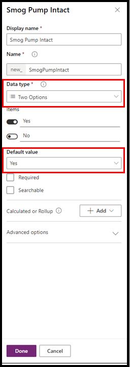
	
	After you create all the new fields, select the **Save Entity** button then
	close the screen and return to the Business Process Flow designer.
	
	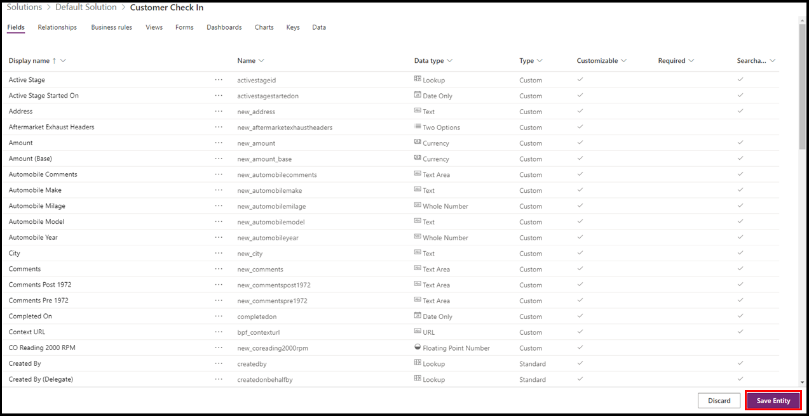
	
Now we will add the fields we created to each stage. Refresh your 
browser and then select the stages below. Add the fields noted for each 
stage as a step under the stage by selecting the details link drop-down 
and then adding in data steps. 

Add a data step for each field within each stage. When you are done, you 
should have a data step under each of the stages shown below.

	Stage - Customer Check In Post 1971 Stage - add the following fields using the add field option	

	- Smog Pump Intact
			
	- PVC Valve Intact
			
	- Aftermarket Exhaust Headers
			
	- Comments Pre 1972

	Stage - Customer Check In 1971 or Older Stage - add the following fields

	- Exhaust Test Performed with Passing Score

	- HC Reading at 2000 RPM

	- O2 Reading 2000 RPM

	- CO Reading 2000 RPM

	- Original Equipment

	- Comments Post 1972

	Stage - Customer Check In Collect Payment Stage - add the following fields

	- Amount

	- Certificate Number

	- Payment Method

When you're done, select the **Update** button in the top ribbon.
Your business process flow should look like the screenshot below.
	
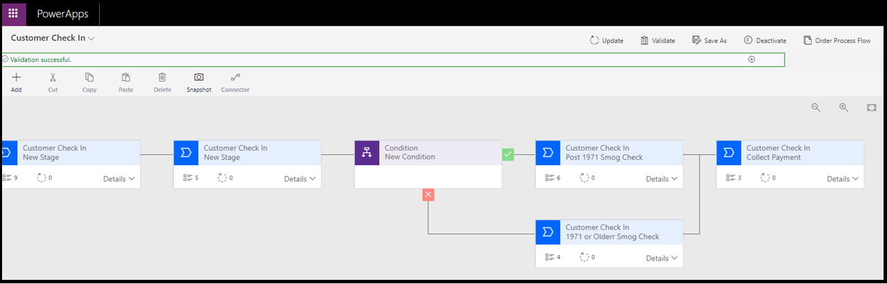

Now we'll test the enhanced business process flow. 

1. Select **My Flows** and then **Business process flows**.

1. Run the Customer Check In flow by selecting the **run**
button (the little triangle button next to the name of the flow).

You can enter in a vehicle with a manufactured date of 1971 or before 
and another after 1971 and you'll notice the smog check info in Stage 3
changes based upon the year of vehicle manufacture. Notice both
reconnect again at the last stage called Collect Payment.
