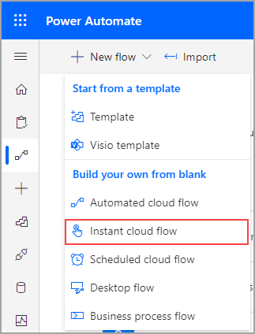
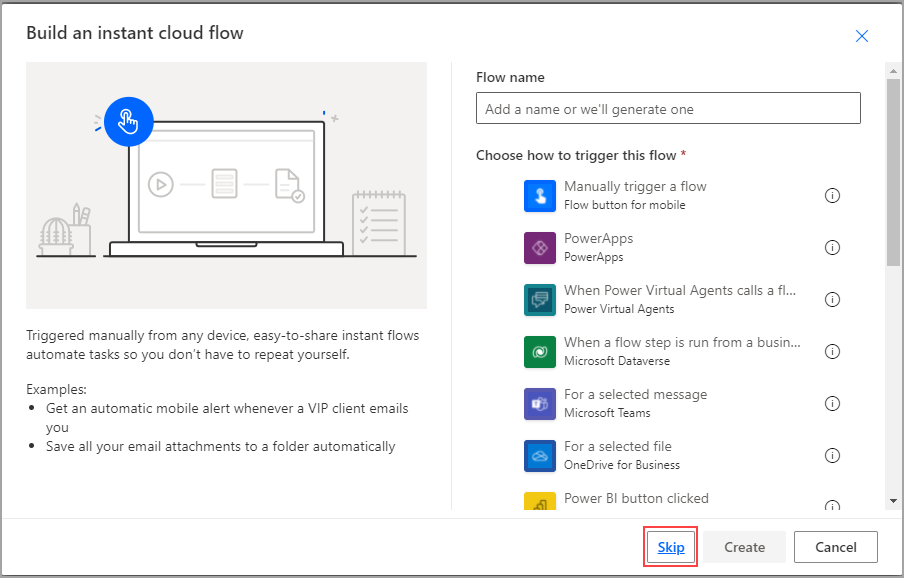
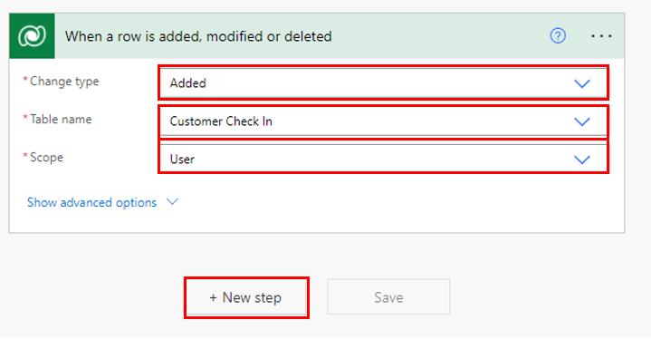
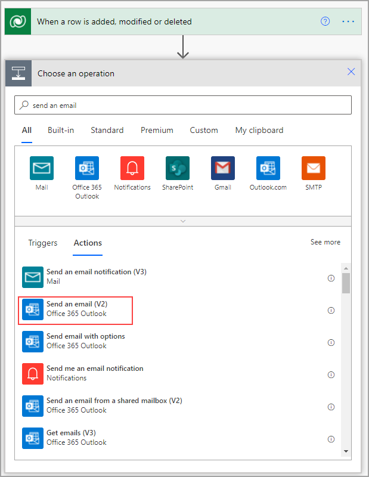
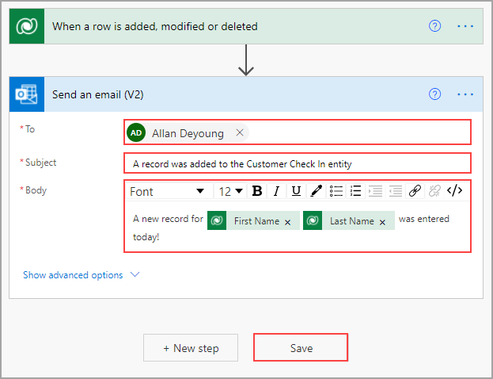
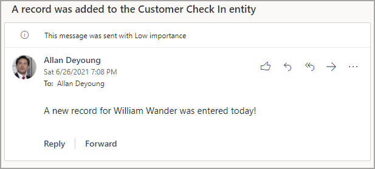

In the previous exercise, you created a business process flow that includes logical
branching for vehicles that were made in 1971 or before and all others that were made in
1972 and beyond. Now, you will enhance that flow by adding a simple instant flow in
Power Automate. You'll create an instant flow that sends an email to
the store manager (you) when a new customer check-in record is created.

1. Sign in to [Power Automate](https://preview.flow.microsoft.com/?azure-portal=true) and select **My flows**.

1. Select **+ New** in the ribbon in the left corner of the screen.

1. Select the **+ Instant-from blank** option, as shown in the following screenshot.

	

1. Select the **Skip** button to open the flow instant designer.

	

1. Enter **Common Data Service** in the connector search dialog box, as shown in the following screenshot.

	

1. Select the Common Data Service connector and the **When a Record is created** 
trigger. Select the **Environment** name that you used in the previous exercises,  
select **Customer Check In** from the **Entity Name** field, select the **User** 
in the **Scope** field, and then select **+ New step**, as shown in the following figure.

	

1. Enter **Send Email** in the actions search box and then select **Send an email notification (V3)**.

	

1. Enter the following information into the **Send Email** action:

	-   **To** - Enter your email address so you receive an email and can see how the instant flow works.

	-   **Subject** - Enter **A record was added to the Customer Check In entity**.

	Select the **First Name** and **Last Name** fields from the list of fields under the Dynamic content option.

	-   **Email Body** - Enter **A new record for** (select the **new_firstname** field and the **new_lastname** field), and then type **was entered today!** 

	

1. Save the flow by selecting **Save** in the top ribbon.

## Run the instant flow

1. Close the instant flow that you created and then select **My flows** and **Business process flows**.

1. Run the **Customer Check In** business process flow.  

1. Enter some values in the first stage fields and then enter a value in the
**Name** field on the main screen (the field is on the **General** form under
the Business process flow diagram) so that values are in the record before you save it. 

1. Save the record. An email will appear in your inbox similar to the one in the following figure.

Congratulations, you have now created an instant flow that works with your business process flow.
