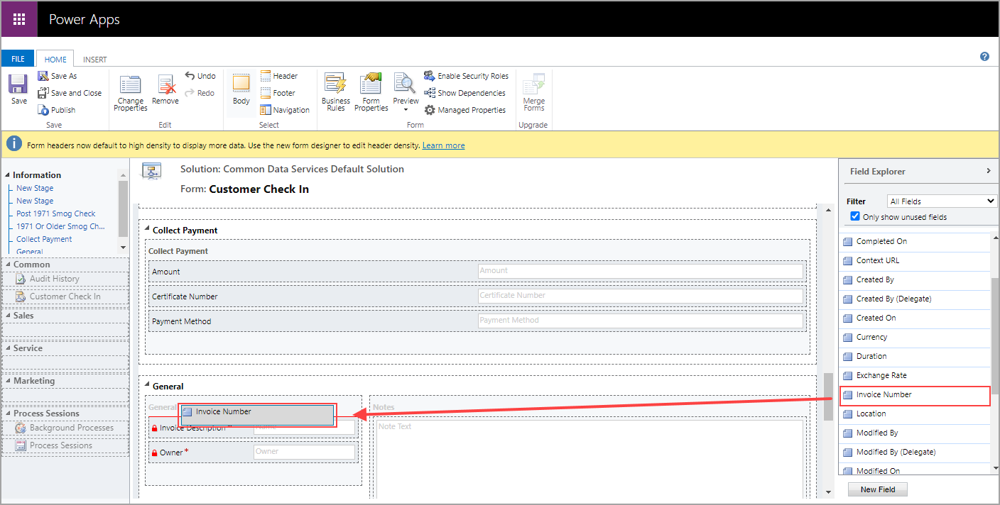

One last enhancement needs to be made before you can complete your business process
flow. Before you begin, quickly review the fields on the main form under the
diagram of your business process flow.

The following screenshot shows a new instance of your business process flow.
Notice that only two fields are shown on the main screen (outlined in red): **Name** and **Owner**.
The name of the record is similar to the title of this record, and the
owner of the record is the current user who created the instance of the
current business process flow. As mentioned previously, you can enhance 
the user experience by ensuring an appropriate number of fields for every 
stage. Now, you will add some fields to make this screen more useful.

## Add fields to the main form

Follow these steps to add fields to the main form.

1. Navigate and sign in to [Power Apps](https://make.powerapps.com/), make sure that you are in the environment
that you have been working in, select **Data**, **Tables**, and then select the appropriate table, in this case **Customer Check In**.

    

1. Start your enhancements by selecting the **+ Add column** button and then adding the following fields.

    

    - **Clerk** - Text

    - **Transaction Date** - Date Only

    - **Location** - Choose **Choice** as the column type and under choice, choose **New choice** and enter the following options:

        - Los Angeles
        - San Francisco
        - San Diego
        - Portland

    - **Invoice Number** - Autonumber - leave the defaults that are provided by Microsoft Dataverse

    - **Service Comments** - Multiline Text

1. After you have added the new fields, save the entity by
selecting the **Save Table** button. Don't skip saving the entity or
your new fields will not be saved with the entity.

   

1. To enhance the main form, select the **Forms** tab on the current screen, as shown in the following figure.

   

1. Select the top main form name, which is a hyperlink to the form
designer (the name of your form might be different). This action will
open the model-driven forms designer.

   

1. Select **Switch to classic** when the new screen opens.

   

1. Scroll down to the **General** section at the bottom of the form.
Double-click the **Name** field, rename the label to **Invoice Description**, and then select the **OK** button.

   

1. Drag the new fields that you previously added in this exercise from the list of fields on the right to the General form area on the left. 

   
 
1. Select the **Save** button and then select the **Publish** button in the ribbon at the top of the form designer.
   
   

1. Close the **Designer** tab in the browser.

1. Go back to the home page of Power Automate. Select **My flows** and
**Business process flows**. Select the **Customer Check In** flow and run
an instance of the flow by selecting the play icon next to the
flow name. It should look like the following screenshot. Add data to the
main form and the stages and then save the record.

   

## Add read-only fields to the form

Your next task is to add a few fields to the main form
from the data that you entered within a few of the stages. You will
make these fields read-only.

1. Navigate and sign in to [Power Apps](https://make.powerapps.com/), make sure that you are in the environment
that you have been working in, select **Data**, **Tables**, and then select the appropriate table, in this case **Customer Check In**.

    

1. Select the **Forms** tab.

   

1. Select the top main form name, which is a hyperlink to the form
designer (the name of your form might be different).

   

1. Select **Switch to classic** when the new screen opens.

   

1. Enhance the main form with some of the data that you collect
within the stages. Clear the **Only show unused fields** option
above the list of fields.

   

1. You should see all the fields that are available within the **Customer Check In**
entity. Drag the following fields from the field panel into the
General section of the form, as shown in the following screenshot.

    - Entry Date

    - First Name

    - Last Name

    - Smog Cert Number

    

1. Double-click the **Entry Date** field that you added and make it
read-only, and then select the **OK** button.

   

1. Do the same for the following fields to also make them read-only.

    - First Name

    - Last Name

    - Smog Cert Number

1. Select the **Save** button in the ribbon and then select **Publish**.

    

1. Close the **Form Designer** tab and return to the business process
flow designer. Double-click the first stage and rename it to **Customer
Info**. Double-click the second stage and rename to **Automobile Info**, as
shown in the following figure. Select the **Update** button in the ribbon so all
the changes are saved and ready to use.

   

1. Close the flow designer screen and refresh your browser. Run the **Customer
Check In** flow to check that all the changes that you made are working properly.
The business process flow should look like the following screenshot.

   

Congratulations, you've created a working business process flow.  
