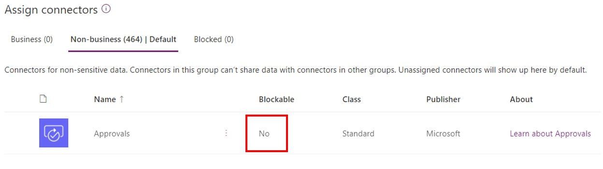
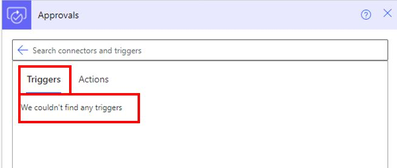
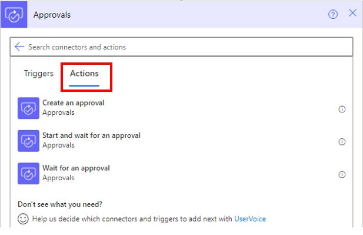

It's important to understand the fundamental information about the Approvals connector, specifically what type of connector it is, whether you can block it in the data loss prevention policy, and if actions and triggers are available for it.

## Assess if the connector is standard or premium

Microsoft Power Automate gives you the flexibility to connect to data or a service by using a connector. Connectors come in two tiers: standard and premium. Approval connectors are part of the standard tier. Standard connectors are part of your Microsoft 365 licenses and no other license is needed. Premium connectors require either a per-flow or a per-user license. For more information on flow licenses, see the links in the Summary unit at the end of this module.

##  Determine if the connector can be blocked

An organization's data is critical to its success. Data needs to be readily available for decision-making, but it also needs to be protected so that it isn't shared with audiences who shouldn't have access to it. To protect data, you can use Power Automate to create and enforce data loss prevention (DLP) policies that define the consumer connectors that specific business data can be shared with.

Connectors can be added to one of the three groups that are available in DLP: **Business**, **Non-Business**, or **Blocked**. The Approvals connector can't be added to the **Blocked** group; it can only be added to **Business** or **Non-Business**.

> [!div class="mx-imgBorder"]
> 

## Decide if the connector can be used as an action or trigger

The Approvals connector doesn't have a trigger option, meaning that approvals can't be the first step in the flow, which is the reason why the flow was initiated.

> [!div class="mx-imgBorder"]
> 

Three actions are available for the Approvals connector: **Create an approval**, **Start and wait for an approval**, and **Wait for an approval**.

> [!div class="mx-imgBorder"]
> 
