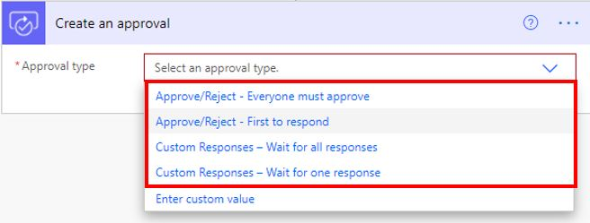
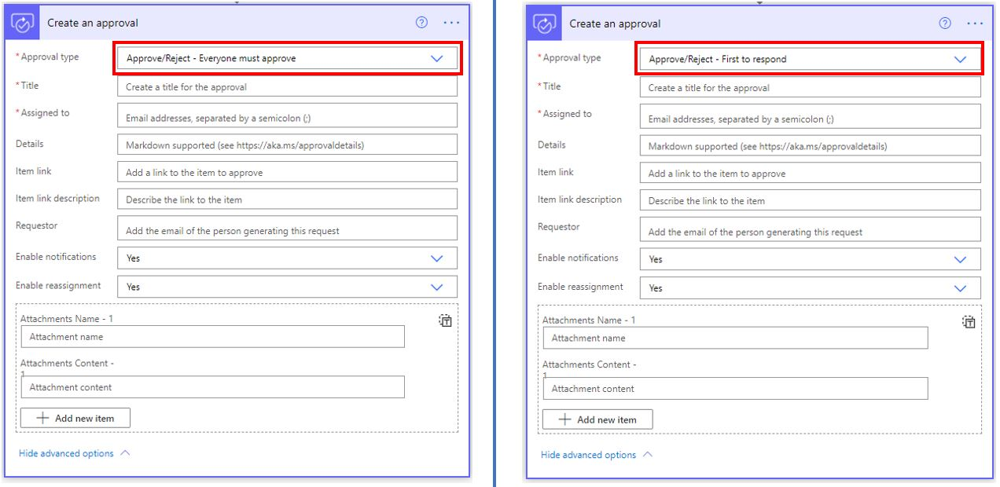
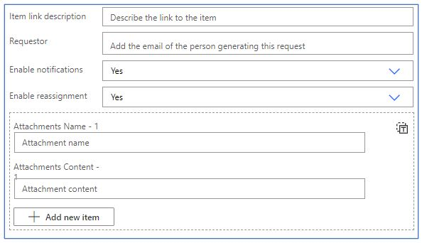
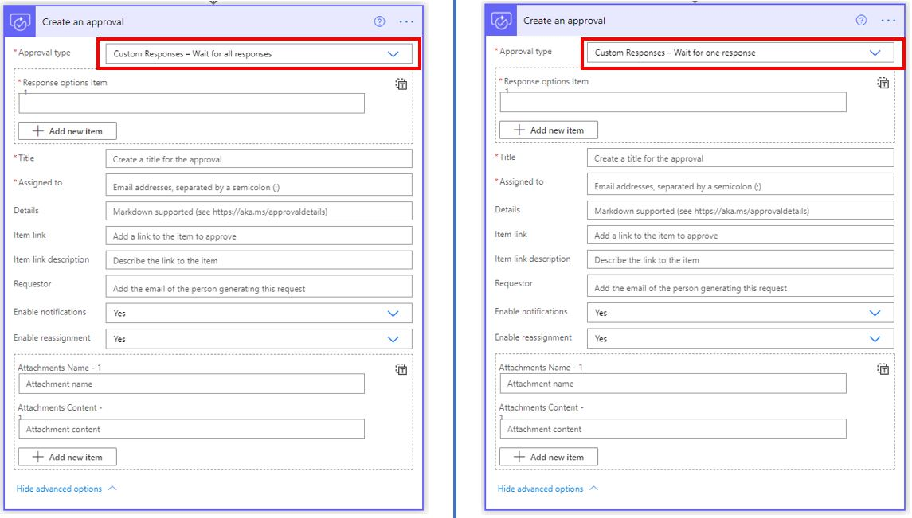
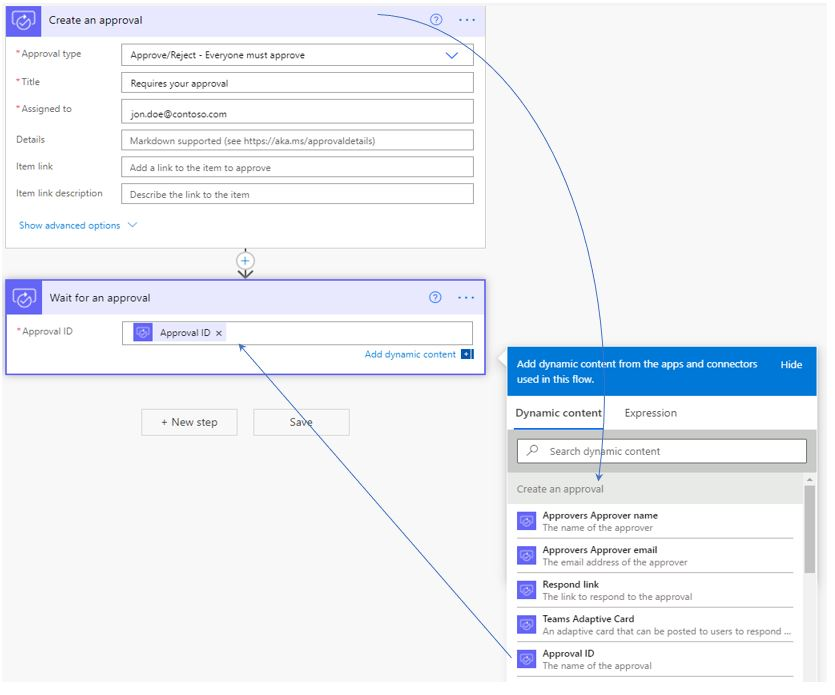
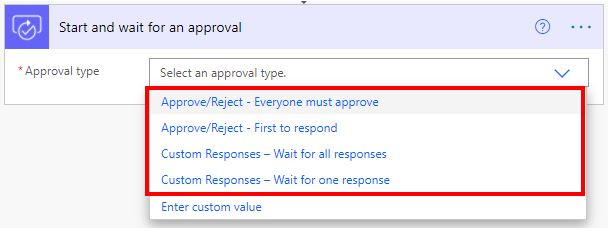
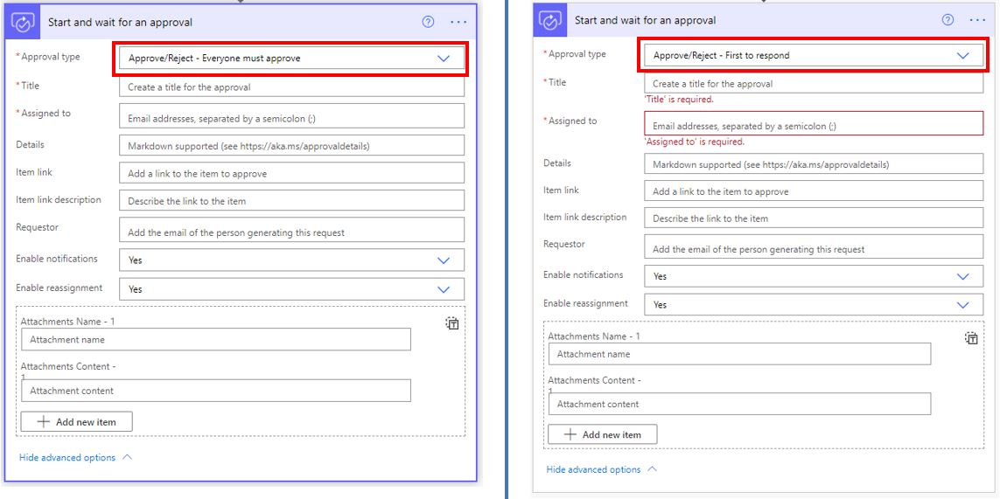
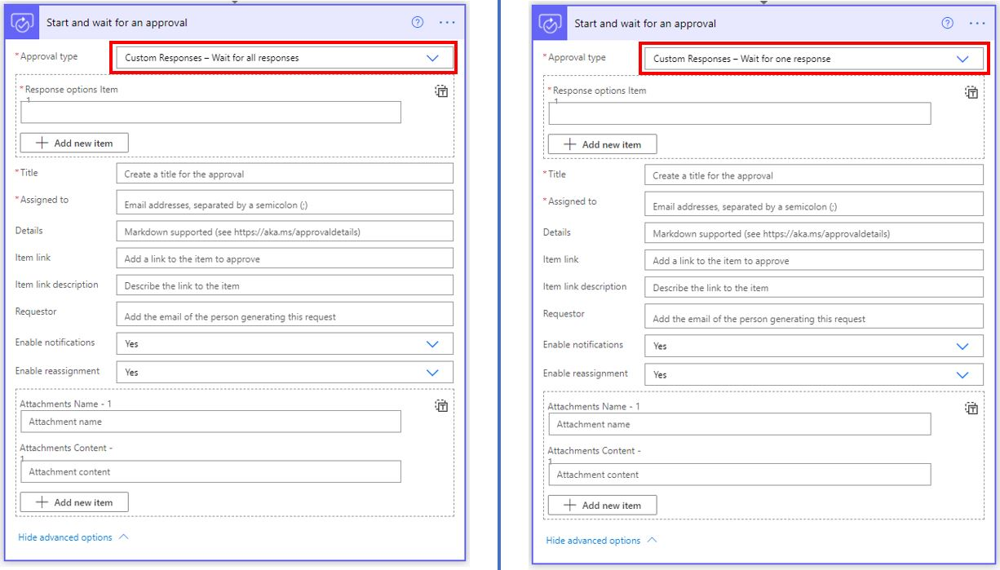

The **Create an approval** action starts an automated approval process but doesn't wait for the approval to complete. You can cancel the approval.

If you want to wait for a response, the **Create an approval** action can be paired with the **Wait for an approval** action.

Four types of approval actions are available in the **Create an approval** action, and they can be summarized into two categories: **Approve/Reject** and **Custom Responses**.

> [!div class="mx-imgBorder"]
> 

The following screenshot shows the two **Approve/Reject** categories side by side. The categories appear similar; however, they have one key difference, which is the number of approvals that are required to complete the action. As their names suggest, the **Everyone must approve** type will wait for everyone to approve, and the **First to respond** type requires only one approval.

> [!div class="mx-imgBorder"]
> 

In the **Assigned to** field, you can add the email addresses of the approvers, which you can separate with a semicolon (**;**).

The following image provides a closer look at the advanced settings. The settings include the ability to link to a description, add attachments, and even assign a requestor who is sending this approval request.

> [!div class="mx-imgBorder"]
> 

**Approve** and **Reject** are the out-of-the-box response options that are available. With **Custom Responses**, you can add your own options. In the **Response options Item** field, you can add your options.

The following figure shows two **Custom Responses** categories side by side. The categories appear similar; however, they have one key difference, which is the number of approvals that are required to complete the action. As the names suggest, the **Wait for all responses** type will wait for all responses, and the **Wait for one response** type requires only one response.

> [!div class="mx-imgBorder"]
> 

The following image provides a closer look at the advanced settings. The settings include the ability to add a link to a description, add attachments, and even assign a requestor who is sending this approval request.

> [!div class="mx-imgBorder"]
> 

The metadata files that are available with the advanced settings include:

- Approvers Approver name

- Approvers Approver email

- Respond link

- Teams Adaptive Card

- Approval ID

- Title

- Details

- Item link

- Item link description

- Request date

- Approvers Approver ID

- Approvers Approver tenant ID

- Approvers Approver user principal name

- Approvers item

- Body

- Approvers

## Use the Wait for an approval action

As the name suggests, the **Wait for an approval** action waits for a specified approval to complete. It requires the ID of the previous approval.

> [!div class="mx-imgBorder"]
> 

The metadata that is available with the **Wait for an approval** action includes:

- Response summary

- Completion date

- Outcome

- Approval ID

- Title

- Details

- Item link

- Item link description

- Request date

- Responses Approver ID

- Responses Approver name

- Responses Approver email

- Responses Approver tenant ID

- Responses Approver user principal name

- Responses Request date

- Response Approver response

- Response comments

- Body

- Responses responder

- Responses item

- Responses

## Use the Start and wait for an approval action

The **Start and wait for an approval** action is the most commonly used approval action.

> [!div class="mx-imgBorder"]
> 

The following image shows the two **Approve/Reject** categories side by side. The categories appear similar; however, they have one key difference, which is the number of approvals that are required to complete the action. As the names suggest, the **Everyone must approve** type waits for everyone to approve, and the **First to respond** type requires only one approval.

> [!div class="mx-imgBorder"]
> 

In the **Assigned to** field, you can add the email addresses of the approvers, which can be separated with a semicolon (**;**).

The following image provides a closer look at the advanced settings. The settings include the ability to add a link to a description, add attachments, and even assign a requestor who is sending this approval request.

> [!div class="mx-imgBorder"]
> 

**Approve** and **Reject** are the out-of-the-box response options that are available. With **Custom Responses**, you can add your own options. In the **Response options Item** field, you can add your options.

The following screenshot shows the two **Custom Responses** categories side by side. The categories appear similar; however, they have one key difference, which is the number of approvals that are required to complete the action. As the names suggest, the **Wait for all responses** type waits for all responses, and the **Wait for one response** type requires only one response.

> [!div class="mx-imgBorder"]
> 

The metadata files that are available with the **Start and wait for an approval** action are:

- Response summary

- Completion date

- Outcome

- Approval ID

- Title

- Details

- Item link

- Item link description

- Request date

- Responses Approver ID

- Responses Approver name

- Responses Approver email

- Responses Approver tenant ID

- Responses Approver user principal name

- Responses Request date

- Response Approver response

- Response comments

- Body

- Responses responder

- Responses item

- Responses
