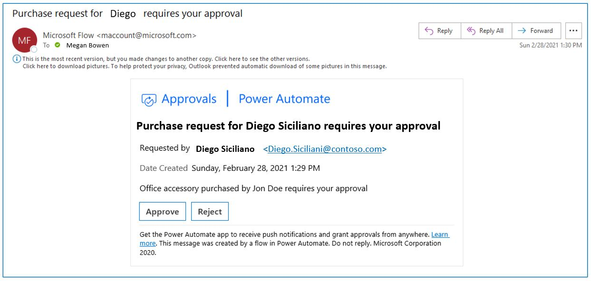
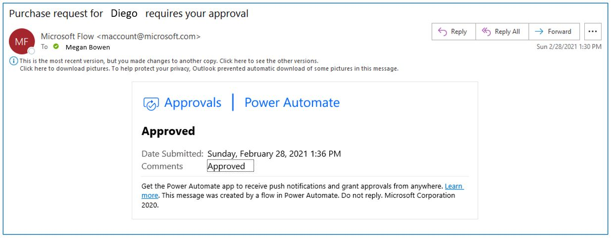
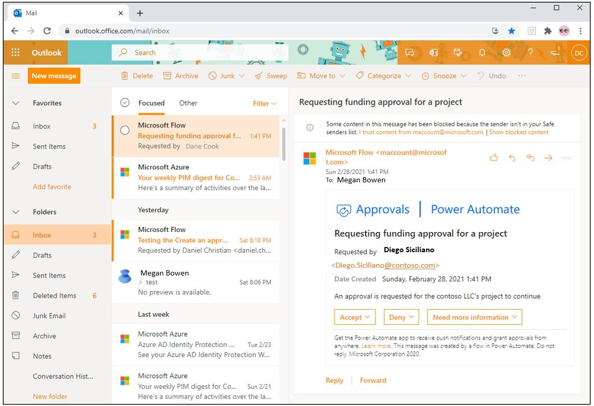
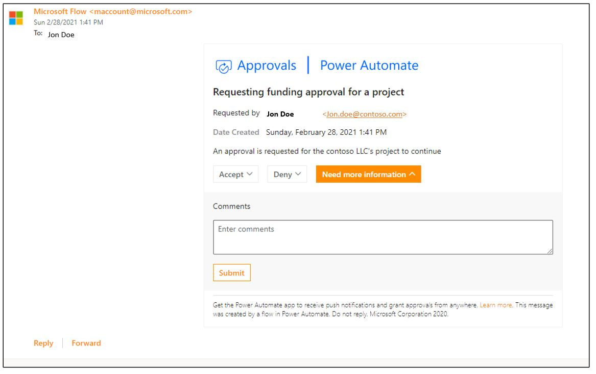
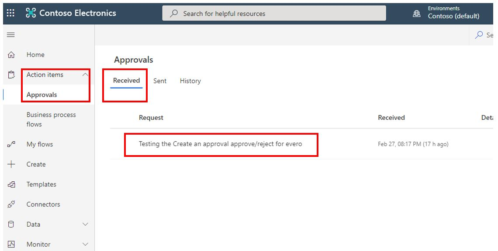
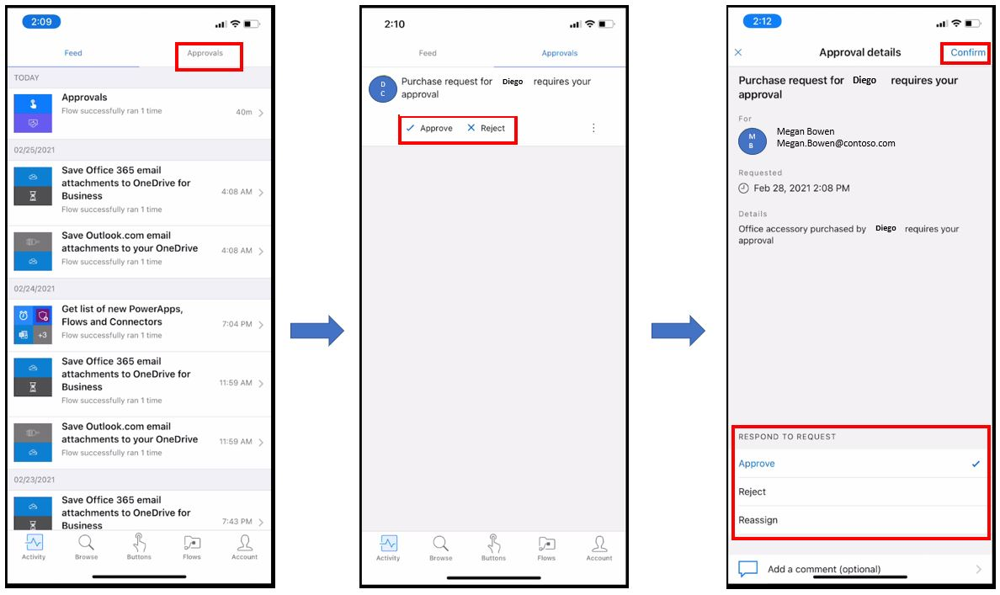
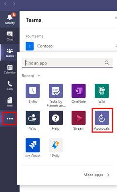
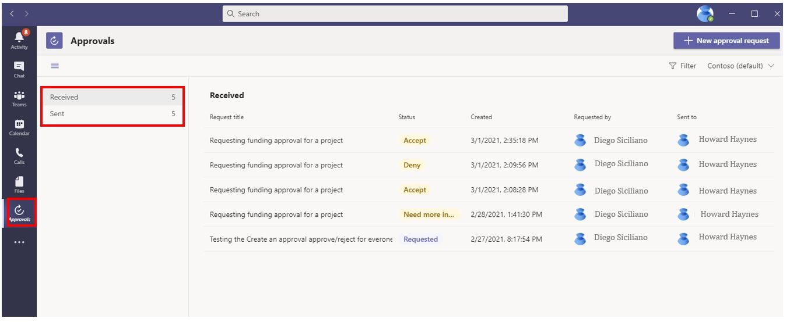
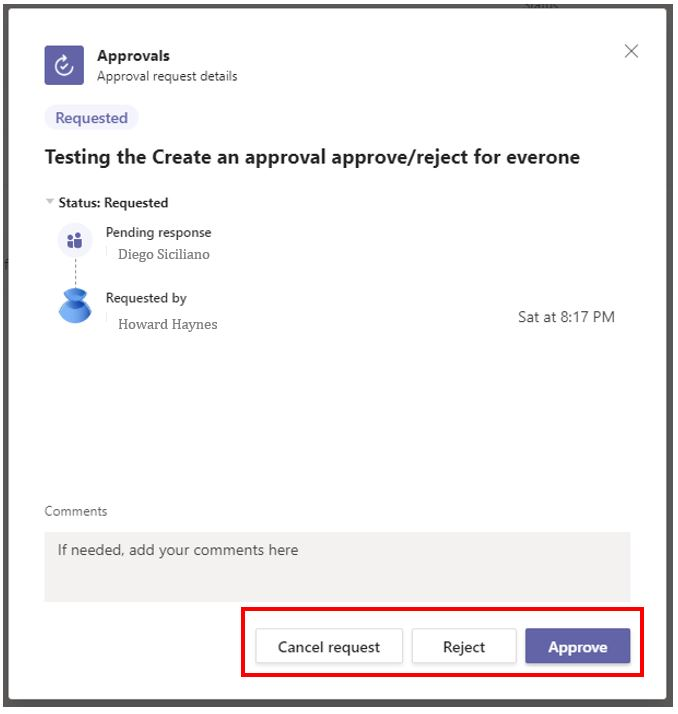

The approval action provides the flexibility to approve or reject across various platforms. This section will focus on four of those platforms.

## Respond from Microsoft Outlook

The **Approvals** connector in Power Automate gives you the flexibility to approve directly from Microsoft Outlook. This feature works for approve and reject responses and also for custom responses.

> [!div class="mx-imgBorder"]
> 

After the approval has been made, the email body automatically updates, as shown in the following screenshot, thereby ensuring that you don't approve or reject multiple times.

> [!div class="mx-imgBorder"]
> 

## Respond from Power Automate through an internet browser

Microsoft Outlook gives you the flexibility to access Outlook web apps through the browser and accept the approvals from there as well.

> [!div class="mx-imgBorder"]
> 

Similar to the desktop Outlook client, you have the flexibility to add a comment from the browser.

> [!div class="mx-imgBorder"]
> 

After the approval process has been completed, the email body automatically updates (as shown in the following screenshot), thereby ensuring that you don't approve or reject multiple times.

Additionally, you can sign in to <https://flow.microsoft.com>, select the **Action items** drop-down menu, and select **Approvals**. The **Received** section will show the item that is pending your approval.

> [!div class="mx-imgBorder"]
> 

> [!div class="mx-imgBorder"]
> 

## Respond from Power Automate mobile device app

You can accept approvals by using the Power Automate app in your smartphone.

In the Power Automate app, select **Activity** in the lower-left corner of the screen. In the top menu of the next screen, select **Approvals**, which will show pending approvals that you can complete by using the available options.

> [!div class="mx-imgBorder"]
> 

## Respond from Microsoft Teams

Microsoft Teams includes approvals as a built-in app that you can use to approve directly from inside Teams. In the side navigation pane, select the ellipsis (**...**) button, which provides you with a list of options, including **Approvals**.

> [!div class="mx-imgBorder"]
> 

Select the **Approvals** option, which will show the approvals that are assigned to you and their status.

> [!div class="mx-imgBorder"]
> 

You can also approve and reject approvals directly from inside Teams by selecting the pending approval.

> [!div class="mx-imgBorder"]
> 
