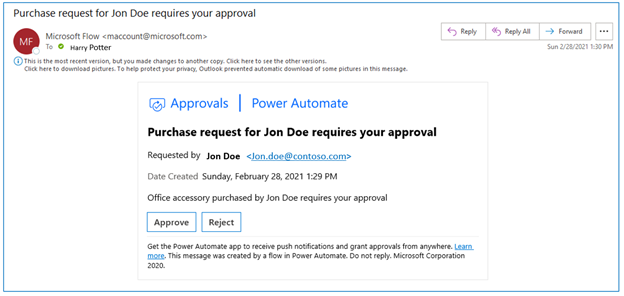
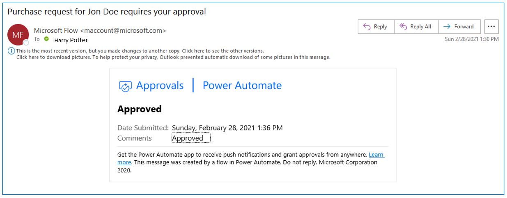
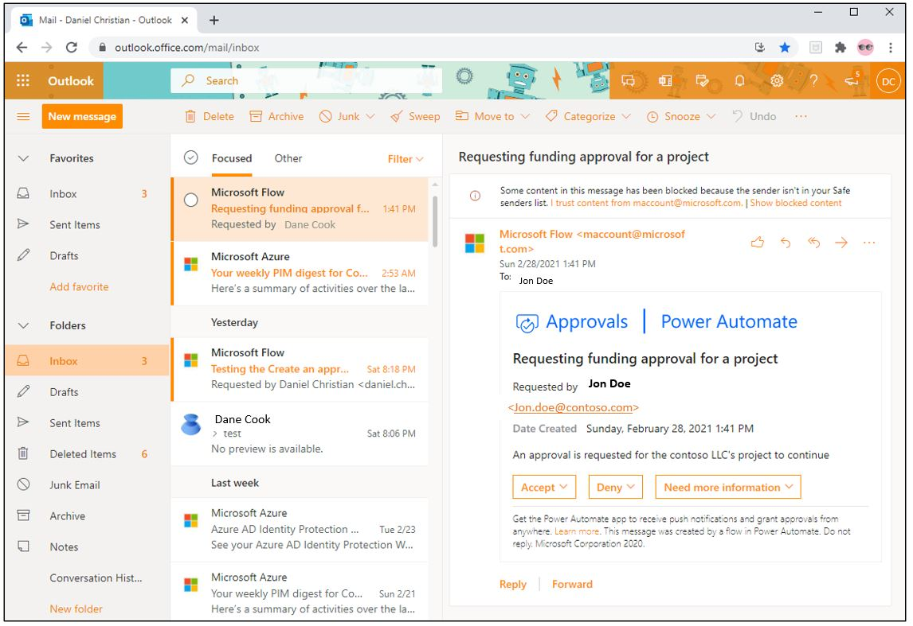
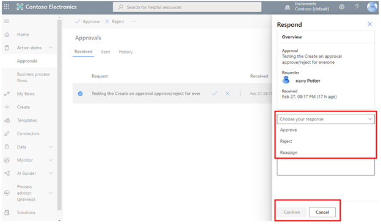
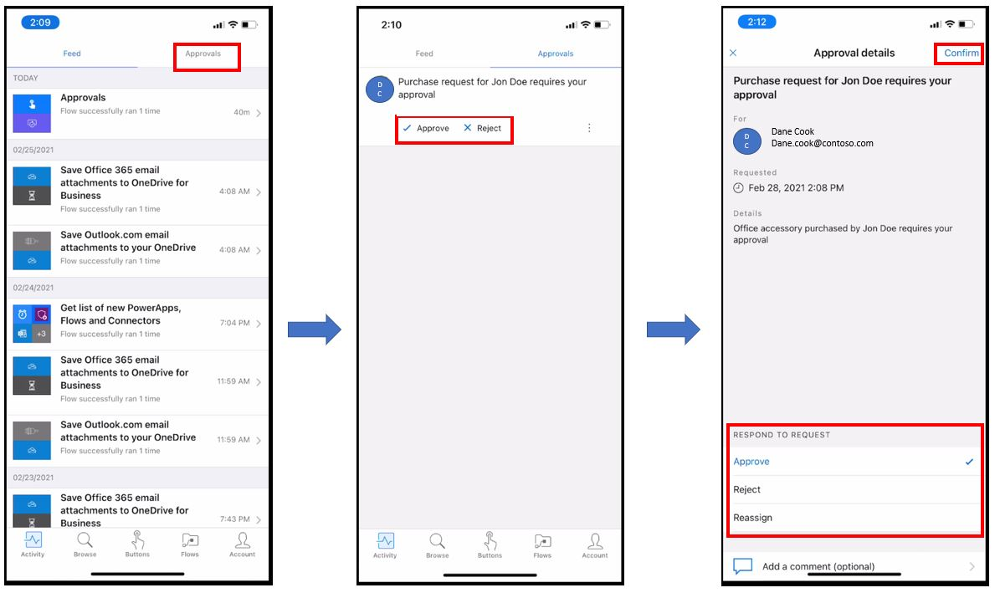
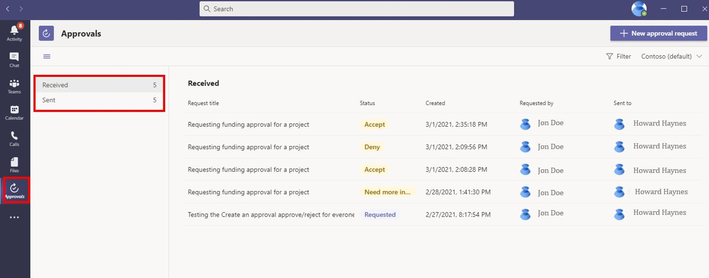
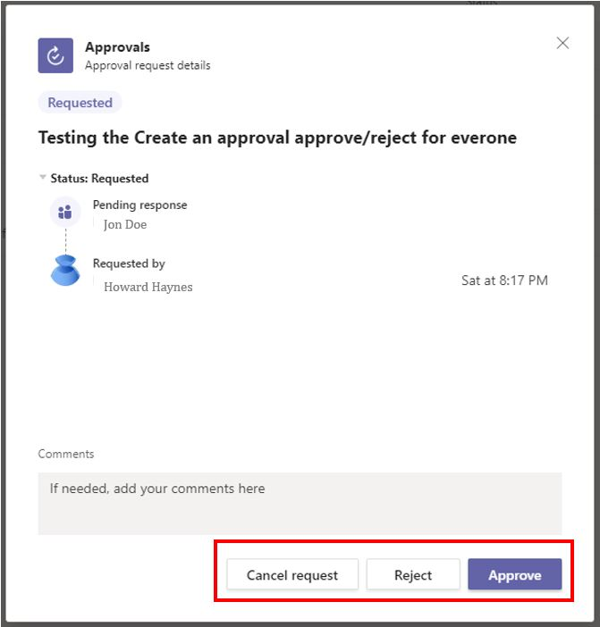

The approval action provides the flexibility to approve or reject across various platforms. This section will focus on four of them.

## How to respond from Microsoft Outlook

**Power Automate Approval** connector gives you the flexibility to approve directly from **Microsoft Outlook**. This works for both the approve and reject and also for custom responses.

> [!div class="mx-imgBorder"]
> 

After the approval is made the email body automatically updates to the following thereby making sure, you do not approve or reject multiple times.

> [!div class="mx-imgBorder"]
> 

## How to respond from Power Automate via internet browser

**Microsoft Outlook** gives you the flexibility to access **Outlook Web Apps** via the browser and accept the approvals from there as well.

> [!div class="mx-imgBorder"]
> 

Just like the desktop Outlook client, you have the flexibility to add a comment from the browser.

> [!div class="mx-imgBorder"]
> 

And once the approval process has been completed the email body automatically updates to the following thereby making sure you do not approve or reject multiple times.

In addition, you can log into <https://flow.microsoft.com>, select the **Actions items,** and select **Approvals**. In **Received,** you will see the item that is pending your approval.

> [!div class="mx-imgBorder"]
> 

> [!div class="mx-imgBorder"]
> 

## How to respond from Power Automate mobile device app

The same can be done using the Power Automate app in your smartphone.

In the app select **Activity**, which is available in the bottom menu, then select **Approvals**, which are available on the top menu. There you will see any pending approvals, which you can complete using the options available.

> [!div class="mx-imgBorder"]
> 

## How to respond from Microsoft Teams

**Microsoft Teams** has approvals as a built-in app that can be used to approve directly inside Teams. Once you select the ..., you will see Approvals.

> [!div class="mx-imgBorder"]
> 

Then you'll see the approvals assigned to you and their status.

> [!div class="mx-imgBorder"]
> 

You can also approve and reject directly inside Teams by clicking on the approval that is pending.

> [!div class="mx-imgBorder"]
> 