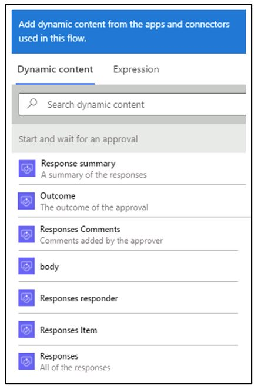
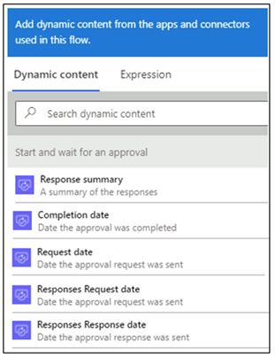
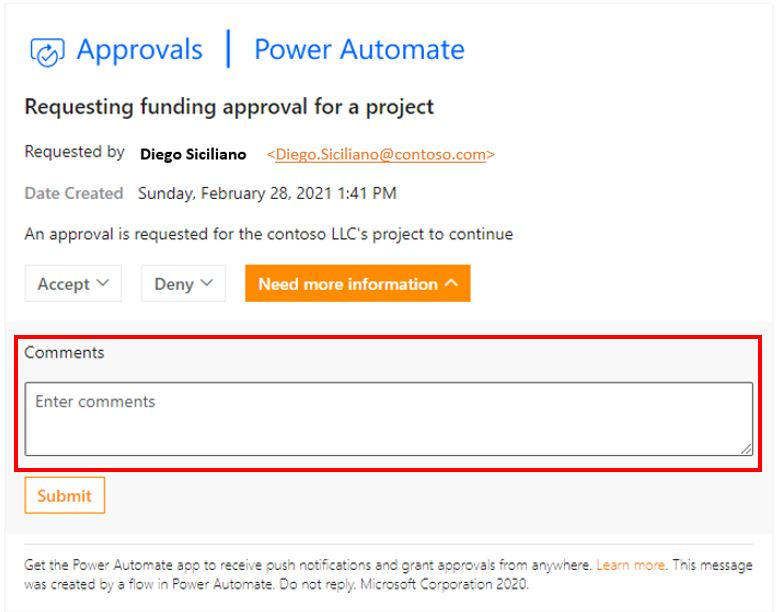
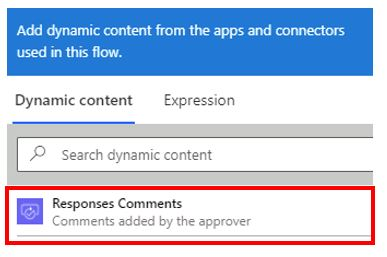

Actions in the **Approvals** connector for Power Automate provide several helpful metadata items.

## Who is approved or rejected

After you approve or reject an item, the metadata from this process is available for other workflow processes. The following screenshot shows the dynamic content that captures the information.

> [!div class="mx-imgBorder"]
> 

The **Outcome** option will provide you with the approval option that was selected, which will likely be **Approve**, **Reject**, or custom responses that you might have added.

## Date and time stamps of the approvals

Approval automatically captures several date and time stamps. The following screenshot shows all of the dates that are captured.

> [!div class="mx-imgBorder"]
> 

## Add comments

When responding to an approval, you can add comments. You can capture these comments and save them in the data source of your choice.

The following screenshot shows what the **Comments** option looks like.

> [!div class="mx-imgBorder"]
> 

The comments can be captured by using Power Automate.

> [!div class="mx-imgBorder"]
> 
