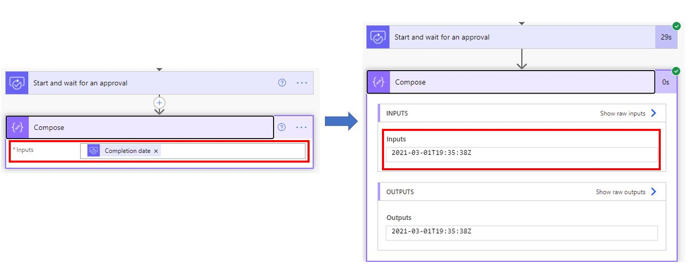
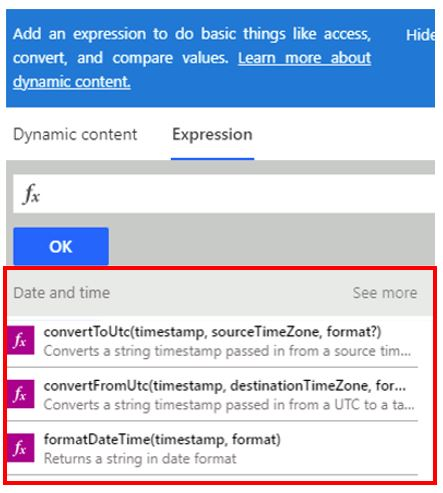

Approvals timestamps will always be shown in UTC. As shown in the following screenshots, the completion date is added to a **Compose** action to display the date format. When the flow runs, the date is in UTC format.

> [!div class="mx-imgBorder"]
> 

> [!NOTE]
> You can always use the **Date and time** expressions to change the UTC format to the one that you prefer.

> [!div class="mx-imgBorder"]
> 

## Approval wait time duration

The approval wait time duration is dependent on the duration of the entire flow. Run duration is calculated by using a run's start time. This calculation includes flows with pending steps like approvals. After 30 days, any pending steps will time out. This timeout encompasses the entire flow, meaning if you have other actions, such as other approvals, anything pending at the 30-day mark will time out. So if you have an approval process that goes through multiple levels, you might consider breaking out the approval into parent-child flows. That gives each approver 30 days to respond. The Summary unit at the end of this module provides links for more information on duration.
