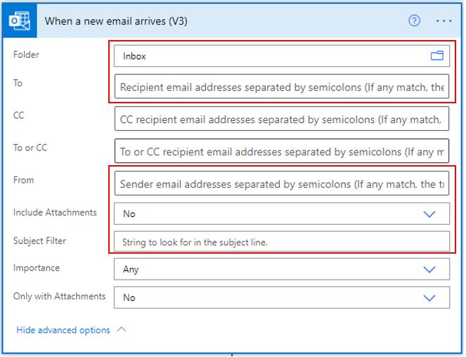
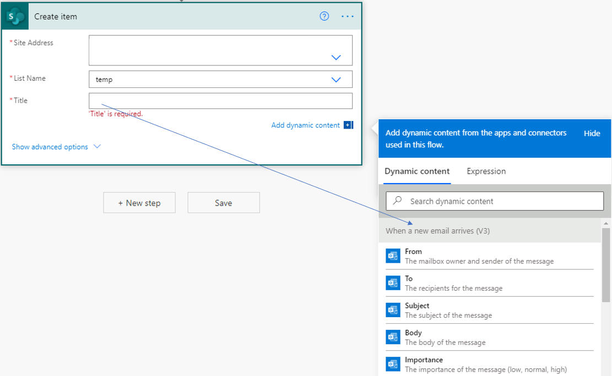
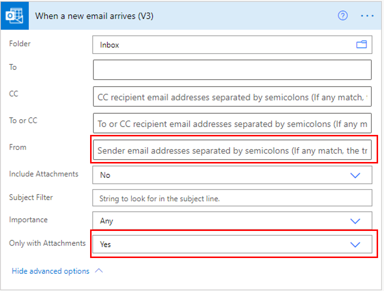
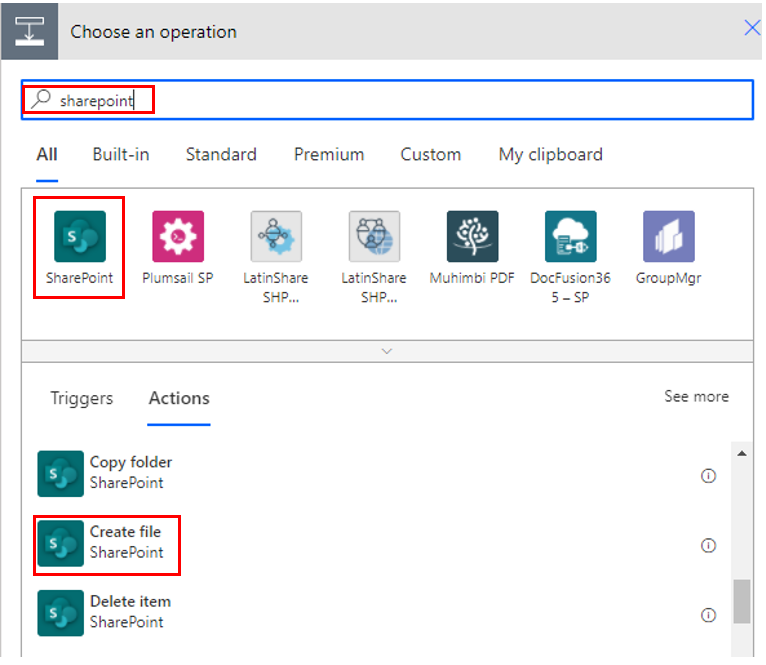
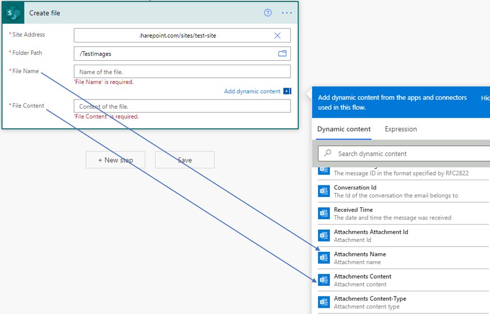
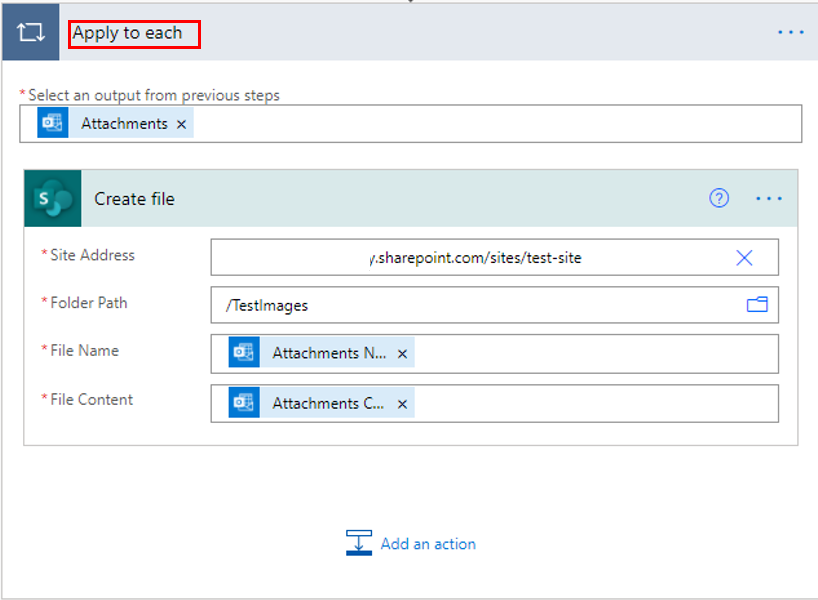
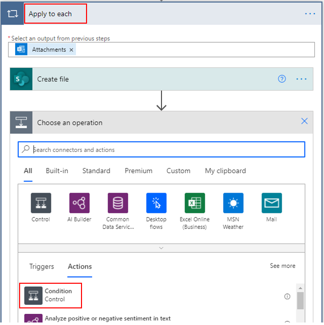
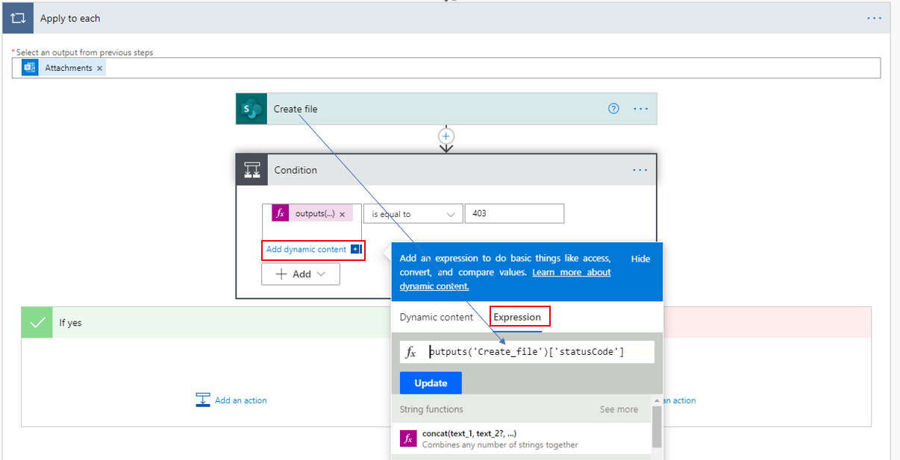
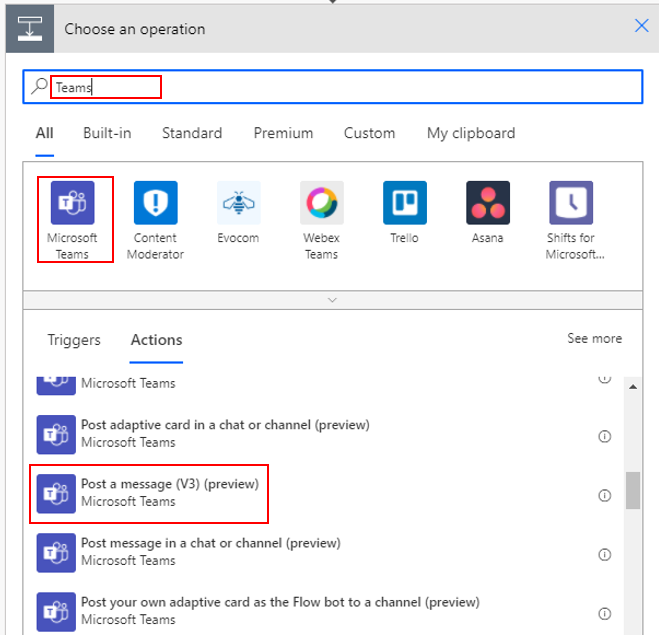
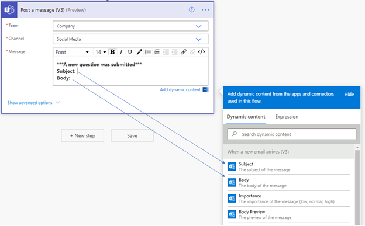

Users can be bombarded with incoming emails that often leave them distracted and unable to concentrate on a single task. Microsoft Power Automate can help with this problem by providing users with the ability to monitor the **To**, **From**, and **Subject** lines of emails and create an automated workflow to take actions based on conditions.

## Trigger flows

Currently, four triggers are available for Power Automate flows. These triggers are from the Microsoft Office 365 Outlook Standard connector and can be used to monitor incoming email:

-   When a new email arrives (V3)

-   When an email is flagged (V3)

-   When a new email arrives in a shared mailbox (V2)

-   When a new email mentioning me arrives (V3)

Each trigger will monitor all incoming email of the folder that you have specified in the trigger. Your default inbox is one of those folders. You can make monitoring more specific by describing to whom the email was sent, whether anyone was added to the **Cc** line, who sent the email, a specific string in the subject, and if attachments were added.

## Save metadata to Microsoft Lists

Metadata is defined as a set of data that describes and gives relevant information about other data. For example, as emails arrive to your Outlook inbox, you would primarily focus on the key metadata such as the **To**, **From**, **Subject**, and **Body** content. However, several other metadata items are available, such as **Importance**, that can be captured for future use. Saving metadata simplifies your task of searching in the future.

If you want to only capture the metadata of specific emails, then you can use a combination of options that are already available to define that parameter. For example, you can only trigger a flow if the email was sent to you, if you are included on the **Cc** line in a specific group email address, and if the email subject contains the words “monthly inventory report.”

> [!div class="mx-imgBorder"]
> 

You can save the metadata from the email to columns in a Microsoft list as a new item.

> [!div class="mx-imgBorder"]
> 

Metadata items that are currently available:

- **From** – Mailbox owner and sender of the message.

- **To** – Recipients of the message.

- **Subject** – Subject of the message.

- **Body** – Body of the message.

- **Importance** – Importance of the message such as low, normal, and high.

- **CC** – Recipients who receive a *courtesy copy* of the message for informational purposes.

- **BCC** – Recipients who receive a *blind carbon copy* of the message, whose name and email address aren't visible to other recipients of the message.

- **Reply To** – The email addresses that is used when you reply to a message.

- **Body Preview** – Preview of the email message.

- **Message ID** – Unique identifier of the message.

- **Internet Message ID** – The message ID in the format that is specified by Request for Comments (RFC) or RFC 2822.

- **Conversation ID** – The ID of the conversation that the email belongs to.

- **Received Time** – Date and time when the message was received.

- **Attachments, Attachments ID** – Add the attachments or the attachment ID.

- **Attachment Name**- Provides the name of the attachment.

- **Attachment content** - Provides the content of the attachment.

- **Attachments Content - Type** - Indicates the type of content that the attachments have.

- **Attachments last Modified Date Time** - Indicates the last date when the attachments were last modified.

- **Attachments Content ID** - Provides the content ID of the attachments.

- **Has Attachment** – Indicates whether the message has attachments.

- **Is Read** – Indicates whether the message has been read.

- **Is HTML** – Indicates whether the email body has an HTML format.

- **Attachments Size** – The size, in bytes, of the attachment.

## Save attachments to SharePoint document libraries

A SharePoint document library is an excellent place to save your email attachments. Those documents are then accessible from anywhere with internet access. With Power Automate, you can create a flow to monitor emails of your choice and then save their attachments to a document library.

You can create a flow by using the **When a new email arrives (V3)** trigger and then set the **Only with Attachments** option to **Yes**.

> [!div class="mx-imgBorder"]
> 

Add a new action, where you will search for **SharePoint** and then select **Create a file**. Technically, you are only saving an existing file; however, from a SharePoint perspective, a new file is being created and, hence, this action is selected.

> [!div class="mx-imgBorder"]
> 

Add the site address, folder path, file name, and file content. The folder path is for the library where you want to save the attachments.

> [!div class="mx-imgBorder"]
> 

> [!NOTE]
> Adding the file information will automatically add the **Create a file** action in the **Apply to each** setting. By design, this approach ensures that all attachments are saved.

> [!div class="mx-imgBorder"]
> 

Next, you will need to confirm that the file(s) have been saved successfully and, if not, then you need to be notified. To accomplish this task, add a condition inside the **Apply to each** setting.

> [!div class="mx-imgBorder"]
> 

On the left side of the condition, select **Add dynamic content**, select **Expressions**, and then add the **outputs('Create_file')['statusCode']** formula. On the right side, add **403**.

> [!div class="mx-imgBorder"]
> 

In the **If yes** area, select **Add an action** and then add **Send an email (V2)**.

This error notification email is sent to the same person who received the original email from which the attachment must be saved.

> [!div class="mx-imgBorder"]
> 

Now, when incoming emails match the criteria, the attachments will be saved in the SharePoint document library. If an error occurs for some reason, the user will be notified.

## Post the message on Microsoft Teams

When inquiry type emails are sent to a general address, you can create a Power Automate flow to monitor those types of emails and then copy them to a team in Microsoft Teams. This approach will help make the email content available to a wider audience and will expedite the response time and/or quality of the response.

Consider incoming emails, which are sent from a specific mailbox that is used to send notifications from a customer-facing form. You can use that email address in the **To** field. If all emails come with the same subject, then you can add that subject line in the **Subject** filter as well.

> [!div class="mx-imgBorder"]
> 

Add a new step and then search for **Teams**. Select the **Post a message (V3) (preview)** action.

> [!div class="mx-imgBorder"]
> 

Select the **Team** and **Channel**. In the **Message** field, add a combination of text and dynamic content. The dynamic content comes from the **Subject** and **Body** of the incoming email.

> [!div class="mx-imgBorder"]
> 
