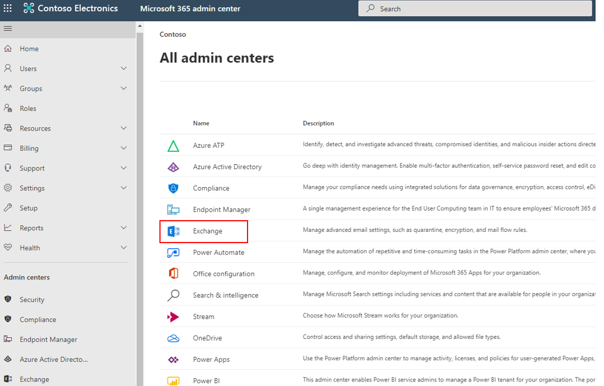
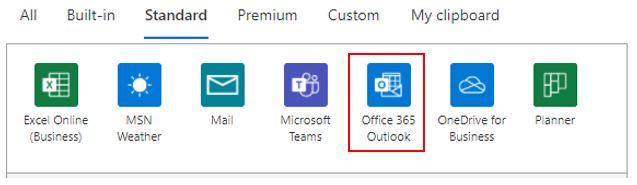
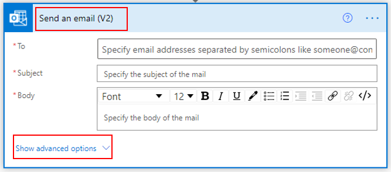
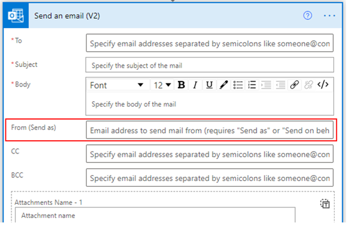
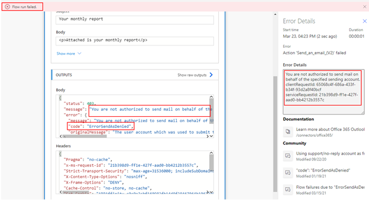
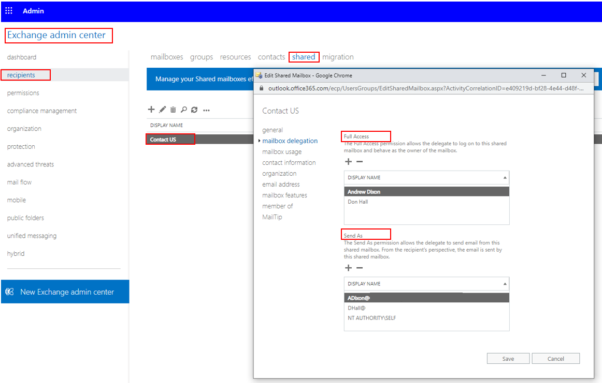
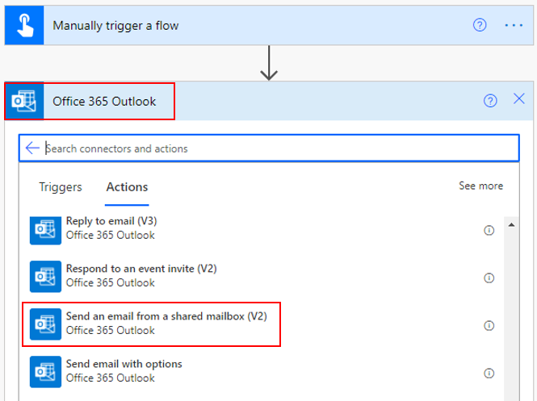
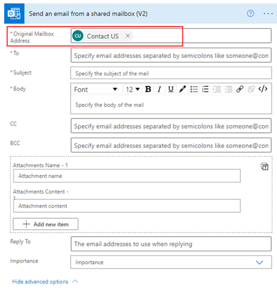

Microsoft Exchange is part of the Microsoft 365 suite that is used to provide email service.

> [!div class="mx-imgBorder"]
> 

This service is the same as the one that runs the **Office 365 Outlook** connector.

> [!div class="mx-imgBorder"]
> 

All your email addresses are created in Exchange as mailbox accounts. If you want someone else to send an email on your behalf, then that person needs to be added to the **Send As** field of your mailbox, which will give that user the required permission.

After the person has the required permission, they can send emails on your behalf by using Power Automate flow.

The **Send an email (V2)** action in the **Office 365 Outlook** connector gives you the option to send an email on behalf of someone else. To find this feature, select **Show advanced options**.

> [!div class="mx-imgBorder"]
> 

In the **From (Send as)** field, you can add the name of the person's mailbox to which you have **Send as** access.

> [!div class="mx-imgBorder"]
> 

> [!NOTE]
> If you are not added to the **Send As** field, then you don't have access to the user's mailbox and your flow will fail.

> [!div class="mx-imgBorder"]
> 

## Shared mailbox

A shared mailbox is an Exchange mailbox that multiple people can use to read and send email messages. To access a shared mailbox, users must first be granted **Send As** or **Full Access** permissions to the mailbox.

> [!div class="mx-imgBorder"]
> 

After permissions have been granted, you can use the **Send an email from a shared mailbox (V2)** action.

> [!div class="mx-imgBorder"]
> 

In this action, you will add the shared mailbox that you have access to in the **Original Mailbox Address** field. When this flow runs, the users will receive an email from the shared mailbox and from the maker of the flow (not you).

> [!div class="mx-imgBorder"]
> 

## Do not reply mailbox

Do Not Reply mailboxes are email accounts that you can use to send email notifications with important information. The email body will clearly state that the recipient should not reply to the message. This scenario is another example of where the shared mailbox process can be used.

