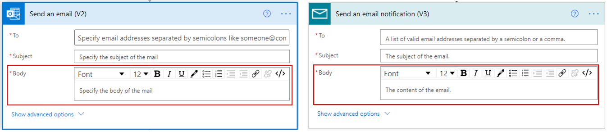
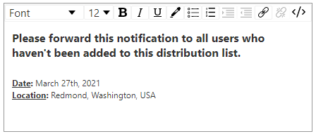
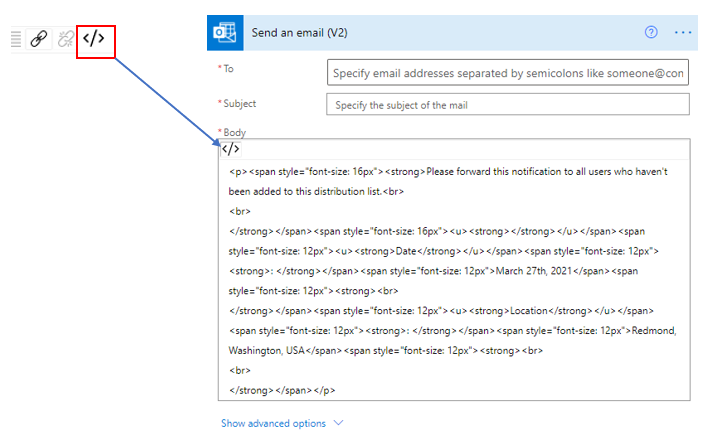
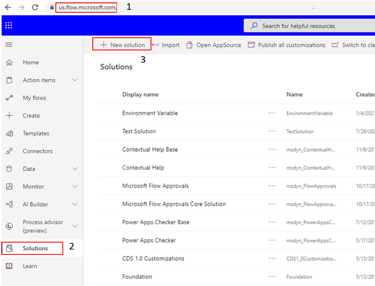
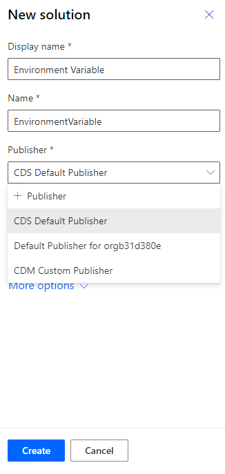
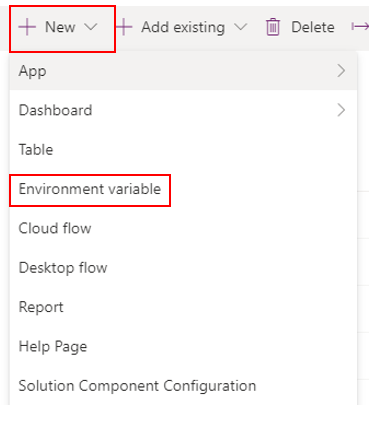
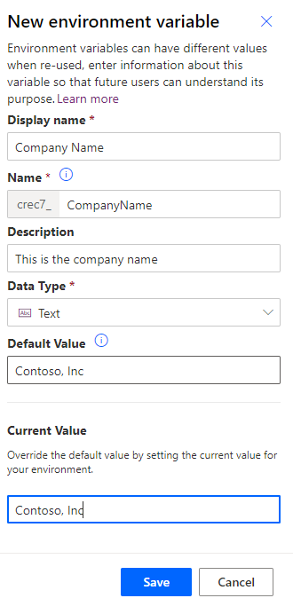
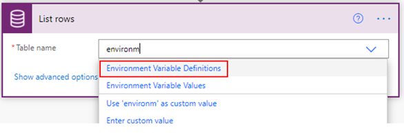
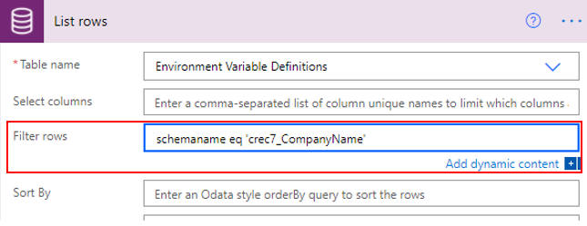
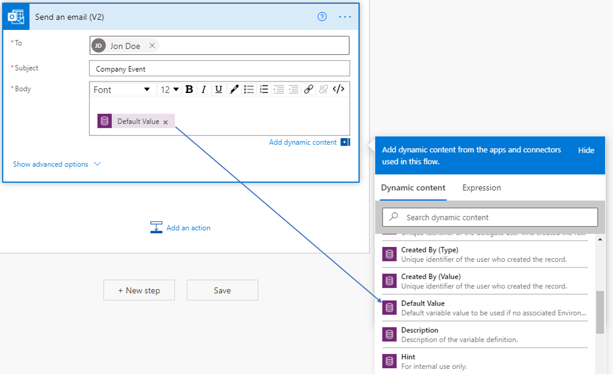

Emails are often an official means of electronic communication and therefore, it is important to have the body well formatted.

## Use rich text edit

Both the **Microsoft Office 365 Outlook** and the **Mail connector** have sent email actions that allow you to format the email body.

> [!div class="mx-imgBorder"]
> 

Both the email actions provide a comprehensive set of tools to format the text of your email body.

> [!div class="mx-imgBorder"]
> 

The Code view option allows you to see the rich text format in an HTML format. This gives you the extra functionality to fine-tune the format.

> [!div class="mx-imgBorder"]
> 

## Add a signature using the Environment variable

When you have the need to add the same data as text or date or numbers again and again in an app, assigning it to a variable and reusing that variable makes it much easier. Variables can hold a value at an app level and environment level. **UpdateContext**, **Set**, and **Collection** are the three functions to create variables at the app level. **Environment variables** are the only function to create variables at the environment level. An environment is a space to store, manage, and share your organization's business data, apps, and flows. It also serves as a container to separate apps that might have different roles, security requirements, or target audiences.

Power Apps Studio comes with several variable functions such as:

**UpdateContext**: Use the UpdateContext function to create a context variable, which temporarily holds a piece of information, such as the number of times the user has selected a button or the result of a data operation. Context variables are scoped to a screen, which means that you cannot build a formula that refers to a context variable on another screen.

**Set**: Use the Set function to set the value of a global variable, which temporarily holds a piece of information, such as the number of times the user has selected a button or the result of a data operation. Global variables are available throughout your app on all screens.

**Collection**: The Collect function adds records to a data source called Collection. Collections are used to hold global variables that are available throughout your app on all screens.

**Environment variables**: Flows often require different configuration settings across environments. Environment variables as configurable input parameters allow management of data separately compared to hard-coding values within your customization or using other tools.

Environment variables are part of Power Automate Solutions. Solutions are used to transport apps and components from one environment to another or to apply a set of customizations to existing apps. A solution can contain one or more flows and other components such as site apps, maps, tables, processes, web resources, choices, and more. To learn more about Solutions see, [Solutions overview](https://docs.microsoft.com/powerapps/maker/data-platform/solutions-overview/?azure-portal=true).

To create a solution, you go to [Power Automate](https://us.flow.microsoft.com/?azure-portal=true) select **Solutions** which available on the left vertical navigation, select **+ New solution**.

> [!div class="mx-imgBorder"]
> 

You can add the **Display Name**, **Name**, select an existing **Publisher** or add a new one and then select **Create**.

> [!div class="mx-imgBorder"]
> 

Inside the new solution click **+ New** and select **Environment variable.**

> [!div class="mx-imgBorder"]
> 

Here are the settings to add a new environment variable. You can add a default value and add a current value. Notice the name has a prefix? In the screenshot below, the prefix is **crec7_**. Make note of this because you will need it for your flows.

> [!div class="mx-imgBorder"]
> 

Once the environment variable is created once, you can reuse it again and again in any flow in that environment. For example, you can get the company name and add it to all your emails.

To get the company name in a flow, you add **List rows** and add **Environment Variable Definitions**

> [!div class="mx-imgBorder"]
> 

In this same action, select Show advanced options and in Filter rows add *schemaname eq 'Prefix_EnvironmentVariableName'*

> [!div class="mx-imgBorder"]
> 

You can now add the company name as a footer in all your emails and if the company name were to change, you make the change in the environment variable and that will automatically change across all the flow actions.

> [!div class="mx-imgBorder"]
> 
