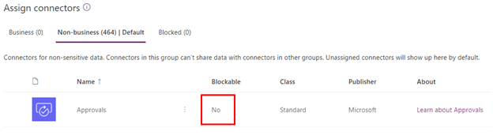
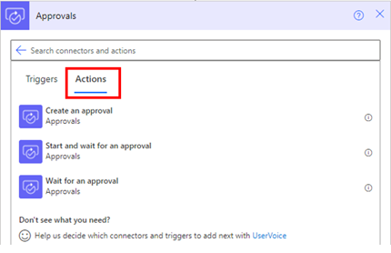
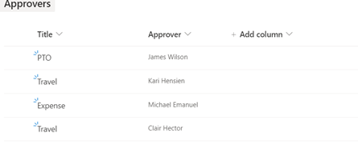
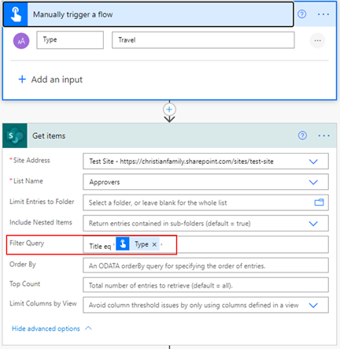
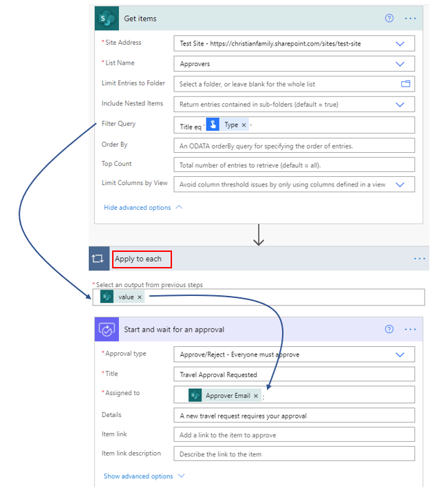
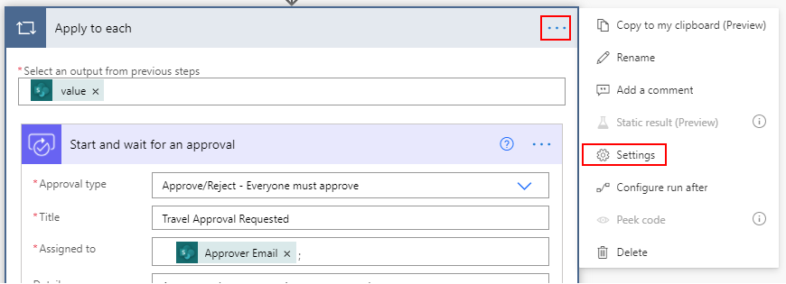
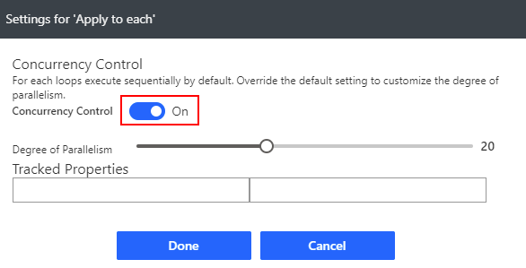

Typically, a workflow process undergoes an approval step. Approvals can be required from a single user or multiple users, and the responses need to be captured to make decisions for the next step.

## Use the Approvals connector

Power Automate gives you the flexibility to connect to data or a service by using a connector. Connectors come in two tiers: standard and premier. Standard connectors are part of your Microsoft 365 licenses, and no other license is needed. Premier connectors require either a per-flow or a per-user license. For more information, see [Power Automate Licensing](https://flow.microsoft.com/pricing/?azure-portal=true). Approvals are part of the standard tier.

An organization's data is critical to its success. Its data needs to be readily available for decision-making, but the data needs to be protected so that it is not shared with audiences who shouldn't have access to it. To protect this data, you can use Power Automate to create and enforce data loss prevention (DLP) policies that define the consumer connectors that specific business data can be shared with.

Connectors can now be added to one of the three groups that are available in DLP: **Business**, **Non-Business**, and **Blocked**. The **Approvals** connector can't be blocked; it can only be added to the **Business** or **Non-Business** group.

> [!div class="mx-imgBorder"]
> 

Three actions are available for **Approvals**:

- Create an approval
- Start and wait for an approval
- Wait for an approval

> [!div class="mx-imgBorder"]
> 

## In sequence or simultaneously

It is possible to have a scenario where you need to send approval actions to a list of users whose names are from a Microsoft list. In this case, the approval action is automatically added to an **Apply to each** filter, and the approval action by default will run in sequential order based on the names that it gets from the list. However, you do have the option to have all those actions in the **Apply to each** filter run in parallel, which will send all approval actions simultaneously.

For example, consider a scenario where you have a list that has items such as PTO, travel, and expense, and each item has its respective approver.

> [!div class="mx-imgBorder"]
> 

Based on the approval type that is added, the flow will filter through the list and find the respective approvers.

> [!div class="mx-imgBorder"]
> 

When you add the **Approver email** in the **Start and wait for an approval** action, the approval action is automatically added into an **Apply to each** filter.

> [!div class="mx-imgBorder"]
> 

By default, each approval is completed in a sequential manner. If you want to change that to parallel, then select the ellipsis for **Apply to each** and then select **Settings**.

> [!div class="mx-imgBorder"]
> 

Turn on the **Concurrency Control** toggle switch and then select **Done**. The maximum number of concurrent runs is 50 and the default is 20.

> [!div class="mx-imgBorder"]
> 

Now, your approvals will be sent simultaneously.

