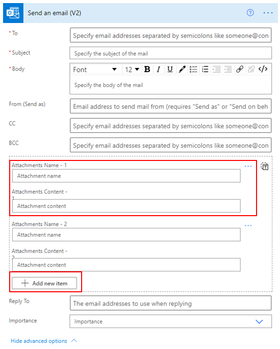
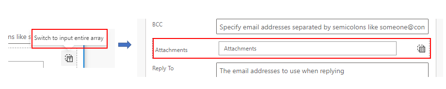
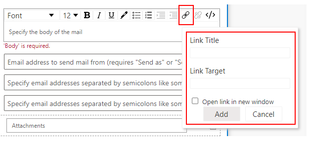
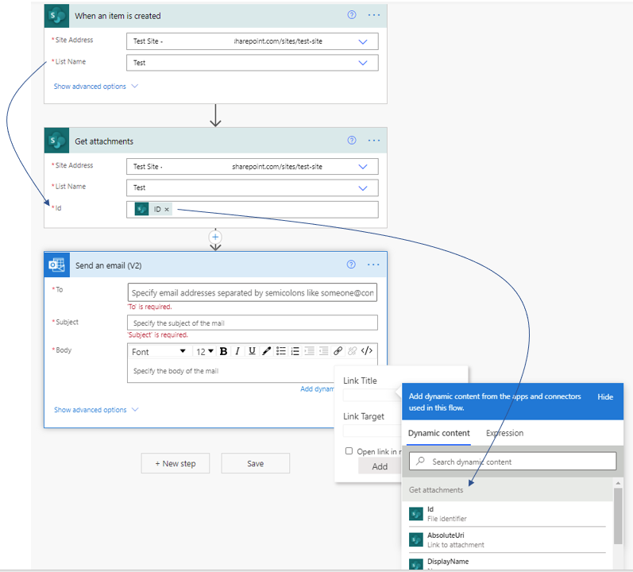

If you have collaborated on a document with people, then you have likely sent copies of the document back and forth through email. However, depending on the situation, you might want to consider saving the document to a SharePoint library and then sending the link instead.

## When to send information as an attachment or a link

If the user to whom the email notification is being sent through a flow is part of your company, then allowing an approved guest or external user to use links instead of attachments is a better option. Guests and external users are approved users in your tenant who have restricted access to locations that you have provided. This access level is configured in your Microsoft tenant's Azure Active Directory (Azure AD).

However, if emails are sent to people outside your company, then sending attachments is the only option.

The Office 365 Outlook connector's **Send an email** action allows you to add multiple attachments.

> [!div class="mx-imgBorder"]
> 

You have the option to add multiple attachments by using the name and the content. In addition, you can switch the entry of the attachments to an array.

> [!div class="mx-imgBorder"]
> 

> [!NOTE]
> Using the array requires that you create an array variable before using the **Send an email** action. The creation of the array variable resembles the following screenshot.

> [!div class="mx-imgBorder"]
> 

Links are part of the rich text option that is available in the body of the email. Selecting the link icon will allow you to add the title and the target, the target being the location of the content.

> [!div class="mx-imgBorder"]
> 

Power Automate gives you the flexibility to get the file name and the file content dynamically from SharePoint if you have the necessary actions before it.

Consider a scenario where you want to send a link to an attachment of a new Microsoft Lists list item.

In this case, you would use the **Get attachments** action to get the file link and the file name and then add those items to the link of the email body. You can add multiple links.

> [!div class="mx-imgBorder"]
> 
