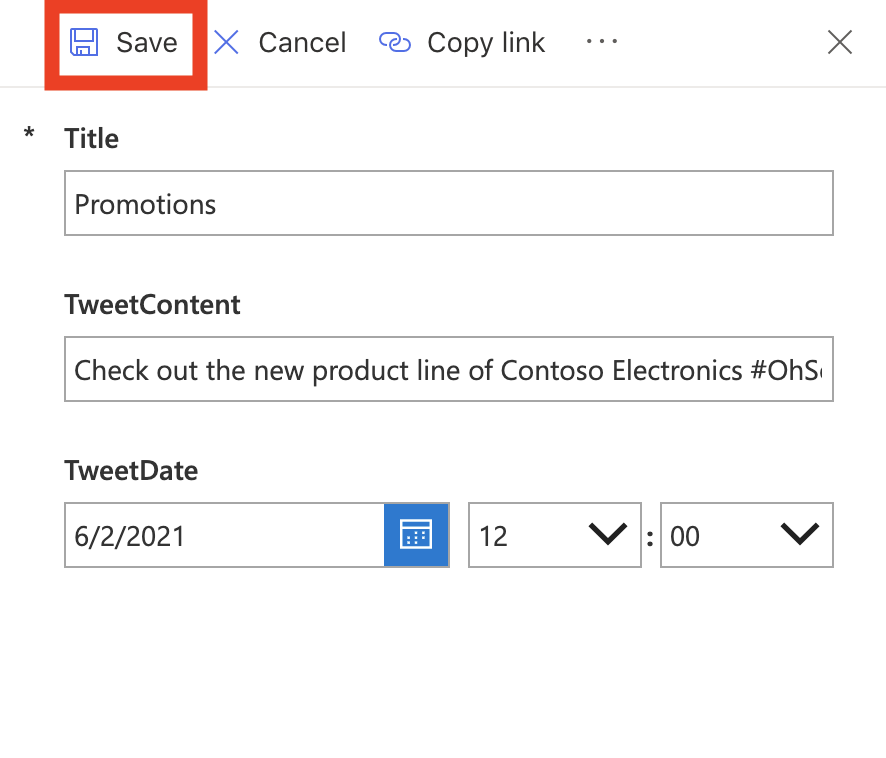
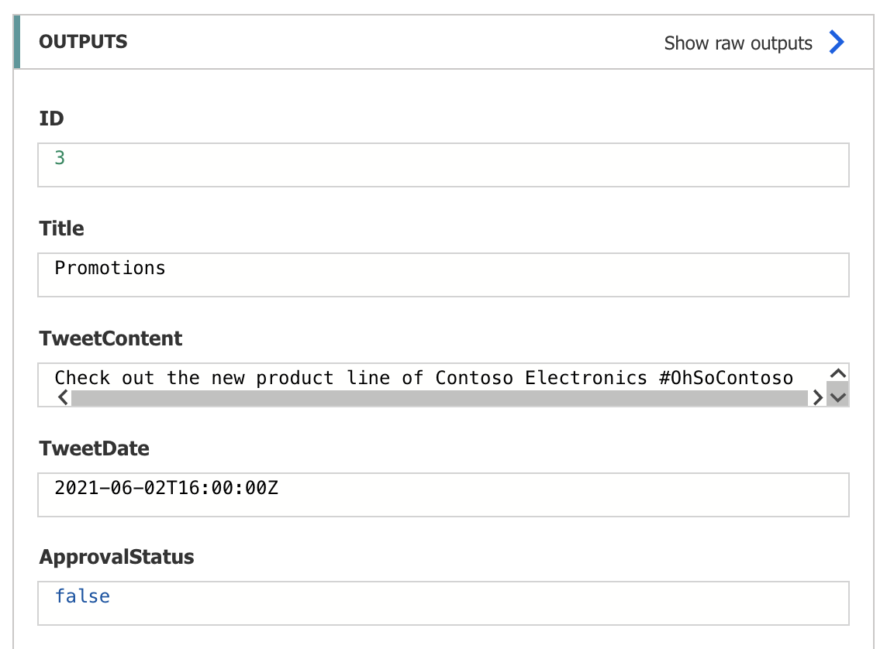
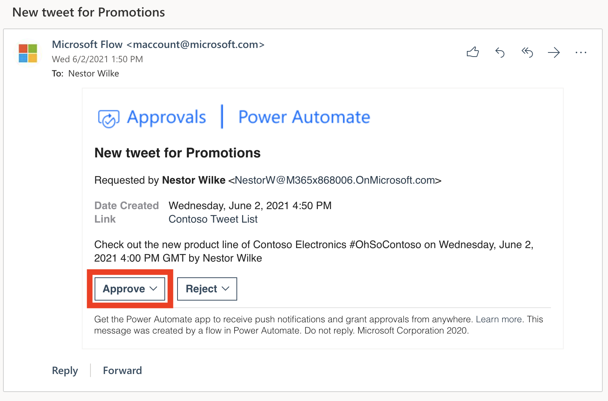
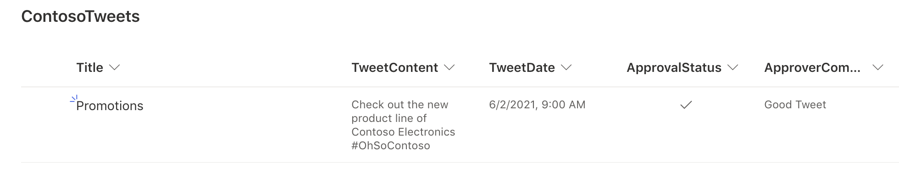

In the previous unit, you learned how to build an approval process for tweets that are stored in a Microsoft Lists list. In this unit, you'll see what the experience looks like when an approver receives a new approval request.

## Customize the SharePoint form via Power Apps 

Before we test the Flow created in the previous unit, it's important to take the time to customize the SharePoint Form with Power Apps. If you're curious as to why, go to the ContosoTweets Microsoft Lists list and select **+ New** to create an Item. The first thing you'll most likely notice is that users can create new SharePoint Items and Approve those Items themselves within the default SharePoint Form. For our example, this isn't significant, but in real-world scenarios, like you'll be creating for your companies and or organizations, restricting users from approving their own items as they're created is an important part of the Approval Process (when using SharePoint as a Datasource). There are many ways to customize your SharePoint Form to hide/show certain fields, these won't be covered in-depth in this unit, instead we'll open the list via Power Apps and remove the fields. By removing the fields from the SharePoint Form, the only way ApprovalStatus and ApprovalComments can be populated is through the Approval Flow process. 
           

1. Navigate to the ContosoTweets list if you're not already there and select **Integrate**.

1. From the dropdown, select **Power Apps** and then select **Customize forms**.

1. Once Power Apps opens, in the Fields pane, select the **...** next to the *ApprovalStatus* field and then select **X Remove**.

1. Repeat the previous step, for the *ApproverComments* field and the **Attachments** field. The only fields remaining on the form should be **Title**, **TweetContent**, and **TweetDate**.

1. In the upper left, select **File** and then select **Save**. 

1. Once the Form has Saved, select **Publish to SharePoint** and then select **Publish to SharePoint** again.

1. Navigate back to the ContosoTweets list, refresh your browser and then select **+ New** to create a New Item. If the SharePoint Form is still showing the old Form with the fields you removed, try refreshing the browser again and then select **+ New** again. It can sometimes take a few minutes for the published changes to take effect, this is normal behavior when customizing a SharePoint Form with Power Apps.

## Create a new item in our Microsoft Lists list

First, we need to add an item to our list. We can then process an approval request for that item.

1. In SharePoint, open the **ContosoTweets** list that you set up in the previous unit, and then select **+ New** to create a list item (tweet).

1. Enter the following values, and then select **Save**:

    - **Title**: Promotions
    - **TweetContent**: Check out the new product line of Contoso Electronics #OhSoContoso
    - **Tweet Date**: Today's date.

    

## Review and approve the new item in Power Automate  

1. In Power Automate, select **My flows**.

1. Select the **Post list items to twitter after approval** flow that you set up in the previous unit.

1. Under **28-day run history**, select the flow that's running, or completed.

1. Select the **When a new item is created** trigger. Make sure that the information for the list item that you just created is shown.

    

1. In Microsoft Outlook, open the automated approval mail in the inbox, and then select **Approve**. Add a comment and press **Submit**.

    

1. In Power Automate, select **Approvals** under **Actions**. You can see the approval you submitted in your history.

1. In SharePoint, refresh the **ContosoTweets** list. Make sure that the **ApprovalStatus** field is set to *Yes*, and that the comment that you just entered is shown.

    

In this unit, you saw the experience from the approver's point of view, from receiving an approval request email to processing the request in the Approval Center.

