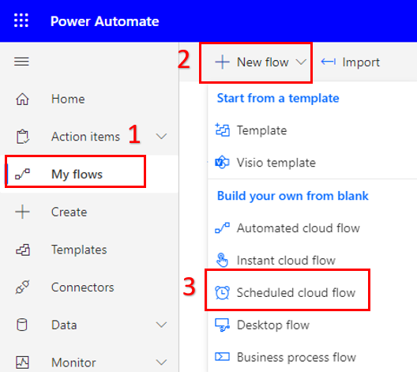
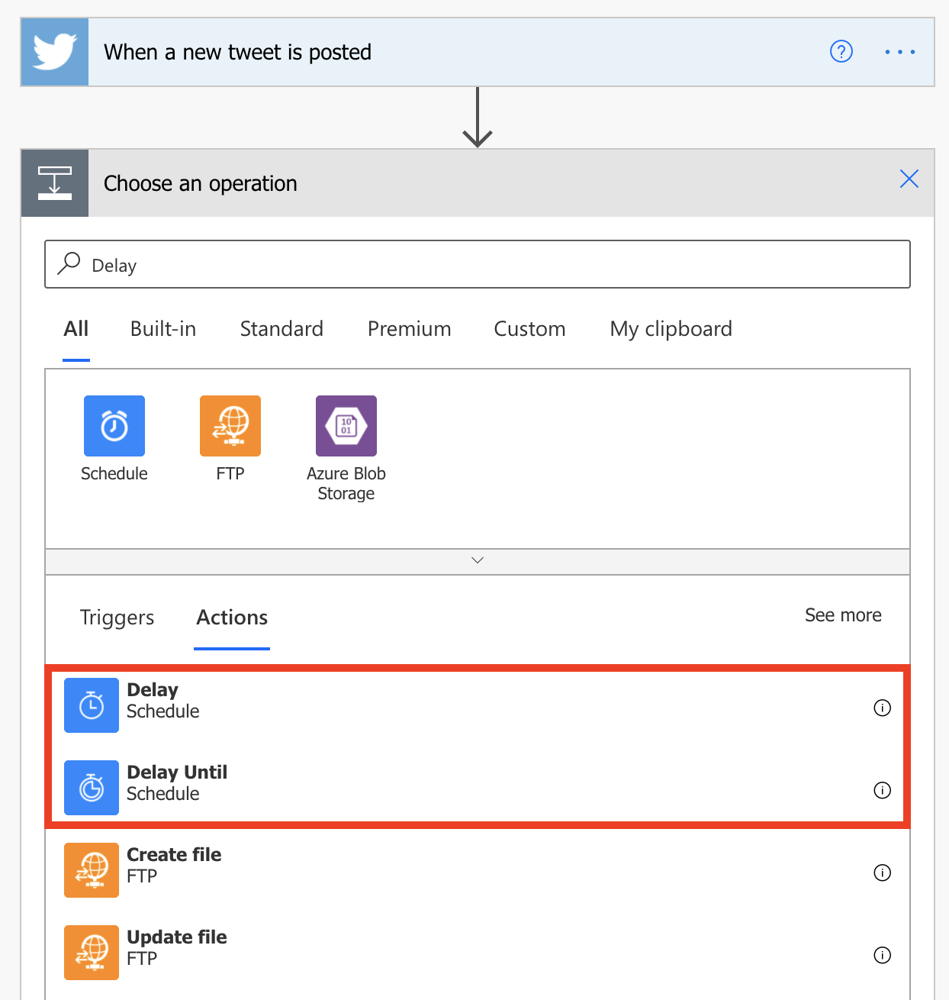

You can create a flow that performs one or more tasks (for example, sending a report by email) on a specific schedule:

- Once a day, an hour, or a minute
- On a date that you specify
- After the quantity of days, hours, or minutes that you specify

## Prerequisites

- Access to [Power Automate](https://flow.microsoft.com/?azure-portal=true).
- A basic understanding of Power Automate and experience with creating a flow is recommended.

## Create the flow

1. Launch Power Automate and sign in using your organizational account.

1. In the left pane, select **My flows**.

1. Select **+ New flow**, and then select **Scheduled cloud flow**.

    

1. In the dialog box, specify the flow's name and how often the flow should run.

    For example, if you want the flow to run every two weeks, enter *2* in the **Interval** field, and select *Week* in the **Frequency** field. You can also specify the day of the week your flow should run. The text at the bottom of the dialog box explains your inputs in plain language.

    

1. When you are satisfied with your inputs, select **Create**.

## Specify advanced options

1. Once your flow is created, select the title of the **Recurrence** card to expand it.

1. Select **Edit** and then **Show advanced options**.

    > [!NOTE]
    > The advanced options vary, depending on the value of the **Interval** and **Frequency** fields. If the dialog box that you see doesn't match the graphic that follows, make sure that the **Interval** and **Frequency** fields are set to the same values that are shown in the graphic.

1. Here you can specify a time zone to reflect the local time zone, Universal Coordinated Time (UTC), or another time zone.

1. If you selected *Day* in the **Frequency** field, you can specify the time of day when the flow should run.

    If you selected *Week*, specify the day or days of the week when the flow should run, and the time or times of day when the flow should run.

    

1. Add the action or actions that the flow should take and then select **Save**.

    For this example, I will add the **Send an email (V2)** action to remind me to submit any expense reports I have for this month.

## Delay the flow

Next, you'll learn how to delay a flow.

1. On the top navigation bar, select **My flows**, and then select **Automated cloud flow**.

1. In the **Search all triggers** field, enter *Twitter*, and then select **Twitter - When a new tweet is posted**.

1. Select **Create** and once the flow is created select **+ New step**.

1. In the list of actions, search **Delay** and select either **Delay** or **Delay Until**.

    

1. Follow one of these steps, depending on the action that you selected:

	- If you selected **Delay**, specify a count and a unit of time, like second, minute, or hour.
	
		
	
	- If you selected **Delay until**, specify a date in this format: *YYYY-MM-DDTHH:MM:SSZ*
	
		

