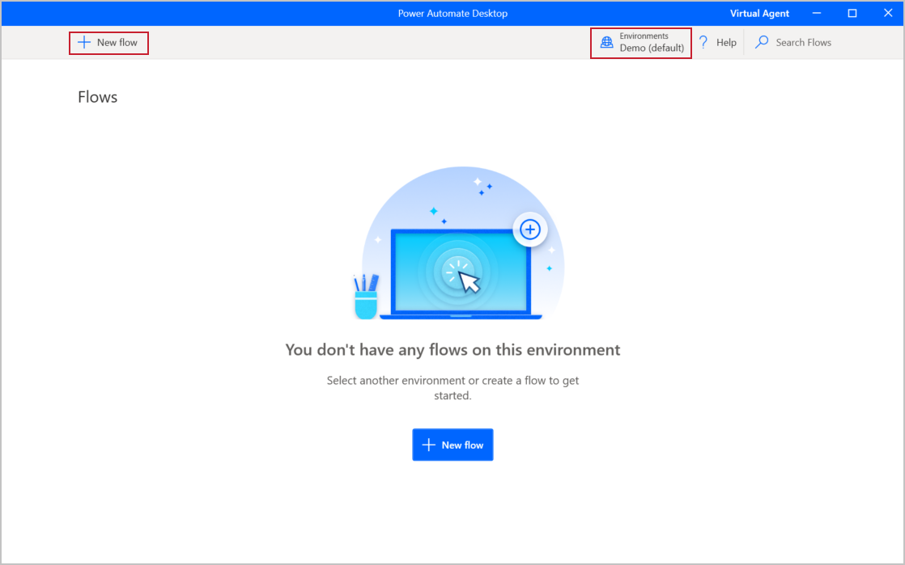
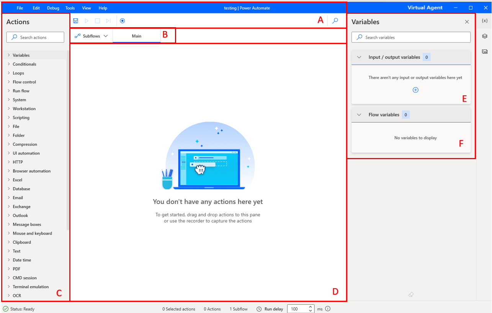
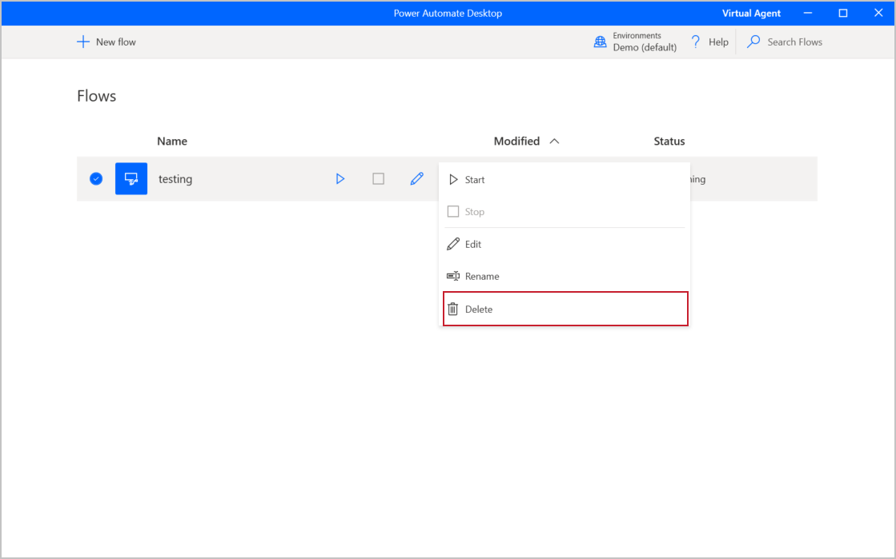

You have now downloaded the appropriate software and have the necessary licenses to create your first desktop flow. Your next task is to become familiar with the software.

Open and explore Power Automate Desktop. The upper-right corner indicates which environment you are in. Take a moment to make sure that this is the same environment that you created a database for previously. Under **Flows**, you will see existing desktop flows that you have, and you will be able to edit, start, or delete them. You can explore what creating or editing a flow looks like by selecting the **+ New flow** button in the upper-left corner.

> [!div class="mx-imgBorder"]
> 

Name your flow and then select **Create**. The specifics of the name aren't important; it's temporary and meant to help you become familiar with the app. You will delete this flow shortly.

After you have created your new test flow, the Power Automate Desktop designer will display. The designer contains several elements for you to focus on:

-   **The toolbar** (A) - Contains basic operations for use with actions (**Save**, **Undo**, **Copy**, **Debug**, and **Paste**) and buttons to start the desktop/web recorders and control the process implementation (Start/Pause/Stop).

-   **Subflows** (B) - Allows you to create subflows under your **Main** flow.

-   **Actions pane** (C) - Contains all Power Automate Desktop actions and includes a search bar that helps you find specific actions by matching the action name to the text string.

-   **Workspace** (D) - Contains all actions that are added to the process so far. Functions are separated into tabs.

-   **Input/output variables** (E) - Contains all variables that you created in the process.

-   **Flow variables** (F) - List of all variables that are used in the process.

> [!div class="mx-imgBorder"]
> 

Save your flow and close the window. You should now see your new flow in the list. Select the ellipsis (**...**) button to expand the options for that flow and then delete it.

> [!div class="mx-imgBorder"]
> 

Now that you're familiar with Power Automate Desktop, you can create a flow.
