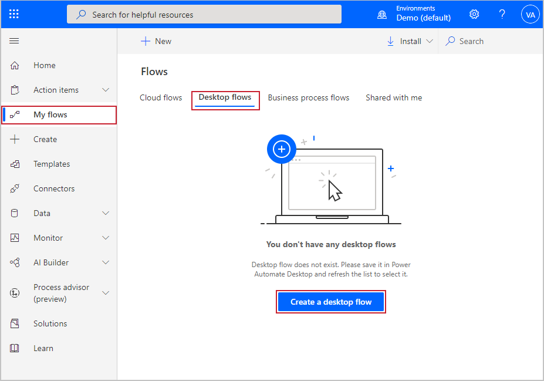
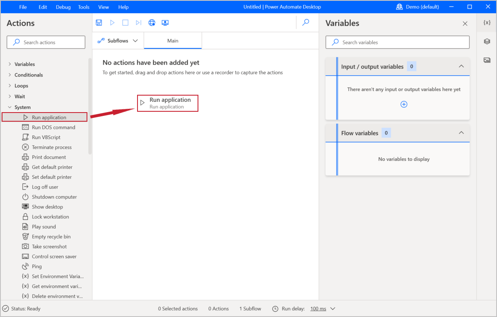
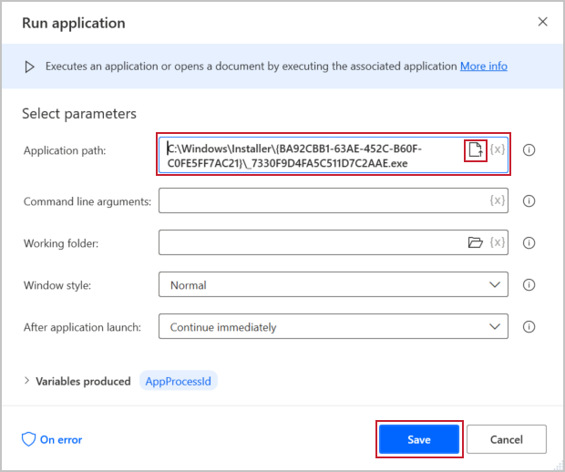

Go to [Power Automate](https://flow.microsoft.com/?azure-portal=true). Ensure that you are signed in and are in the appropriate environment. Under **My flows**, select **Desktop flows > Create a desktop flow**.

> [!div class="mx-imgBorder"]
> 

Select **Launch app** and then open Power Automate from the subsequent dialog box. The desktop app will open in the designer with a new flow named "Untitled," which you can change later.

Desktop flows are created to mimic the actions of a user who is performing steps in a process. You have to train the flow by adding those actions.

To add actions to your flow, select the desired action and then drag it to the **Main** canvas. Under the **System** drop-down menu on the Actions Pane, select and drag **Run Application**. You will use this feature to open your invoicing application.

> [!div class="mx-imgBorder"]
> 

In the following dialog box, specify the path to the application by entering the location manually; however, by selecting the icon on the right, you can select the application from a file explorer. You can search in the file explorer if you don't know the exact location of your application.

Leave the remaining fields as they are and then select **Save**.

> [!div class="mx-imgBorder"]
> 

Now that Power Automate has opened the application, you can complete the next actions. Previously, you chose from the actions on the Action Pane; however, a simpler way of communicating actions that need to be performed is by recording your desktop. The next unit provides instructions on how you can record your desktop.
