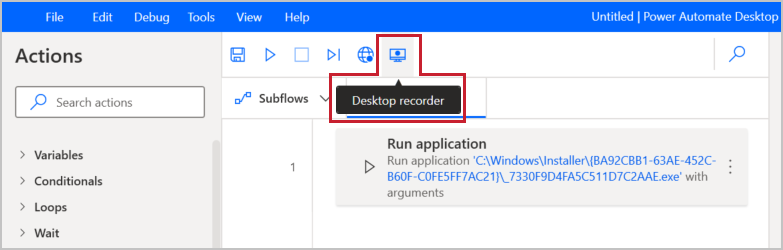
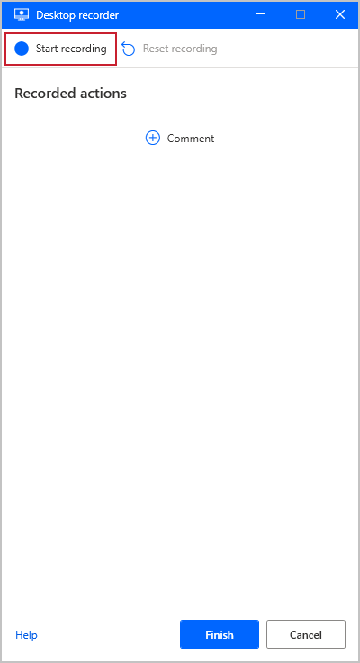
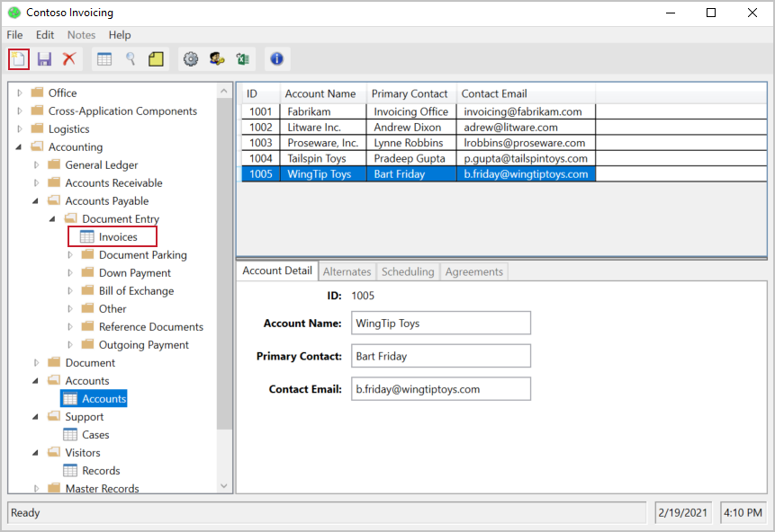
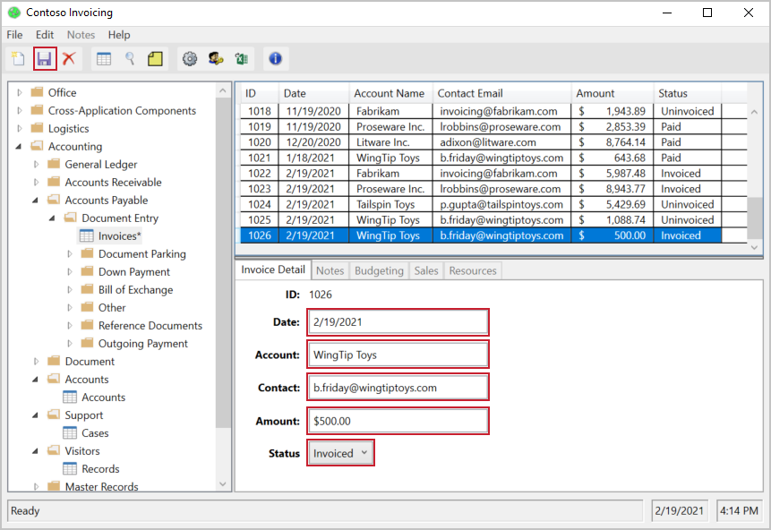
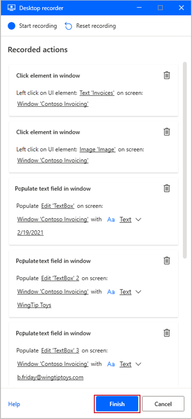

Before you get started, there are a couple of cleanup items to call out. Firstly, the process will go more smoothly if you exit out of any unnecessary applications while recording. If you have more browsers or programs running, it's a good idea to close them now. Secondly, it will be difficult to read the instructions and perform the actions required for the recording simultaneously. You may want to read through this unit completely before performing the steps outlined below. With those items out of the way, you are now ready to begin recording.

To begin recording your desktop actions, open up the Contoso Invoicing App and the **Desktop recorder** in Power Automate. If your application is not maximized, this will show as an icon without text in the toolbar. Hit the **Start recording** button in Power Automate Desktop.

> [!div class="mx-imgBorder"]
> 

> [!div class="mx-imgBorder"]
> 

As you record, make sure to go slowly and wait several seconds between actions. There will be a red outline on a control before selecting and a blue highlight after. If these outlines and highlights do not appear, your actions may not be recorded properly.

In the Contoso Invoicing App, select **Invoices** and then create a new record by clicking the appropriate icon in the upper left.

> [!div class="mx-imgBorder"]
> 

Complete the information required for the invoice: **Date**, **Account**, **Contact**, **Amount**, and **Status**. You can use whatever values you want, or you could copy the values used below. Edit the date field even if it has the value you want. This will allow you to change it via the flow instead of always using the default date. Be sure to only use clicks and not keyboard shortcuts to go to the next field. You can pause the recording or delete actions if you make a mistake.

Once complete, select the **Save** icon to save your record.

> [!div class="mx-imgBorder"]
> 

Now go back to the recording pop it in Power Automate Desktop and select **Finish**. Your recorded actions should look something like the below.

> [!div class="mx-imgBorder"]
> 

After clicking finish, you will see your newly recorded actions beneath the action to open your app. We did not record closing the app and that running your flow will result in a new instance of the app being open every run.
