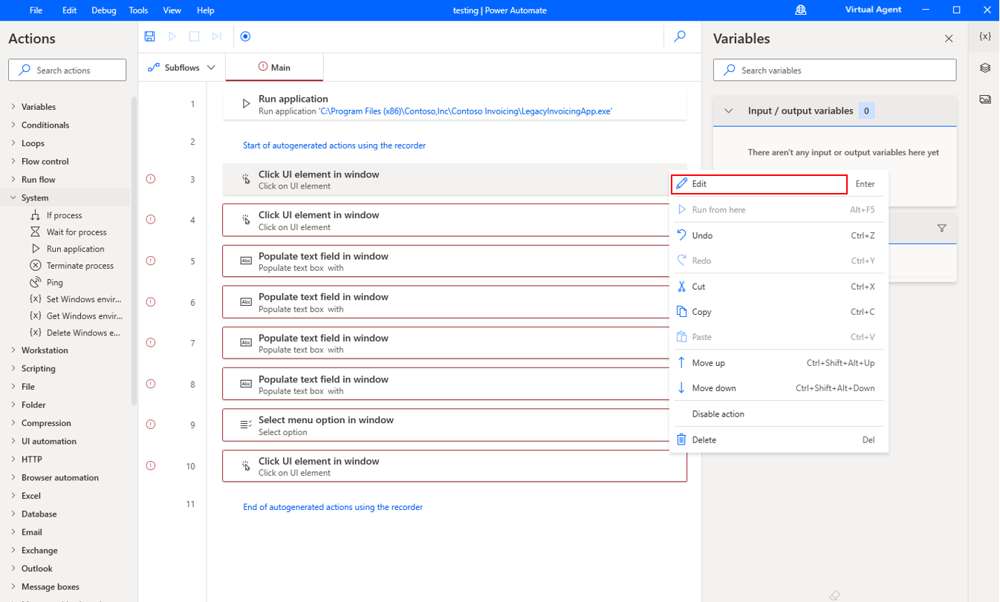
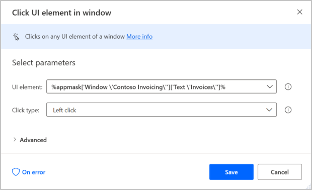
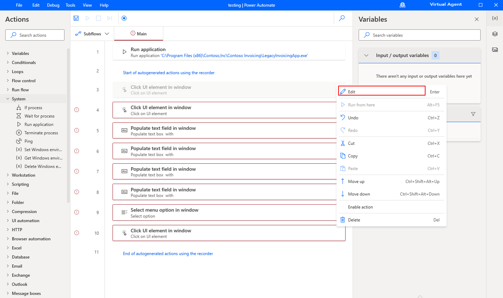
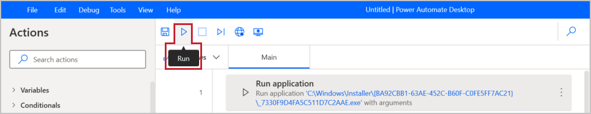

You can edit the recording actions by selecting the ellipsis (**...**) button and then by selecting **Edit**. In the subsequent dialog box, you can correct mistakes that you made during recording.

> [!div class="mx-imgBorder"]
> 

> [!div class="mx-imgBorder"]
> 

You can also **Delete** unnecessary or duplicate steps in this menu.

> [!div class="mx-imgBorder"]
> 

Test your flow by selecting the **Run** icon in the toolbar. Avoid using your computer to perform actions while the test is running.

> [!div class="mx-imgBorder"]
> 

When your test is successful, select the **Save** icon.
