Flows can be used to automate a sequence of actions from within your Power Apps application. For example, when a new customer record is created, you could start an approval process, add a new SharePoint list item, or email a forms survey to your customer. This feature allows for more consistent business processes and less manual work.

The key feature that makes this ability so powerful is that needed information is passed from the app to a flow when it's triggered. The following steps demonstrate how to connect a flow to Power Apps with a simple app to send a message to Teams. The goal is when **Button1** is pressed, the contents of **TextBox1** will be passed to the flow to become a message in Teams.

## Step 1 - Create the Power Apps application

To create the Power Apps application, follow these steps:

1. Open the Power Apps app in Teams from the **Home** tab select **+ New App**.

1. Select a team to store the app and then select **Create**.

1. Name the app **Trigger Flow From App** and then select **Save**.  Your created app will show a blank screen with a center screen menu displaying the options to start the screen **With data**, **With layout**, **Or drag and drop an item from the Insert pane**.

   > [!div class="mx-imgBorder"]
   > [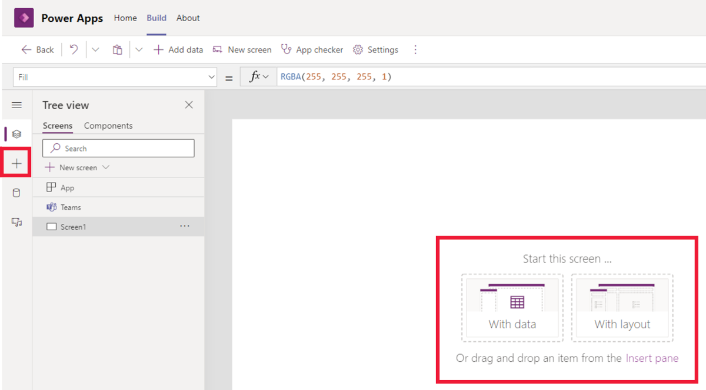](../media/app-start-screen.png#lightbox)

1. Select the **Insert** menu by selecting the words **Insert pane** from the **Start this screen** menu or by selecting the **+** in the left side rail.

1. From the **Insert** menu, drag and drop a **Text box** and **Button** from the **Popular** (or the **Input**) section. Position the options on the screen by selecting and dragging them around. Resize the text box by first selecting it and then selecting and dragging the corners.

   > [!div class="mx-imgBorder"]
   > [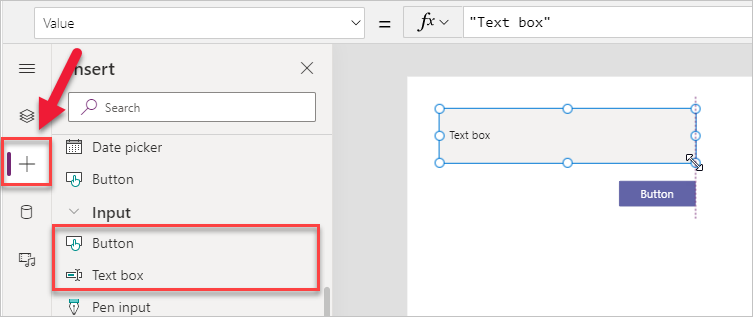](../media/image-12.png#lightbox)

1. Change the following properties of **TextBox1** and **Button1** first by selecting them and using the **Properties** tab.

    TextBox1 Mode - **Multiline**

    Button1 Text - **Send Message**

    > [!div class="mx-imgBorder"]
    > 

## Step 2 - Create and connect a flow

To create and connect a flow, follow these steps:

1. To connect a flow, select the item and event that will start the flow. Because you want the flow to trigger when **Button1** is pressed, select the button and then select **OnSelect** from the drop-down menu.

   > [!div class="mx-imgBorder"]
   > [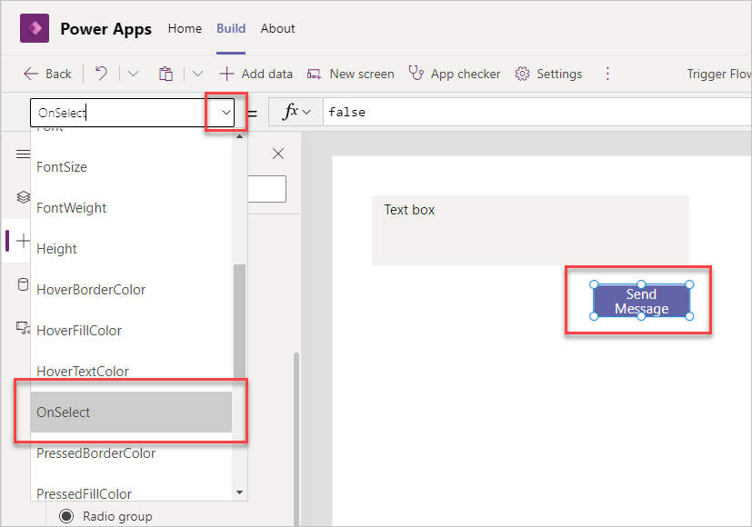](../media/image-14.png#lightbox)

1. To create a flow and link it to the app, select the ellipsis drop-down menu and then select **Power Automate**.

   > [!div class="mx-imgBorder"]
   > [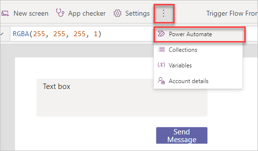](../media/image-15.png#lightbox)

1. Select **Create a new flow** and the Power Automate editor will launch in a web browser.

1. Give your flow a new name by selecting **Untitled** and then entering **Power Apps to Teams Message**.

   Either select the Power Apps icon or enter **Powerapps** in the search field and then select **Power Apps (V2)** in the **Triggers** section.

   > [!div class="mx-imgBorder"]
   > [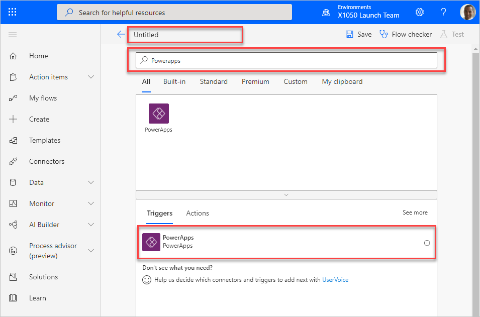](../media/image-16.png#lightbox)

1. The flow is now editable. It only has Power Apps defined as the trigger. With the Power Apps (V2) connector, we're going to add an input by selecting clicking **+ Add an input**. Then under **Choose the type of user input**, select Text.  There's nothing further you need to add right now.

   > [!div class="mx-imgBorder"]
   > [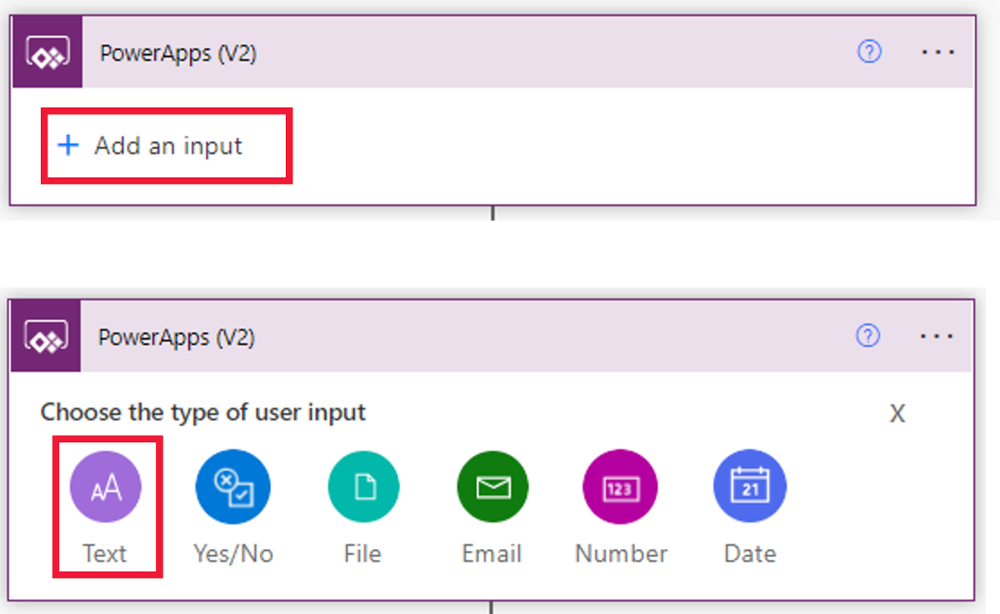](../media/power-apps-v2-connector.png#lightbox)

1. To add an action, select **New Step**.

1. Enter **Teams post message** in the search box and then scroll down under **Actions** and select **Post message in a chat or channel**.

   > [!div class="mx-imgBorder"]
   > [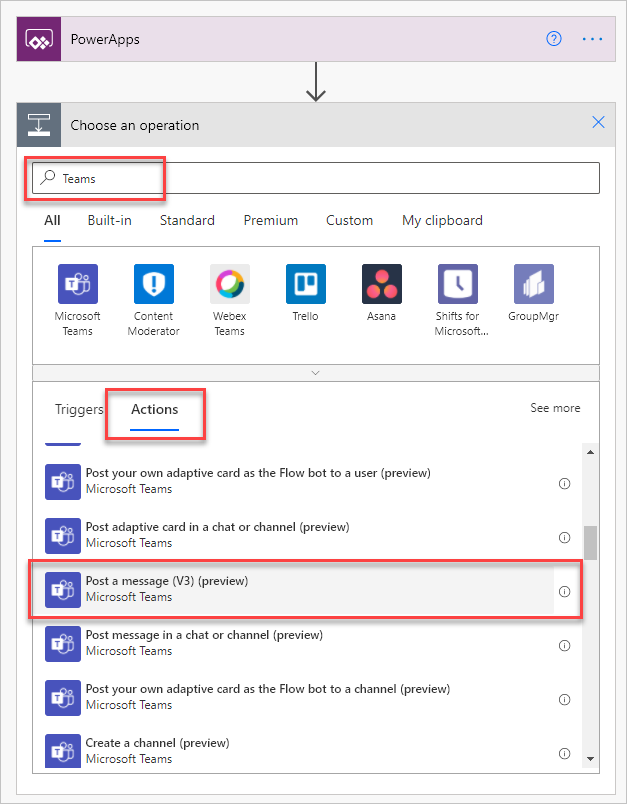](../media/image-17.png#lightbox)

1. In the **Post as** section you have 2 choices, **Flow bot** and **User**, select **Flow bot**. This will send your messages as the Flow bot instead of specific user. So essentially, the messages will be sent as a generic user.

1. For the **Post in** section, select **Channel**.

1. Now, select the **Team** and **Channel** that you want the message to be sent to.

1. The Team message will be provided by the Power Apps application when it's triggered. Select in the **Message** text box and then select **Input** (listed under PowerApps (V2)) as the dynamic content.

   > [!div class="mx-imgBorder"]
   > [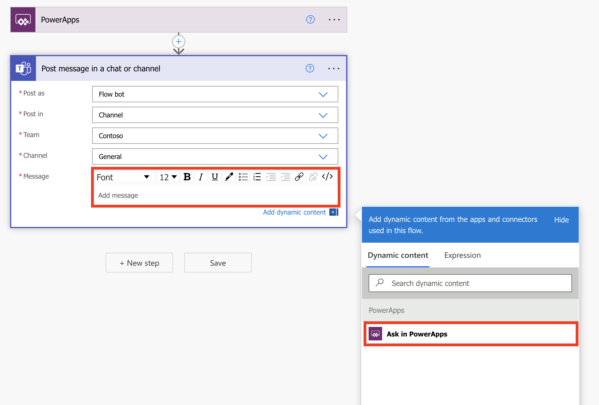](../media/image-18.png#lightbox)

1. When **Input** from Power Apps was selected as the dynamic content for the message, it automatically created a variable and gave it a name. Select **Save** at the end of the flow.

   > [!div class="mx-imgBorder"]
   > [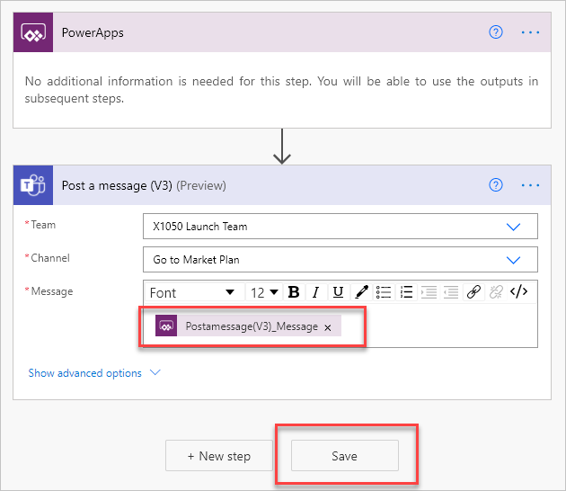](../media/image-19.png#lightbox)

1. With the flow saved, return to the Power Apps editor that you started in. The new flow should appear in the Power Apps editor under the **Data** pop-out window. If that window is closed, select **Button1** and check that **OnSelect** is selected in the drop-down menu. Select the ellipsis menu and then select **Power Automate**. Select the flow to continue.

   > [!div class="mx-imgBorder"]
   > [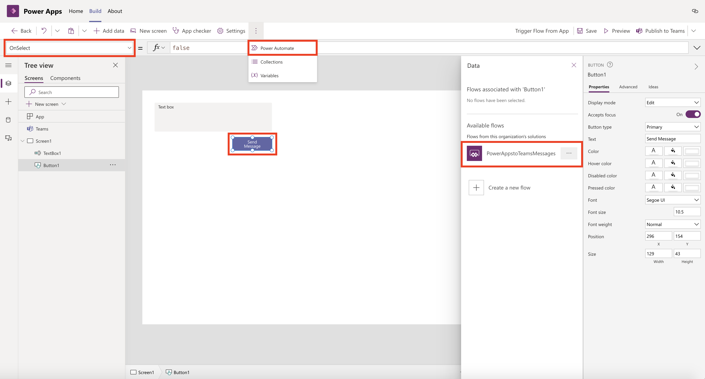](../media/image-20.png#lightbox)

1. The command to run the flow will appear in the formula bar. It will be in the format of **[FlowName].Run(**. This format is only the first part of the formula. You'll now need to pass in the message text for the flow. For this example, enter **Textbox1.Value)** at the end of the formula.

   > [!div class="mx-imgBorder"]
   > [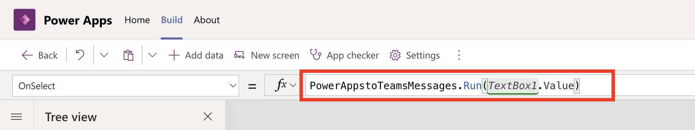](../media/image-21.png#lightbox)

    To learn more about formulas in Power Apps, see the links in the Summary unit at the end of this module.

1. Select **Save** in the toolbar.

## Step 3 - Test the app and flow

Before publishing any application to **Teams**, you can test it by selecting **Preview** from the toolbar.

1. From the toolbar, select **Preview**.

1. Enter a message into the text box and then select **Send Message**.

   > [!div class="mx-imgBorder"]
   > [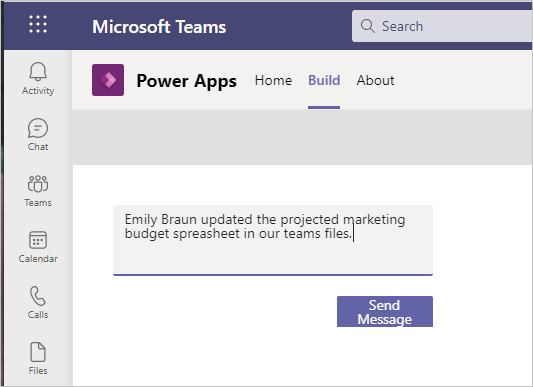](../media/image-22.png#lightbox)

1. Switch to the Teams channel to see the message in Teams.

   > [!div class="mx-imgBorder"]
   > [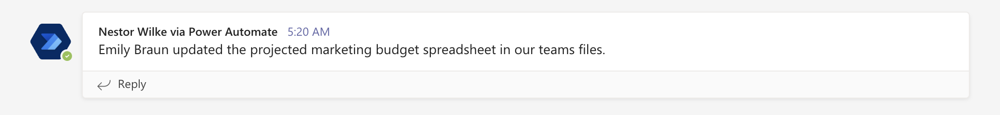](../media/image-23.png#lightbox)

1. In the Power Apps editor, close preview mode by selecting the **X** icon or by pressing the **Esc** key. 

Now let's edit the flow and change the **Post as** from **Flow bot** to **User**. To edit a flow you've connected to Power Apps, follow the steps below:

1. Open the Power Apps app in Teams.

1. Select the **Build** menu.

1. Select **See all**.

   > [!div class="mx-imgBorder"]
   > [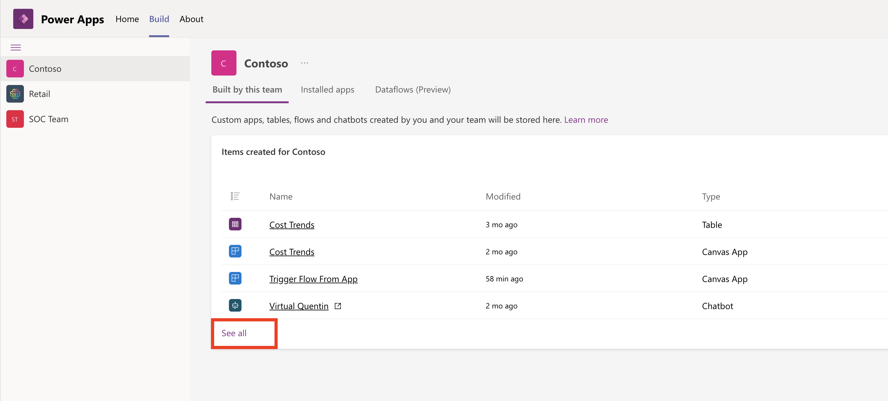](../media/items-27.png#lightbox)

1. Select **Cloud flows** from the left menu and then select the flow from the list.

   > [!div class="mx-imgBorder"]
   > [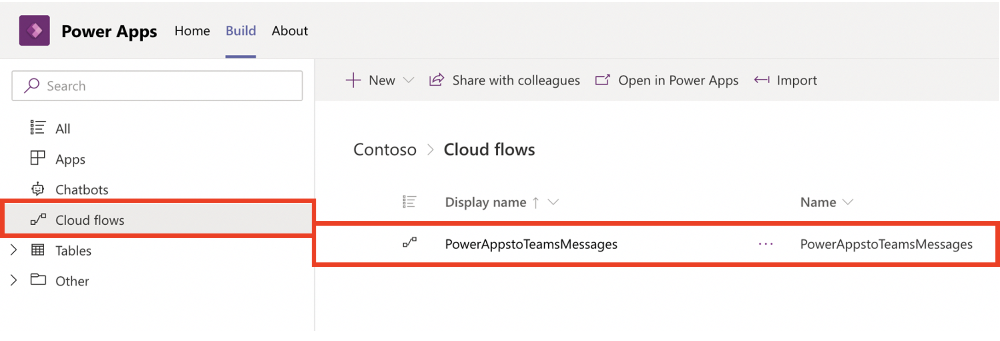](../media/cloud-flows-28.png#lightbox)

1. Select Edit.

   > [!div class="mx-imgBorder"]
   > [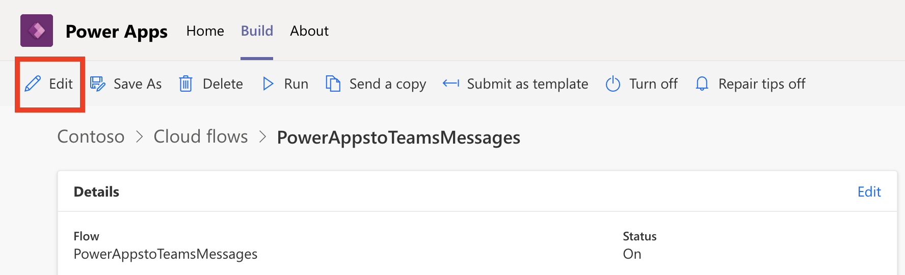](../media/edit-flow-29.png#lightbox)

1. Expand the **Post message in a chat or channel** action and for Post as, change this to **User**.

1. In the Message section, clear out the dynamic content and then you'll need to readd it back to the field. When you update the Post as section, it's not uncommon for dynamic content to also need updated.

   > [!div class="mx-imgBorder"]
   > [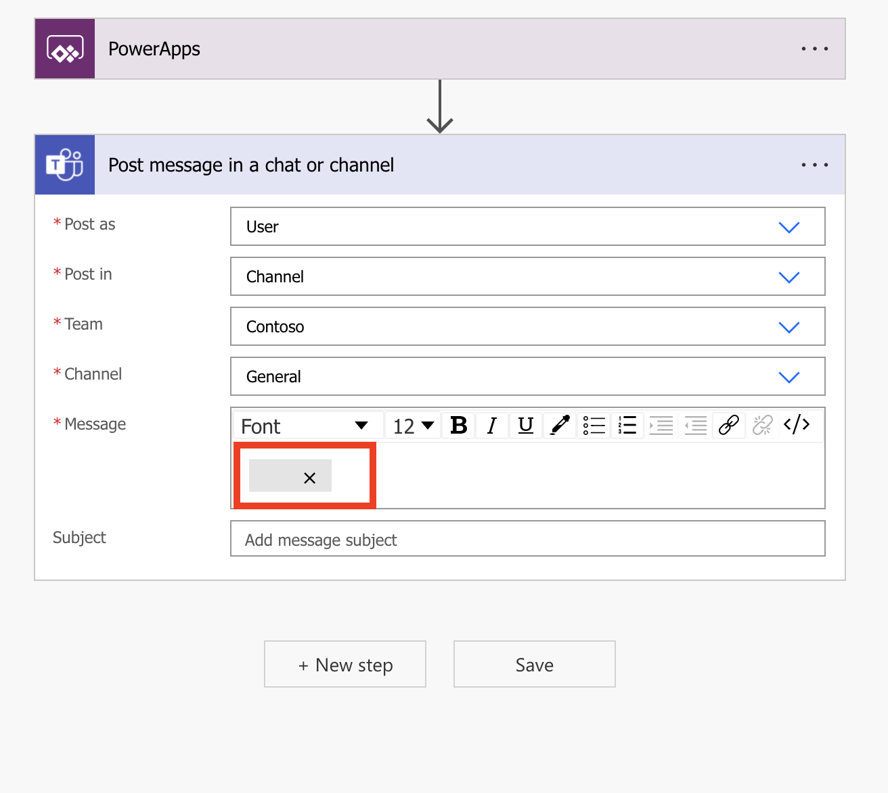](../media/corrupt-32.png#lightbox)

Also make note that there's an extra field for Subject now after the Message field. The Subject isn't required though, so don't feel obligated to fill it out. But you can if you want to see how it looks when you send your next message.

   > [!div class="mx-imgBorder"]
   > [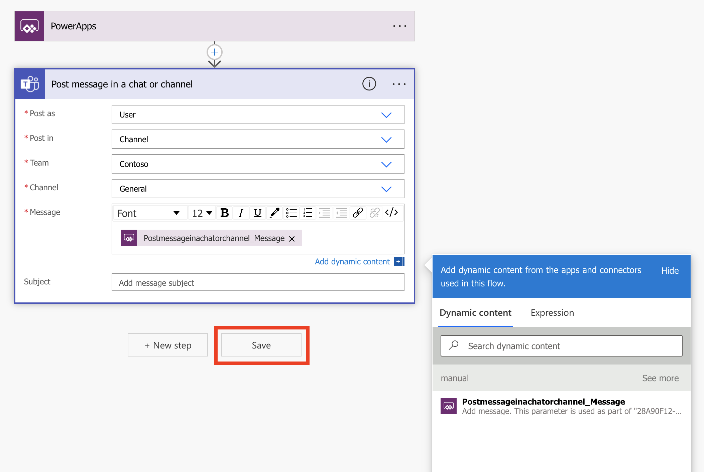](../media/updates-30.png#lightbox)

Once you've finished updating the flow, make sure to save your changes and then head back over to the app and test it out. You can use the same message as before. That's what I did. Or you could use a different message. It's up to you. But when the flow completes and the message posts, it should look slightly different than when you ran it as the **Flow bot**.

   > [!div class="mx-imgBorder"]
   > [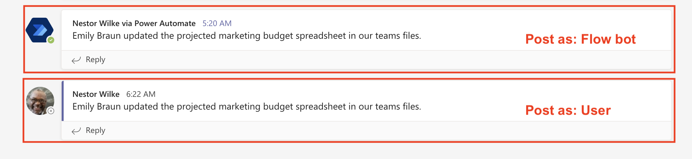](../media/test-31.png#lightbox)
