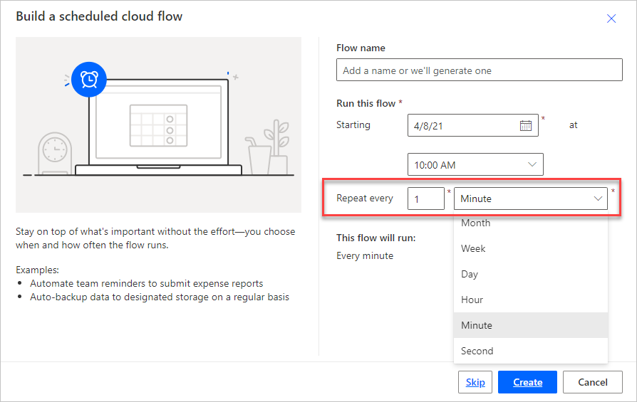
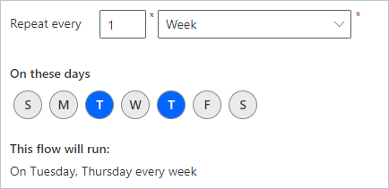
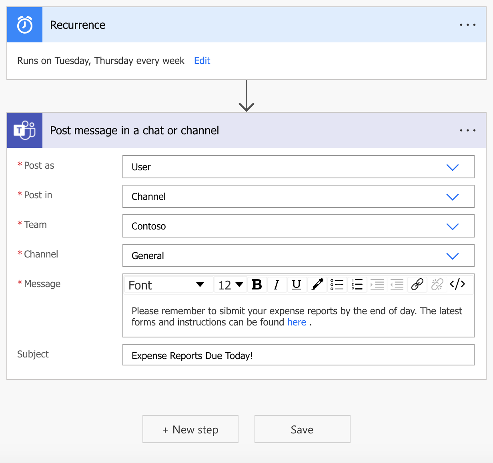

Some business processes and tasks are done on a schedule. This schedule could include a weekly reminder for the team to turn in expense reports, a check for overdue tasks each day, or for sending out a daily report. With Dataverse for Teams scheduled flows, you can create scheduled workflows to automate these actions, making them more consistent and less time-consuming.

To create a new schedule flow:

1. Open Teams and select the Power Apps for Teams app.

1. From the **Build** tab, select the team on the left to store the flow.

1. Under the **Built by this team** tab, select **See all**.

1. Select **+ New > Cloud flow > Scheduled**.

1. Provide a **Name** and select a **Starting** date and time for the flow. This action will set the first time that the flow will run.

1. For the **Repeat every** section, set the amount of time until the flow will run again by setting the number of seconds, minutes, hours, days, weeks, or months between each flow run.

   > [!div class="mx-imgBorder"]
   > 

   Selecting **Week** will bring up more options to define which days of the week to run the flow. For example, you can run the flow on Tuesday and Thursday each week.

   > [!div class="mx-imgBorder"]
   > 

1. Select **Create** to open the Power Automate editor and start building the rest of the flow.

After a scheduled flow is triggered, it processes the tasks that are defined in the flow just like any other flow. The following example shows a simple flow to send out a reminder to submit expense reports as a Teams message every Friday. Use the text editing controls in the message window to create hyperlinks to help make finding important resources easier for your users.

> [!div class="mx-imgBorder"]
> 
