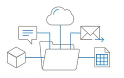
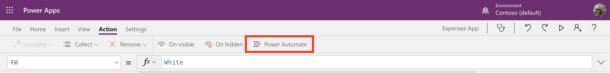
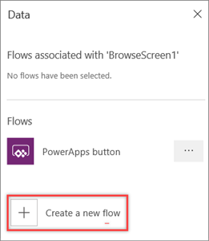
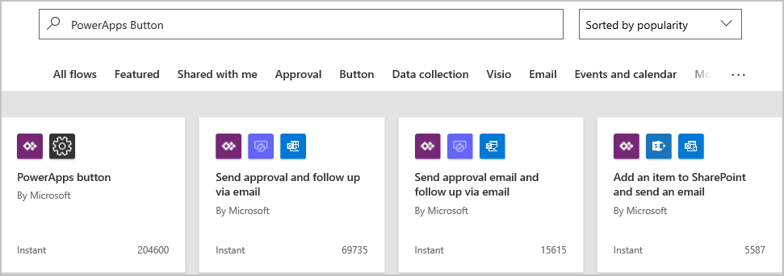
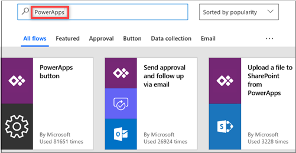
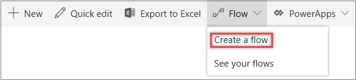
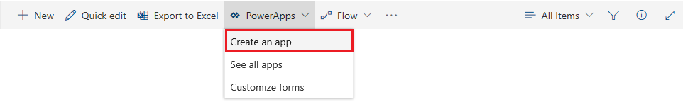

The data that fuels business processes is often buried in separate systems that are difficult to connect to and navigate. This is one reason why business processes don't stop becoming complex, and why people rarely stop worrying about them. 

But Microsoft Dynamics 365 with Microsoft Flow, Microsoft PowerApps, and Microsoft SharePoint makes it all easier. Together, these apps and services provide these advantages:

- The data can easily be tapped. 
- Critical business decisions can be made more quickly and more intelligently.
- People can worry less about what their data is doing and concentrate more on moving their business forward.

This unit gives an overview of:

- Integration of Microsoft Flow with PowerApps.
- Integration of Microsoft Flow and PowerApps with SharePoint for easy sharing of data in lists.

## Add a flow in PowerApps

Adding a flow to a PowerApps application is very straightforward.

1. Go to [https://web.powerapps.com](https://web.powerapps.com), and sign in by using your organizational account.
1. Open your app for editing.
1. On the **Action** tab, select **Flows** on the toolbar.

    

1. In the **Data** dialog box, select **Create a new flow**.

    

    Microsoft Flow is started and shows the beginning of a new flow where PowerApps is a trigger. 

    

For more about how to create flows, see [Create a flow from a template in Microsoft Flow](https://docs.microsoft.com/flow/get-started-logic-template).

## Add a PowerApps application from Microsoft Flow

You can also go in the other direction. You can start in Microsoft Flow and then select a template to add an app from PowerApps.

1. Launch Microsoft Flow and sign in using your organizational account.
1. In the left pane, select **Templates**.
1. Select one of the many PowerApps templates.

    To see all the PowerApps templates that are available, you can enter search for *PowerApps*.

    

    The template is opened, and you can start building your flow.

For more about how to create apps by using PowerApps, see [Create a canvas app from a template in PowerApps](https://docs.microsoft.com/powerapps/maker/canvas-apps/get-started-test-drive).

## Integration of SharePoint with Microsoft Flow

Customers regularly exchange data between SharePoint lists and other systems to support business processes. These scenarios become more powerful through the deep integration of Microsoft Flow with SharePoint lists. 

Microsoft Flow automates the exchange of workflows and data between SharePoint and a variety of Microsoft and third-party services. You can now create and start flows directly from a SharePoint list, and store and change that data in SharePoint.

1. From a SharePoint list, select **Flow** on the top toolbar, and then select **Create a flow**.

    

2. In the **Create a flow** pane, select the template to use.

    Microsoft Flow is started, and you can finish creating the flow.

## Integration of SharePoint with PowerApps

PowerApps lets you connect to, create, and share business apps on any device in minutes. You can build efficient mobile forms and apps directly from a SharePoint list, without writing a line of code. 

PowerApps and Microsoft Flow share a common connector framework that lets you weave in dozens of data sources that are located on premises or in the cloud. These data sources include Microsoft Exchange, Microsoft SQL Server, Microsoft Dynamics, Salesforce, Google, MailChimp, Twitter, and Wunderlist.

1. From a SharePoint list, select **PowerApps** on the top toolbar, and then select **Create an app**.

    

2. In the **Create an app** pane, enter a name for your app, and then select **Create**.

    PowerApps is started, and you can finish creating the app.
