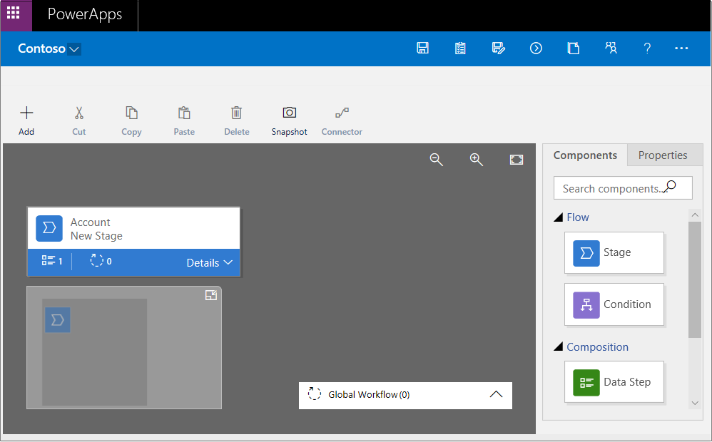
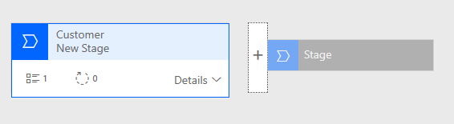
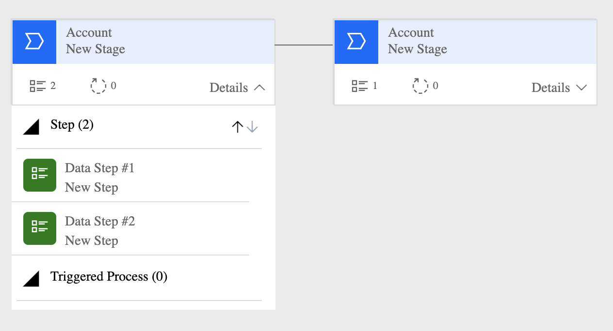
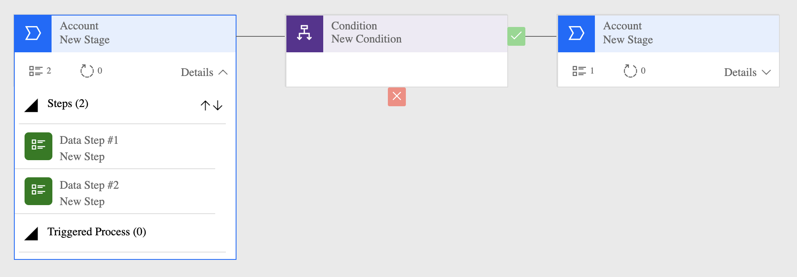

This unit shows how to create a business process flow by using Microsoft Power Apps.

For more about how to create a mobile task flow, see [Create a mobile task flow](https://docs.microsoft.com/dynamics365/customer-engagement/customize/create-mobile-task-flow).

When a user starts a business process flow, the process bar at the top of the page shows the stages and steps of the process.

> [!TIP]
> When you create a business process flow definition, you can define who has privileges to create, read, update, or delete instances of the business process flow. For example, for service-related processes, you might give customer service reps full access to change the business process flow instance. But you might give sales reps just read-only access to the instance, so that they can monitor post-sales activities for their customers. To set security for a business process flow definition that you create, select **Enable Security Roles** on the action bar.

## Create a business process flow

1. Launch Power Automate and sign in using your organizational account.
1. In the left pane, select **Flows**.
1. On the top bar, select **Business process flows**.
1. On the right, select **Create from Blank**.
1. In the **Create business process flow** pane, fill in the required fields:

    - **Display name**: The display name of the process doesn't have to be unique, but it should be meaningful for people who must choose a process. You can change this name later.
    - **Name**: A unique name that's based on the display name. You can change the name when you create the process, but you can't change it after the process has been created.
    - **Common Data Service entity**: Select the entity to base the process on.

        The entity that you select affects the fields that are available for steps that can be added to the first stage of the process flow. If you can't find the entity that you want, make sure that the **Business process flows (fields will be created)** option is set for the entity in the entity definition. You can't change the entity after you save the process.

1. Select **OK**.

    The new process is created, and the business process flow designer is started. The designer page has three sections:

    - On the left, a single stage named *Account New Stage* has already been created for you.
    - Beneath this stage is the mini map, which lets you see the whole process or quickly go to a part of the process.
    - On the right are components that you can drag to the designer. You can also set properties to create a business process flow.

    

1. Add stages, so that users can proceed from one business stage to another in the process:

    1. Drag the **Stage** component from the **Components** tab to the plus sign (**+**) in the designer.

        

    2. Select the stage, and then, on the **Properties** tab on the right, set the properties:

        1. Enter a display name.
        2. Optional: Select a category for the stage (for example, **Qualify** or **Develop**). This category appears as a chevron on the process bar.

            

        3. When you've finished setting the properties, select **Apply**.

1. Add steps to each stage:

    > [!TIP]
    > To see the steps in a stage, select **Details** in the lower-right corner of the stage.

    1. Drag the **Step** component from the **Components** tab to the stage.

        

    2. Select the step, and then, on the **Properties** tab, set the properties:

        1. Enter a display name for the step.
        2. If users should be able to enter data to finish a step, select the appropriate field in the drop-down list.
        3. If users must fill in the selected field to finish the step before they can proceed to the next stage of the process, select **Required**.
        4. When you've finished, select **Apply**.

1. Add a branch (condition) to the process:

    1. Drag the **Condition** component from the **Components** tab to the plus sign (**+**) between two stages.

        

    2. Select the condition, and then, on the **Properties** tab, set the properties. When you've finished, select **Apply**.

1. Add a workflow to the process:

    1. Drag the **Workflow** component from the **Components** tab to either a specific stage or the **Global Workflow** item:

        - Drag the **Workflow** component to a specific stage if the workflow should be triggered when the process enters or exits that stage. The **Workflow** component must be based on the same primary entity as the stage.
        - Drag the **Workflow** component to the **Global Workflow** item if the workflow should be triggered when the process is activated or archived (that is, when the status changes to **Completed** or **Abandoned**). The **Workflow** component must be based on the same primary entity as the process.

    2. Select the condition, and then, on the **Properties** tab, set the properties:

        1. Enter a display name.
        2. Select when the workflow should be triggered.
        3. Search for an existing on-demand active workflow that matches the stage entity, or create a workflow by selecting **New**.
        4. When you've finished, select **Apply**.

1. To validate the business process flow, select **Validate**  on the action bar.
1. To save the process as a draft while you continue to work on it, select **Save** on the action bar.

    > [!IMPORTANT]
    > No one can use a process while it's a draft.

1. To activate the process and make it available to your team, select **Activate** on the action bar.
1. To define who has privileges to create, read, update, or delete the business process flow instance, select **Edit Security Roles**  on the action bar. For example, for service-related processes, you might give customer service reps full access to change the business process flow instance. But you might give sales reps just read-only access to the instance, so that they can monitor post-sales activities for their customers.

    1. In the **Security Roles** pane, select the name of a role to open the details page for that role.
    1. On the **Business Process Flows** tab, select options to assign the role appropriate privileges for the business process flow.

        > [!NOTE]
        > By default, the System Administrator and System Customizer security roles have access to new business process flows.

        

    1. Select **Save**.

> [!TIP]
> Keep these tips in mind as you work on your business process flow in the designer:
> 
> - To take a snapshot of everything in the business process flow designer, select **Snapshot** on the action bar. This option is useful if you want to share and get comments about the process from a team member.
> - Use the mini map to quickly go to different parts of the process. This option is useful when you have a complicated process that scrolls off the screen.
> - To add a description of the business process, select **Details** under the process name in the upper-left corner of the page. You can enter up to 2,000 characters.

## Edit a business process flow

You can edit the business process flow after it has been created.

1. On the Power Apps main page, select **Flows** in the left pane.
1. In the list of processes, select the business process flow that you created, and then select the **Edit** button.

Keep the following points in mind when you edit the stages of a business process flow:

- Business process flows can have up to 30 stages.
- You can add or change the following properties of a stage:

    - **Stage Name**: You can change the stage name after you create the stage.
    - **Entity**: You can change the entity for any stage except the first one.
    - **Stage Category**: A category lets you group stages by the type of action. It's useful for reports that will group records by the stage that they're in. The options for the stage category come from the Stage Category global option set. You can add more options to this global option set and change the labels of existing options. You can also delete options, but we recommend that you keep the existing options. If you delete an option, you won't be able to add it back later. If you don't want an option to be used, change the label to *Do not use*.
    - **Relationship**: Enter a relationship when the preceding stage in the process is based on a different entity than the current stage. For the current stage, select **Select relationships**, and then specify the relationship that should be used when the flow moves between the two stages. We recommend that you specify relationships, because they provide the following benefits:

        - Attribute maps are often defined for relationships. These attribute maps automatically carry over data between records. Therefore, they help minimize the amount data entry that's required.
        - When you select **Next Stage** on the process bar for a record, any records that use the relationship are listed in the process flow. Therefore, the reuse of records in the process is promoted. In addition, you can use workflows to automate the creation of records. Users then just have to select the workflow instead of creating a record. Therefore, the process is streamlined.

    - **Set Process Flow Order**: If you have more than one business process flow for an entity (record type), you must specify which process is automatically assigned to new records. On the action bar, select **Order Process Flow**. For new records or records that don't already have a process flow associated with them, the first business process flow that a user has access to will be used.
    - **Enable Security Roles**: A user's access to a business process flow depends on the privileges that are defined for the business process flow in the security role that's assigned to the user. By default, only the System Administrator and System Customizer security roles can view a new business process flow.
