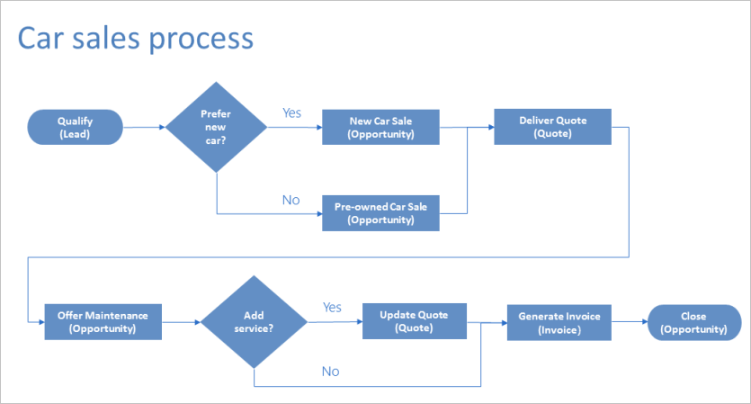
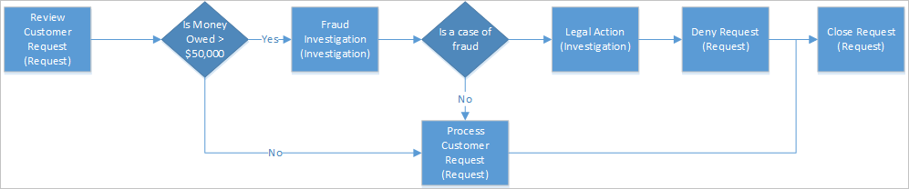

Business process flows guide you through the different stages of sales, marketing, or service processes, toward completion. For a simple process, a linear business process flow is a good option. But in more complex scenarios, you can use an enhanced business process flow that branches into different directions, depending on conditions within the flow.

Branches are automatically selected in real time, based on rules that are defined in the process definition.

- If you have **Create** permissions on business process flows, you can use `If-Else` logic to create business process flows that have multiple branches.
- The branching condition can be formed from multiple logical expressions that use a combination of `AND` or `OR` operators.

For example, for the process of selling cars, you can set up a single business process flow that starts with a common qualification stage but then splits into separate branches, based on a rule:

- One branch manages the case of a customer who prefers a new car or a pre-owned car.
- Another branch manages the case of a customer whose budget is above or below $20,000.
- A third branch might be for purchasing or declining a maintenance or service plan.

The following diagram shows a business process flow that has branches.

## Guidelines for business process flows that have branches

Keep the following points in mind when you design a business process flow that has branches:

- A process can span a maximum of five unique entities.
- You can use a maximum of 30 stages per process and a maximum of 30 steps per stage.
- Each branch can be no more than five levels deep.
- Branching rules must be based on the steps in the stage that immediately precedes them.
- You can combine multiple conditions in a rule by using the `AND` operator or the `OR` operator, but not both.
- When you define a process flow, you can optionally select an entity relationship. This entity relationship must a one-to-many (1:N) relationship.
- More than one active process can run concurrently on the same data record.
- When branches are merged, either all the peer branches must be merged to a single stage, or each peer branch must end the process. A peer branch can't merge with other branches and end the process at the same time.

> [!NOTE]
> - An entity that's used in the process can be revisited multiple times (that is, there can be multiple closed entity loops).
> - A process can go back to the previous stage, regardless of the entity type. For example, if the active stage is **Deliver Quote** on a quote record, process users can move the active stage back to the **Propose** stage on an opportunity record.

## Dynamics 365 customer engagement example: Car selling process flow that has two branches

Let's look at an example of a business process flow that has two branches. In this example, the business process flow is used for sales of new and pre-owned cars.

First, we'll create a process named **Car Sales Process**.

1. Launch Power Automate and sign in using your organizational account.
1. In the left pane, select **Flows**.
1. On the top bar, select **New** **Business process--from blank**.
1. In the **Create business process flow** pane, fill in the required fields:

    - **Display name**: Enter *Car sales process*.
    - **Name**: A unique name that's based on the display name that you entered. You can change the name when you create the process, but you can't change it after the process has been created.
    - **Common Data Service entity**: Select the *Lead* entity.

        The entity that you select affects the fields that are available for steps that can be added to the first stage of the process flow. If you can't find the Lead entity, make sure that the **Business process flows (fields will be created)** option is set for that entity in the entity definition. You can't change the entity after you save the process.

1. Select **Create**.
1. Once the new page spins up in PowerApps, add the first stage to the process, name the stage *Qualify*, and add two data steps to it: *Purchase Time frame* and *Car Preference*.
1. After the common Qualify stage, split the process into two separate branches by adding a **Condition** component:

    1. Set up the condition with rules that meet your business requirements.
    1. To add the first branch, which will be run when the condition is satisfied, add a **Stage** component to the **Yes** path of the **Condition** component.
    1. To add the second branch, which will be run when condition isn't satisfied, add a **Stage** component to the **No** path of the **Condition** component.

    > [!TIP]
    > To create more complex branching, you can add another a **Condition** component to the **No** path of an existing **Condition** component.

    

    If **Car preference** = **New**, the process branches out to the **New Car Sales** stage, as shown here.

    

    Otherwise, the process goes to the **Pre-Owned Car Sales** stage in the second branch, as shown here.

    

    After all the steps in either the **New Car Sales** stage or the **Pre-Owned Car Sales** stage are finished, the process returns to the main flow, at the **Deliver Quote** stage.

    

## Prevent information disclosure example 

There are a few things that you need to consider to prevent people from seeing specific information about a process flow.

This section uses the example of a business process flow that has branches for processing a loan request at a bank. In the following diagram, the custom entities that are used in the stages are shown in parentheses.

In this scenario, the bank loan officer needs access to the Request record, but she shouldn't have any visibility into the investigation of the request. At first glance, it looks as though we can easily meet this requirement by assigning the loan officer a security role that doesn't grant access to the Investigation entity. But let's look at the example in more detail to see whether things will really be that easy.

Let's say that a customer submits a loan request for more than $60,000 to the bank. Here is a high-level view of the stages and branches:

- In the first stage, the loan officer reviews the request.
- A branching rule checks whether the amount that's owed to the bank will exceed $50,000. If this branching rule is satisfied, the next stage in the process is to investigate whether the request is fraudulent.
- If it's determined that the request is fraudulent, the process moves on to taking legal action against the requestor.
- The loan officer shouldn't have visibility into the two investigative stages, because she doesn't have access to the Investigation entity.
- But if the loan officer opens the Request record, she can see the entire end-to-end process. Not only will she be able to see the Fraud Investigation stage, but she'll also be able to identify the outcome of the investigation, because she can see the Legal Action stage in the process.
- The loan officer can preview the steps in the investigative stages by choosing the stage. Although she won't be able to see the data or the step completion status, she'll be able to identify the potential actions that were taken against the requestor during the Fraud Investigation and Legal Action stages.

In this process flow, the loan officer will be able to see the Fraud Investigation and Legal Action stages, and this ability constitutes improper information disclosure.

Pay special attention to the information that might become disclosed because of branching. In our example, to prevent information disclosure, split the process into two separate processes: one for the request processing and one for the fraud investigation. The process for the loan officer will then look like this.

The process for the investigation will be self-contained and will include the following stages.

You'll have to provide a workflow to synchronize the Approve/Deny decision from the Investigation record to the Request record.
