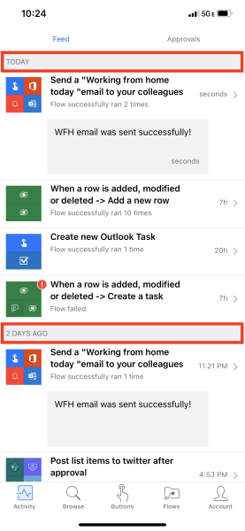
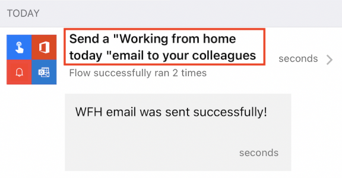
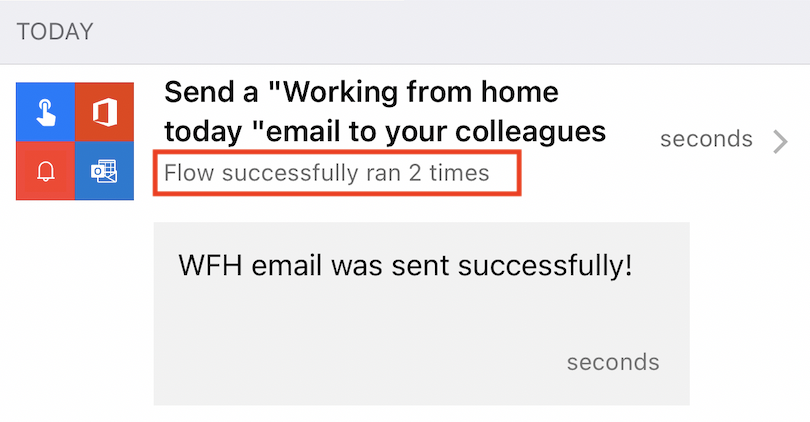
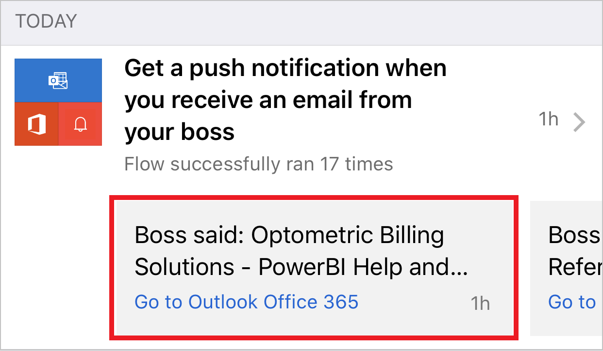
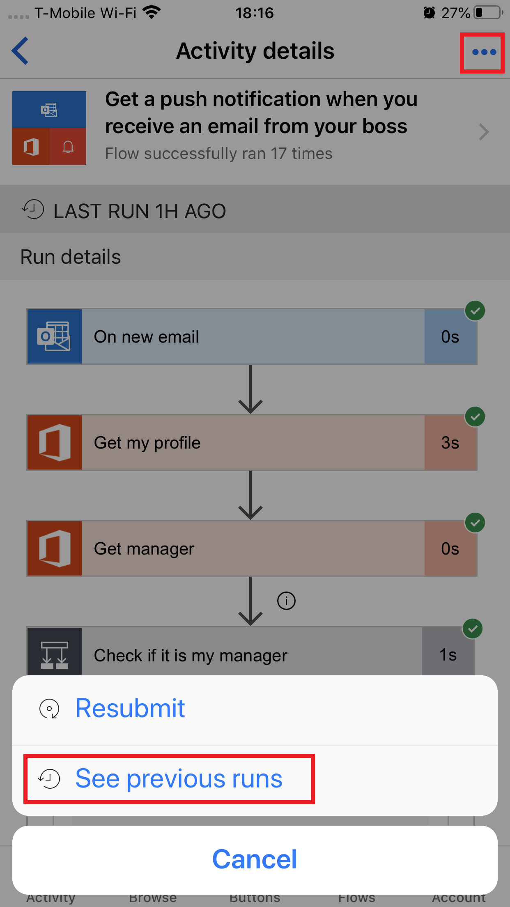
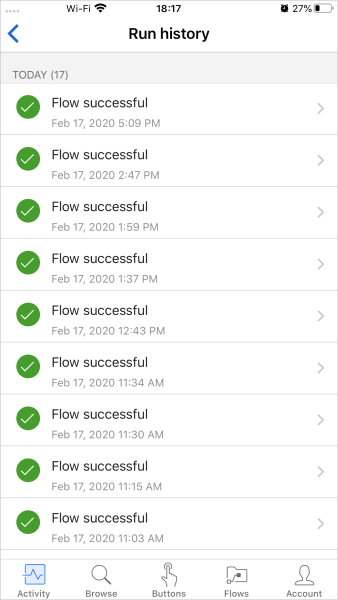

You can view a summary of the number of times that each flow succeeded or failed today, yesterday, and on previous days. You can also explore details about each run, like when it ran, how long each step took, and, if a step failed, why it failed.

## Prerequisites

* Install the Power Automate mobile app for [Google Android](https://aka.ms/flowmobiledocsandroid), [Apple iOS](https://aka.ms/flowmobiledocsios), or [Windows Phone](https://aka.ms/flowmobilewindows) on a supported device. The screenshots in this unit were taken on the Apple iPhone version of the app, but the mobile app for Android and Windows Phone are similar.
* If you don't already have a flow, create one on the [Power Automate website](https://flow.microsoft.com/). For easier testing, use a flow that you can trigger yourself instead of waiting for an external event.

The flow in this tutorial runs when you receive email from a specific address.

> [!TIP]
> For testing, you can set up the flow with your personal email address. Then, when the flow is ready for real use, you can set it up with a different address (for example, your manager's).

When the flow runs, it sends a custom push notification to your phone.

## Show a summary of activity

1. If your flow hasn't run before, trigger a run to generate data.

    It might take some time for the data to appear in the app.

1. Start the mobile app.

    Select the **Activity** tab. This tab organizes data by day, and today's data appears at the top.

    

    Each entry shows the name of the flow and icons that correspond to the flow's trigger events and actions.

    

    If at least one run of a flow has succeeded in a day, an entry shows the number of successful runs and the time of the most recent success. A different entry shows similar information if a flow has failed.

    

    If a flow sends push notifications, the text of the most recent notification appears at the bottom of the entry for successful runs.

    

## Show details of a run

1. In the activity summary, select an entry to show details for the most recent run.

    For each event and action, a symbol indicates whether the event or action succeeded or failed. If it succeeded, the amount of time that it took (in seconds) also appears.

    

1. Tap **Run history** to list all runs of the flow. Then select a specific run to view its details.
    
    

    
