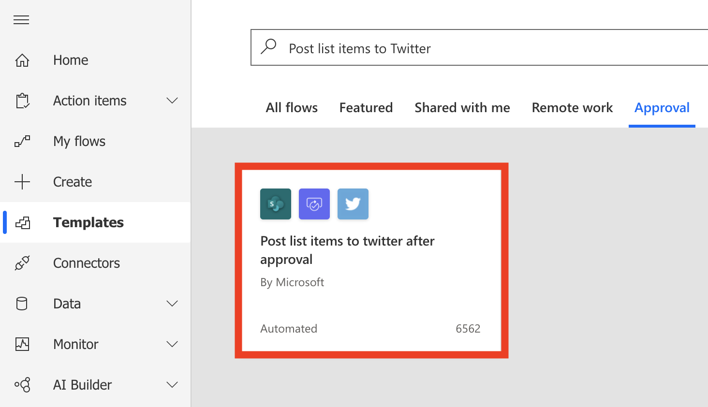
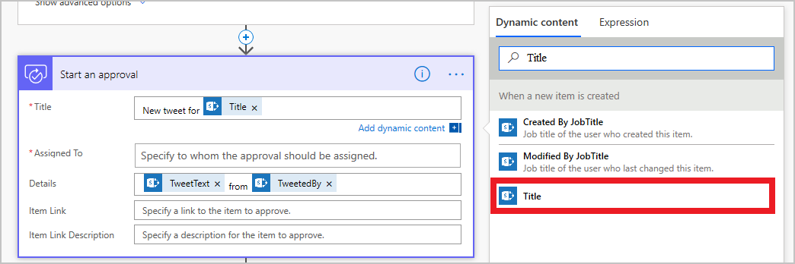
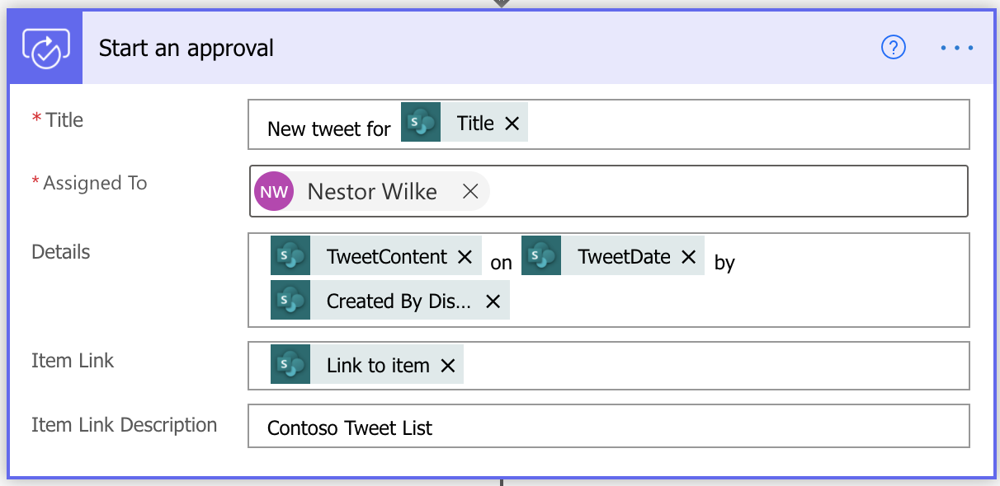
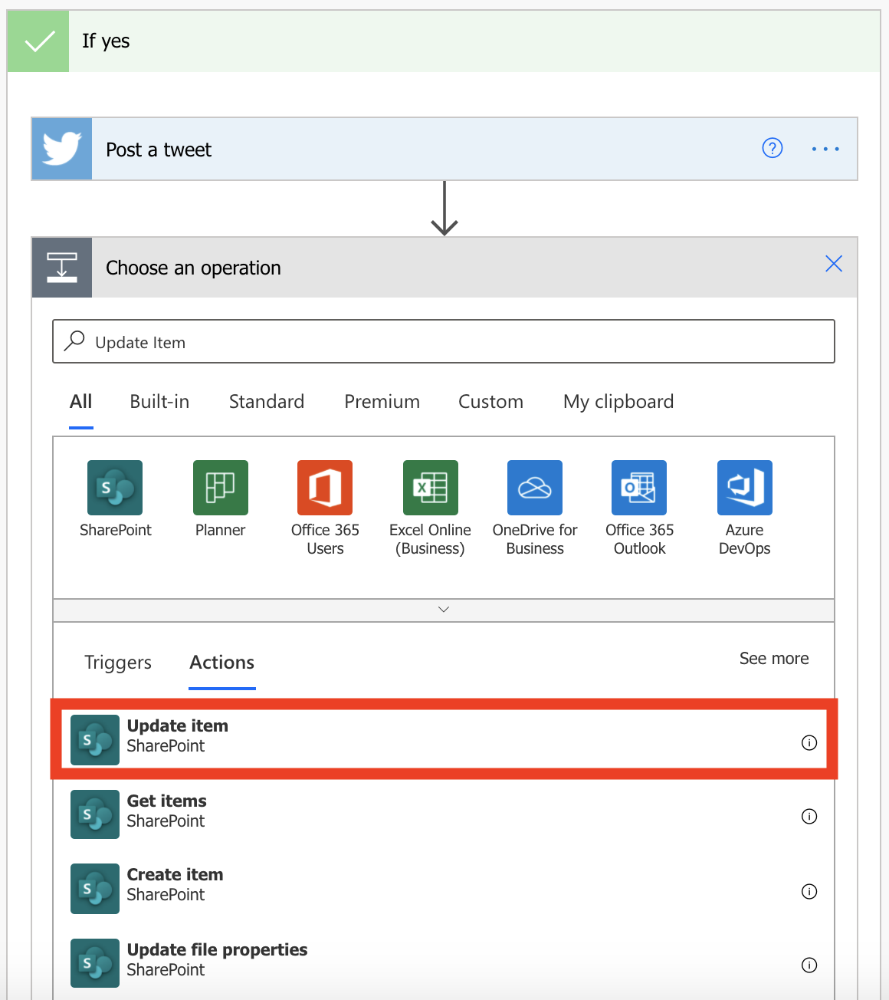
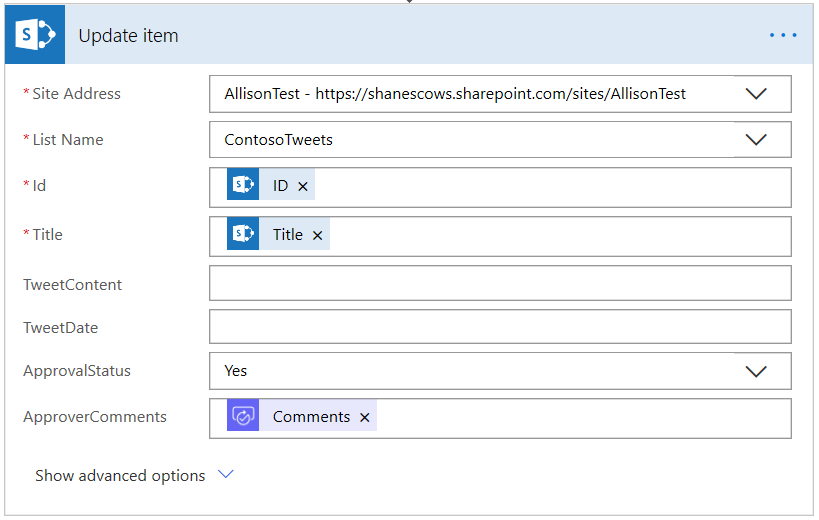
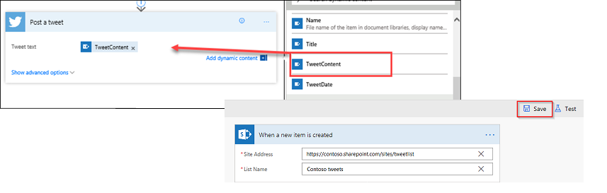

In this unit, you'll learn how to build a business-friendly scenario that uses approvals.

In this scenario, anyone who has access to the Microsoft SharePoint list can contribute tweets without knowing anything about Twitter. The social media team can then approve or reject those tweets allowing that team to remain in control of the account and the content that goes out to customers.

## Step one: Create a SharePoint list for tweets

You'll use a template that starts an approval process whenever a new item is created in a specific list. If the item is approved, a tweet is posted to Twitter. For this unit, you'll change the process by adding steps that update a SharePoint list with the approval response, indicate whether the item was approved, and add any comments that the approver added to the proposed tweet.

First, let's create the SharePoint list.

1. On your SharePoint site, create a SharePoint list named *ContosoTweets*.

1. Open the list, and select **Add column**.

1. Select **+ Add column** to add the following columns. Select **Save** after you create each column.

    - Add a column of the *Multiple lines of text* type that's named *TweetContent*. This column will hold the content of the tweets that will be approved later.
    - Add a column of the *Date* type that's named *TweetDate*. Toggle the **Include Time** option to yes.
    - Add a column of the *Yes/No* type that's named *ApprovalStatus*. The approver can then select **Yes** or **No** to approve or reject the tweet.
    - Add a column of the *Single line of text* type that's named *ApproverComments*. The approver can then add a comment about the approval status.

1. Copy the URL of the SharePoint list. You'll use it when you create the flow.

## Step two: Create an approval request flow

1. Sign in to [Power Automate](https://ms.flow.microsoft.com), and then select **Templates**.
1. Search **Post list items to Twitter** under **Approvals** and select the appropriate template.

    

1. Make sure that your account credentials for **SharePoint**, **Approvals**, and **Twitter** are correct, and then select **Continue**.

1. In the **When a new item is created** action, enter the following values:

    * **Site Address**: Enter the URL of your team's SharePoint site.
    * **List Name**: Select *ContosoTweets*.

1. In the **Start an approval** action, in the **Title** field, enter *New tweet for*, and then select **Title** in the dynamic content list.

    

1. In the **Assigned to** field, enter and select either your name or the name of a test user.

1. In the **Details** field, remove the default items, and add dynamic fields and text to get **TweetContent** on **TweetDate** by **Created by DisplayName**.

1. In the **Item Link** field, add the dynamic content **Link to Item**. In the **Item Link Description** field, enter *Contoso Tweet List*.

    

1. In the **If yes** section of the Condition, select **Add an action**.

1. Search for *update item*, select the **SharePoint** connector, and then select the **SharePoint – Update item** action.

    

1. In the **Site Address**, enter the URL of the team's SharePoint site again. In the **List Name** field, select *ContosoTweets* again. In the **Id** field, add **ID** from the dynamic content list. The **Id** field is used to match the actual tweet request in the SharePoint list.

1. Select the **Title** field, and then, in the dynamic content list, search for *title*. Add **Title** from the **When a new item is created** action.

1. In the **ApprovalStatus** field, select *Yes*. Then select the **ApproverComments** field, and add **Comments** from the dynamic content list.

    

1. Click and drag **Post a Tweet** to below the **Update Item** action.

1. In the **If no** section of the Condition, select **Add an action**.

1. Repeat steps 10 through 13 to create a **SharePoint – Update item** action. Set the same values that you set for the **IF YES** condition. The only difference is that you set the **ApprovalStatus** field to *No* this time.

1. Expand the **Post a tweet** action by selecting the title bar. Then select the **Tweet text** field, and add **TweetContent** from the dynamic content list. This step will create the actual tweet and then post it to Twitter when it's approved.

    

1. Select **Save**.

Congratulations! You just created your first approval flow.

This unit showed just one way that Power Automate can empower your team to be more productive. Your team can contribute ideas, relevant news, or product guidance, but you maintain control over what's tweeted out to customers.

In the next unit, you'll see what it looks like when an approver receives a new request for a proposed tweet.
